# 文書とマーカーの圏論的見取り図

1. 基本的な視点
   - 設計書 = 圏の対象(object)
   - マーカーによる継承や判断の関係 = 圏の射(morphism)
   - よって、設計書群をオブジェクト集合とみなし、マーカーが定義する情報伝達を射として表現できる。
2. GLOBAL_CONCLUSION マーカー(結論)
   - GLOBAL_CONCLUSION は「文書 → 基底文書」へ結論を射影する射に相当。
   - 圏論的には関手的な構造保存射に近い。
   - 各設計書(オブジェクト)の「結論」部分構造を、基底文書へ写す。
   - 特に「Why 系 → What 系 → How 系」への階層的な写像は、前層(presheaf)的構造に近い。
3. PREMISE マーカー(前提)
   - PREMISE は「基底文書 → 文書」へ前提を引き込む射に相当。
   - 論理的な推論の出発点として、他の契約を前提として取り込む。
   - 圏論的には「引き戻し(pullback)」による前提条件の取得として表現できる。
4. LOCAL_CONCLUSION マーカー(結論)
   - LOCAL_CONCLUSION は文書内での完全な結論定義を行うが、基底文書への射影は実行しない射。
   - バリデーション用として結論の完全性と整合性をチェックするための技術的構造。
   - 圏論的には完全な colimit の構成要素として機能するが、抽象化関手によるフィルタリング対象となる射。
5. REFERENCE マーカー(参照)
   - REFERENCE は説明・例示のための「弱い射」として機能。
   - 構造保存はするが、基底文書への射影は行わない。
   - 圏論的には「自然変換」的な役割で、対象間の関係を説明する。

## 設計書体系構造の概念の圏論対応

以下は [設計書体系構造](design-structure.md) に挙がる主要概念を、もれなく圏論の
語彙へ写像した対応表です。

### ドキュメント体系と階層

- 文書圏: 文書を対象、マーカーでの情報伝達を射とする圏 `Doc`。
- 階層圏: `Why < What < How` の前順序から作る小さな圏 `L`。
- 射影関手: 文書の階層レベルを返す関手 `p: Doc → L`。
- 前層/層: 各文書に「結論/前提/本文の部分」を対応させる前層 `Γ`。
  - REFERENCE を解消し、一意に貼り合わせができるとき `Γ` は層条件を満たす。
- 結論集: Why/What の統合結果は、対応する図式の(共)極限
  として解釈できる(例: Why 群の結論図式のコリミット)。

### 個別タイプ(pattern-logic / pattern-research / pattern-reframing)

- pattern-logic(純粋): `Premises → Conclusion` を与える射。副作用が無いので
  Kleisli 合成を要しない(CCC 的な解釈も可能)。
- pattern-research(外部 I/O): 効果付計算として、モナド `T` による Kleisli 射
  `Premises → T Conclusion`(環境・文脈はコモナドで表せる)。
- pattern-reframing(段階的リフレーミング): 文書上の自己関手 `R: Doc → Doc` の
  反復適用、もしくは商射の連鎖(情報の同一視)としてのコイコライザ列。全体は
  直和/直列の図式の(共)極限に収束する。

### 統合型タイプ(分解と合成)

- 分解(網羅分割): 対象 `A` を互いに素な部分の余積 `A ≅ ⨿ᵢ Aᵢ` とみなす。
  - MECE: 余積の添字集合が重なりを持たないこと(交わりは初期対象)。
- 分解(直交分割): 直交する性質の直積 `A ≅ ∏ᵢ Aᵢ` とみなし、そのまま保持。
- 分解(分割合成): 直交する性質の直積 `A ≅ ∏ᵢ Aᵢ` から極限への変換 `∏ᵢ Aᵢ → lim Dᵢ`。
- 並列処理: 分解要素からなる図式 `D: J → Doc`。
- 合成/統合: `D` 上で「結論」だけを抜き出す関手 `Γ₍結論₎ ∘ D: J → Set` に対し、
  - 要約・統合は極限(limit)、
  - 併合・統合は余極限(colimit)
    として表現。どちらを取るかは運用上の意図で決める。
- 抜き出し関手: 「結論/前提/本文」などの部分構造を返す関手 `Γ_section: Doc → Set`。

### 段階型タイプ(段階的詳細化／解空間制限)

- 段階的詳細化: 情報を付加するモノ射の連鎖 `X₀ ↪ X₁ ↪ …` からなる逆系。
  - 最終仕様は射影極限 `lim Xᵢ` とみなせる。
- 解空間制限: 制約を追加する写像の合流としてのプルバック/交わり。
  - 要件集合の圏(前順序)では、「制約の合成」は meet(グレブナー境界のような
    最大下界)に対応する。

### マーカー仕様(GLOBAL_CONCLUSION / LOCAL_CONCLUSION / PREMISE / REFERENCE)

- GLOBAL_CONCLUSION(基底継承結論):
  - `Doc` から `L` への射影 `p` に沿って情報を上位へ運ぶ(op)ファイブレーションの
    部分選択(cleavage)として解釈できる。
  - 構造保存: `Γ_section` を保つ自然変換として振る舞う。
  - 安定性: 反復しても変わらない冪等射、かつ継承先でサブオブジェクトとして固定
    される(モノ射)。
- LOCAL_CONCLUSION(完全性保証結論):
  - 文書内での完全な結論定義を行うが、基底文書への射影は実行しない射。
  - バリデーション用: 結論の完全性と整合性をチェックするための技術的構造。
  - 圏論的解釈: 完全な colimit の構成要素として機能するが、抽象化関手による
    フィルタリング対象となる射。
- PREMISE(前提):
  - 基底文書から推論の前提を引き込む射。圏論的には「引き戻し(pullback)」による
    前提条件の取得として表現。
  - 論理的基盤: 推論チェーンの開始点を提供する射。
- REFERENCE(参照):
  - 説明・例示のための弱い射。構造保存はするが基底文書への射影は行わない。
  - 自然変換的役割: 対象間の関係を説明するが、情報の永続化は行わない。

### 共通ルールの圏論的解釈

- マーカー名は任意: インデックス集合に対する族としての取り扱い(擬自然変換)。
- 本文の完全一致(空白・記号含む): 文字列の離散圏上での厳密等しさ。
  - 同名マーカーの一致要件は、並行射に対する等化子(equalizer)制約として記述できる。
- 同一マーカー名は全ファイルで同一: 前層 `Γ` の貼り合わせ一意性(層条件の一部)
  を満たすことに相当。

### 運用ルールの圏論対応

- 1 ステップ 1 操作: 複合射を原子的な射へ因数分解(合成の局所性を担保)。
- 省略は明示的: 情報を潰す操作は商/コイコライザとして明示し、どの関係を潰したか
  を射で記録する。
- 「結論の継承」「前提の提供」: `L` の順序に沿った(op)カーテシアン射の選択
  (ファイブレーション/オプファイブレーション)。

### 図式(flowchart)の位置づけ

- Mermaid で書く処理フローは、`Doc` 上の図式 `D: J → Doc` の可視化。
- 統合は `D` の(共)極限、段階は `D` の(逆/順)系極限として読める。

## 設計書パターンの関数表現と圏論的解釈

### 基本パターン(関数表現)

#### 論理型(純粋関数型)

`conclusion = logic(premise)`

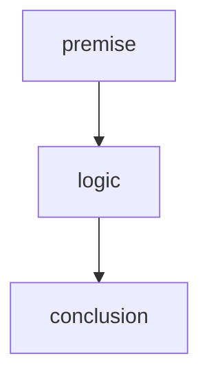

**圏論的解釈**: `Premises → Conclusion` を与える射。副作用が無いので Kleisli 合成を要しない(CCC 的な解釈も可能)。

#### 選択型(副作用関数型)

`selected = compare(premise, criteria)`

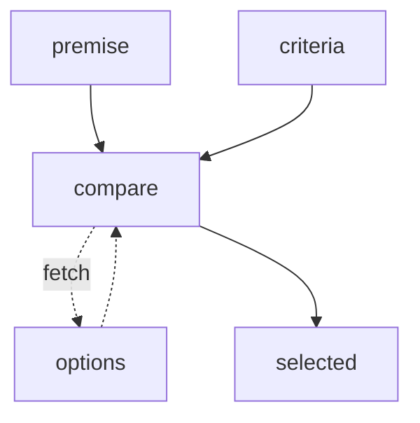

**圏論的解釈**: 効果付計算として、モナド `T` による Kleisli 射 `Premises → T Conclusion`(環境・文脈はコモナドで表せる)。

#### 適応型(環境依存関数型)

`solution = constrain(requirements, constraints)`

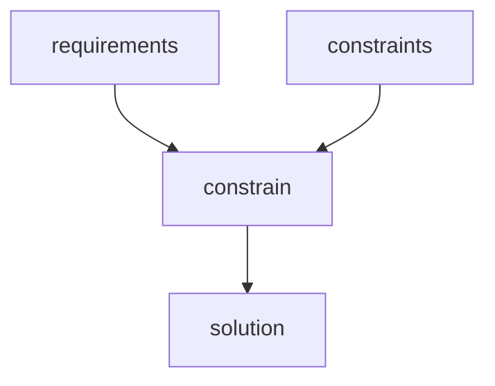

`output = transform(input, rules)`

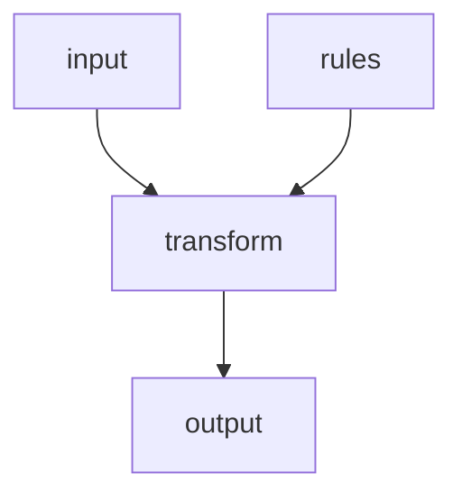

**圏論的解釈**: 環境依存の写像として、制約圏での制約保存射に対応。

#### 発想型(生成関数)

`ideas = brainstorm(issue)`

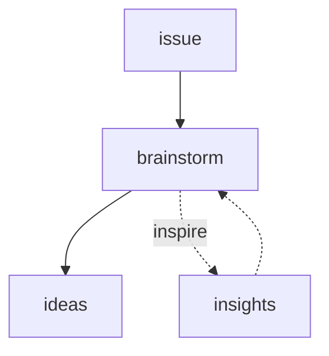

`knowledge = narrate(experience)`

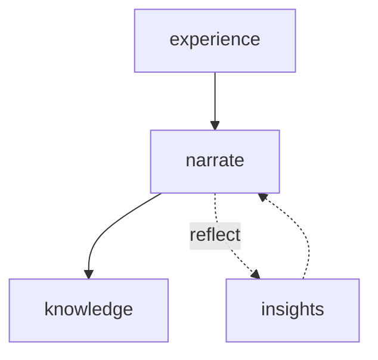

**圏論的解釈**: 段階的リフレーミングによる創造。文書上の自己関手 `R: Doc → Doc` の反復適用、もしくは商射の連鎖(情報の同一視)としてのコイコライザ列。

### 複合パターン

#### 並列型(直交分割 + 並列保持)

`outputs = parallel_preserve(logic(decompose_independent(input)))`

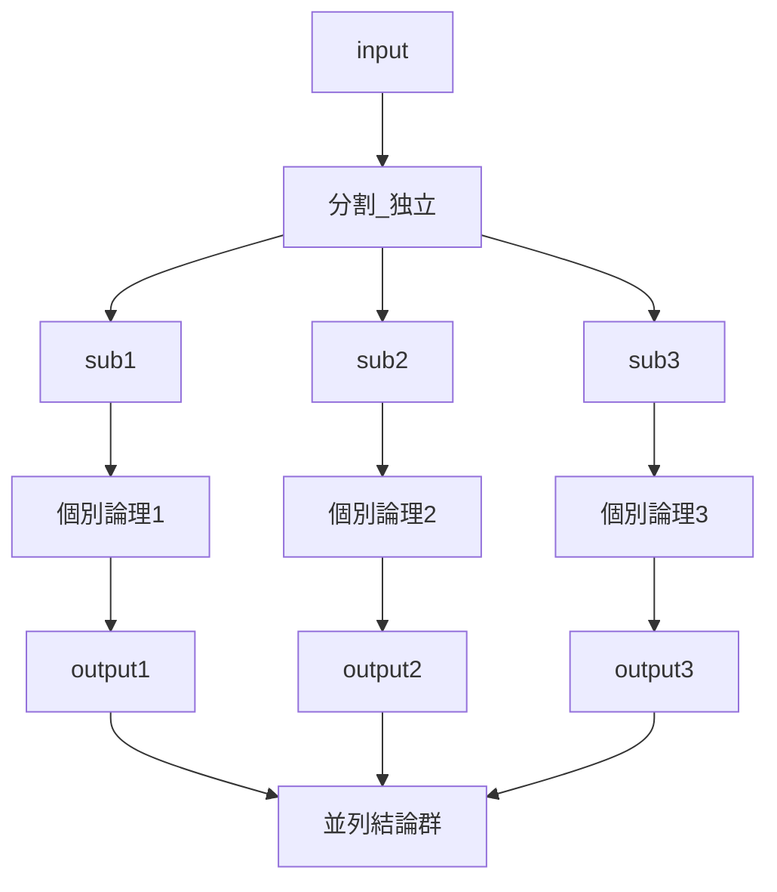

**圏論的解釈**: 直交する性質の直積 `A ≅ ∏ᵢ Aᵢ` を保持。各要素は独立して存在し続ける。

#### 合成型(分割合成 + 統合処理)

`conclusion = filter(compose(logic(decompose_independent(input))))`

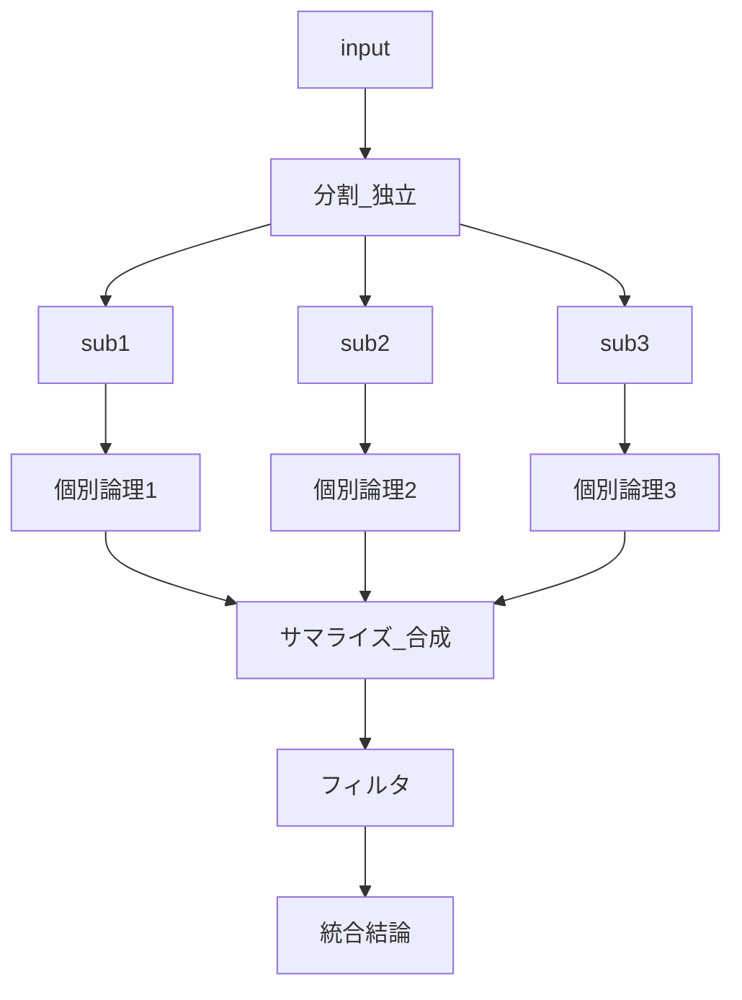

**圏論的解釈**: 直交する性質の直積 `A ≅ ∏ᵢ Aᵢ` から極限への変換 `∏ᵢ Aᵢ → lim Dᵢ`。合成は極限(limit)として表現。

#### 統合型(網羅分割 + 並列処理)

`conclusion = integrate(logic(decompose_exhaustive(input)))`

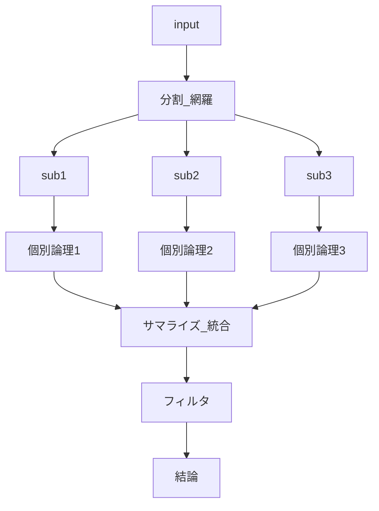

**圏論的解釈**: 対象 `A` を互いに素な部分の余積 `A ≅ ⨿ᵢ Aᵢ` とみなす網羅分割。統合は余極限(colimit)として表現。

#### 弁証法型(二項対立 + 並列処理)

`synthesis = dialectic(logic(decompose_binary(input)))`

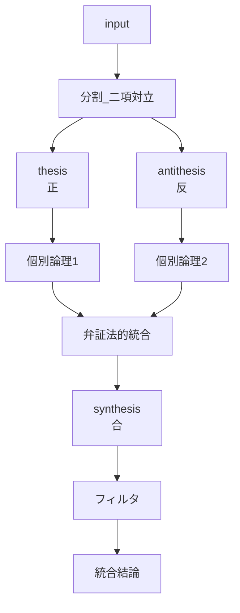

**圏論的解釈**: 対立する 2 つの視点の弁証法的統合。プッシュアウト図式による対立の解消として表現可能。

#### 段階型(依存分割 + 順序処理)

`integrated_solution = sequential_compose(decompose_dependent(input))`

**直列依存の場合**:

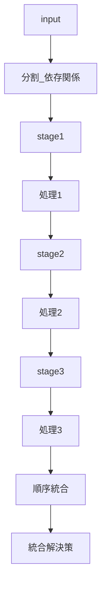

**分岐依存の場合**:

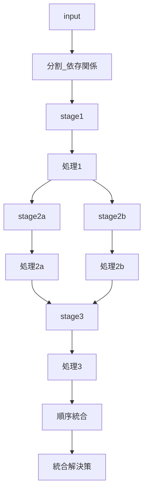

**圏論的解釈**: 段階的詳細化は情報を付加するモノ射の連鎖 `X₀ ↪ X₁ ↪ …` からなる逆系。最終仕様は射影極限 `lim Xᵢ` とみなせる。
