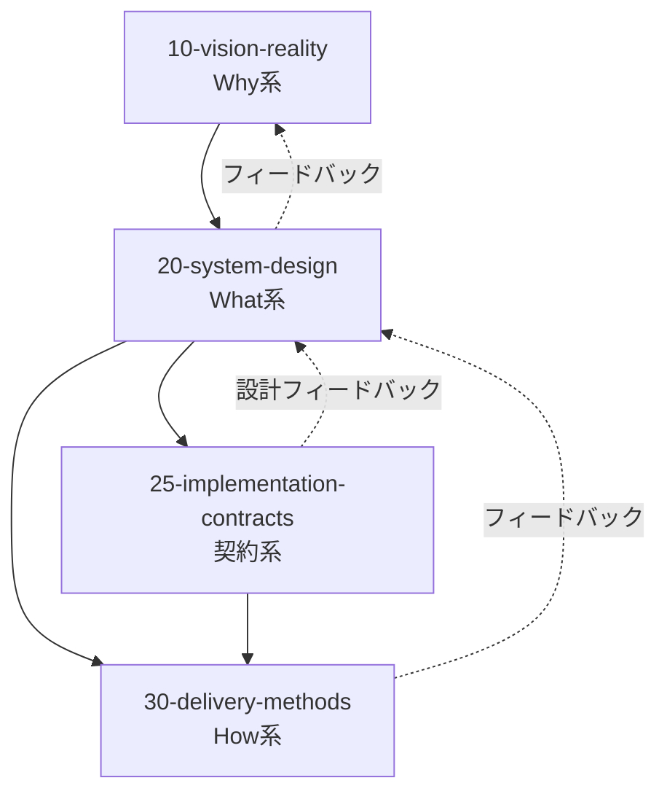
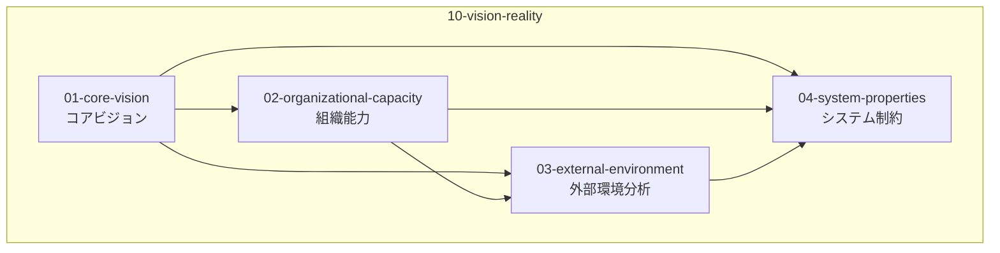
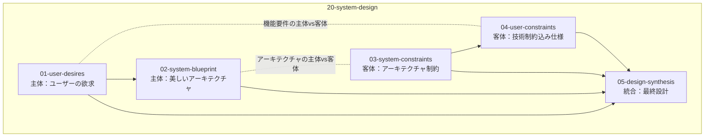
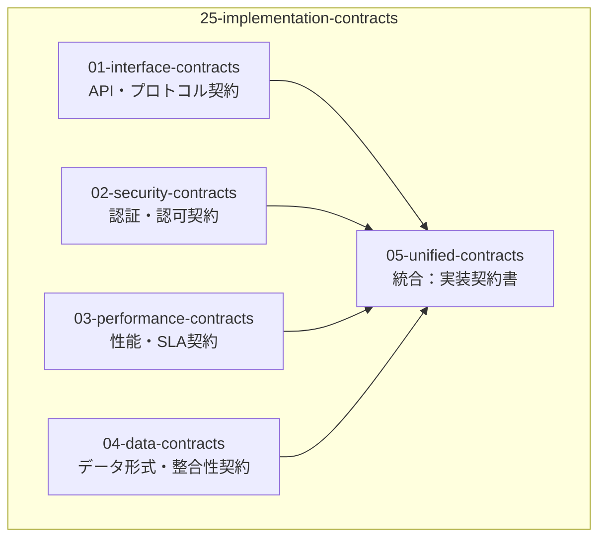
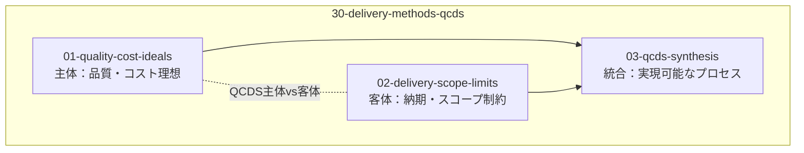
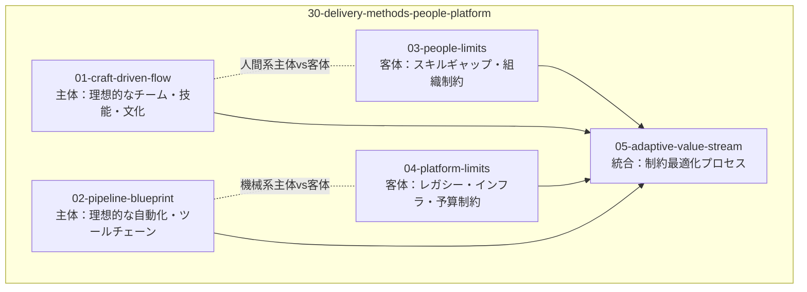
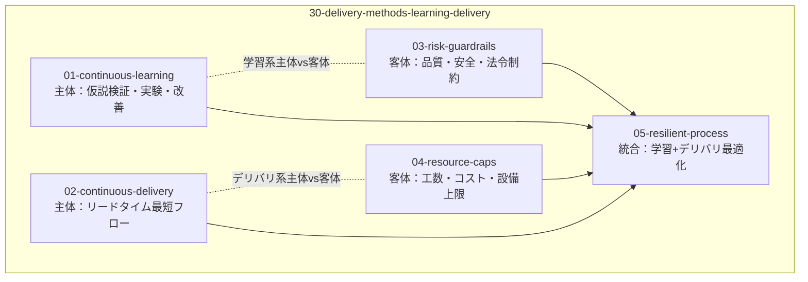
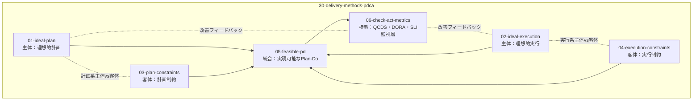

# 設計書体系構造

## 設計書体系概要とその論理的根拠

設計書は構造化 4 軸設計フレームワーク(Why/What/Contract/How)に従って体系化されます。各設計判断は「1 ファイル 1 判断」原則に基づき細分化され、前提 → 論理 → 結論構造で整理されます。

### Why/What/How の基本的役割と境界線

**Why 系**はシステムの目的と背景を扱います。ビジネス課題や理想と現実の調整を行い、要件定義段階で顧客と共に明らかにします。Why は本質的にアジャイルで柔軟に見直すべき領域であり、Why の変化に対応することがアジャイル開発の本質です。

**What 系**は実現すべき機能と構造を定義します。Kruchten の 4+1 アーキテクチャビュー（Logical, Development, Process, Physical + Scenarios）で網羅的に扱い、外部との整合性を保証するため最初に全て決め切るのが原則です。変更があれば再契約や影響範囲の明確化が必要となる、整合性を守るために事前に定義すべき領域です。

**How 系**は実装と運用の手段を扱います。コーディング規約、CI/CD、テスト戦略、リリース方式などはチーム内裁量で決められる領域であり、アジャイルで柔軟に変更可能な内部完結する実装詳細です。

**境界線の判定**は明確です。外部に影響するものは必ず What 系、内部で完結するものは How 系として扱います。「グレーゾーン」は実際には存在せず、外部影響の有無で明確に分類できます。

理想と現実のペアによる対比構造により、並行作業可能で柔軟性の高い設計書構造を実現します。各軸における理想と現実の建設的な対話により、早期のフィードバックループが形成されます。

## 構造と依存関係

### 1. 全体構造：軸間の依存関係

### 2. Why 系内部：理想・現実制約・統合解

### 3. What 系内部：ユーザー・システム軸の正反合

### 4. 契約系内部：Design by Contract

### 5. How 系内部：複数パターン

#### パターン A: QCDS 分割モデル（個人開発向け）

#### パターン B: People/Platform モデル（チーム開発向け）

#### パターン C: Learning/Delivery モデル（DevOps 向け）

#### パターン D: PDCA 二段モデル（改善重視組織向け）

## Why 系における設計判断 - なぜ作るのか

Why 系では「なぜ作るのか」という根本的な問いに対して、4 つの観点で答えます。

### 01-core-vision：理想 - ビジョン&スコープ

プロダクトビジョン・設計原則・スコープを定義します。Why の理想像は「複数のシナリオ」として表現できます。インクリメンタルに進める場合は、1 つ目のシナリオを end-to-end で実現することが重要です。ただし、全シナリオを包含する骨格（What）は事前に定義し、2 つ目以降のシナリオで整合性が崩れることを防ぎます。

### 02-organizational-capacity：組織能力

開発体制・技術選択・品質基準等の組織の技術的能力、予算・時間・設備等のリソース制約と活用方針、競合・差別化・価値提案等の市場での立ち位置を定義します。これらは組織の特性に応じた直交分割により並列分析されます。

### 03-external-environment：外部環境分析

PEST 分析（Political・Economic・Social・Technological）に基づく外部環境要因を定義します。政治的要因、経済的要因、社会的要因、技術的要因を分析し、組織が直接コントロールできない外部環境がシステム設計に与える影響を評価します。

### 04-system-properties：システム制約

ISO/IEC 25010 システム及びソフトウェア品質モデルに基づく品質制約・非機能要件を定義します。機能適合性、性能効率性、互換性、ユーザビリティ、信頼性、セキュリティ、保守性、移植性の 8 つの品質特性を網羅的に扱います。

## What 系における設計判断 - 何を作るのか

What 系では「何を作るのか」という問いに対して、[20-system-design](../20-system-design/)でユーザーが本当に欲しいものの理想を描き、技術制約込みの実現可能な仕様という現実を扱います。

### 20-system-design：What 系 - システム設計判断

システム設計は Kruchten 4+1 アーキテクチャビューモデルに基づいて構成されています：

- [01-user-desires](../20-system-design/01-user-desires/) - Scenario View（+1）：ユーザーシナリオと要求
- [02-system-blueprint](../20-system-design/02-system-blueprint/) - 4 つのアーキテクチャビュー：
  - Logical View：論理構造とコンポーネント
  - Process View：プロセスと並行性
  - Development View：開発とモジュール構成
  - Physical View：物理配置と環境
- [03-system-constraints](../20-system-design/03-system-constraints/) - アーキテクチャ制約条件
- [04-user-constraints](../20-system-design/04-user-constraints/) - 技術制約込み実現可能仕様

## How 系における設計判断 - どう作るのか

How 系では「どう作るのか」という問いに対して、[25-implementation-contracts](../25-implementation-contracts/)で契約系を、[30-delivery-methods](../30-delivery-methods/)で実装・運用方法を扱います。

### 25-implementation-contracts：契約系 - Design by Contract

C4 モデルによる実装契約の定義では、Context（システム境界と外部システムとの関係）から Container（アプリケーション内部の構成要素間契約）、Component（コンテナ内部のコンポーネント間契約）、Code（クラス・インターフェース・データ契約）まで、階層的に契約を定義します。

TBD - 現在構築中

### 30-delivery-methods：How 系 - 実装・運用方法

実装・運用方法ではアジャイル開発の正しい理解が重要です。アジャイルは What の曖昧化ではなく、Why の変化に応じるための仕組みであることを明確にします。「要件を後から決める」や「仕様を曖昧にしておく」という誤解を避け、Why の変化に対応する柔軟性を持ちながらも、What は整合性のため最初に骨格を定義し、How は継続的に改善するという適切な運用を行います。

TBD - 現在構築中

## 設計書体系の定期振り返り

構造化 4 軸設計フレームワークは、1 ファイル 1 判断原則により認知負荷を軽減し、理想と現実の対比構造により読みやすさを実現しています。この特性を活かし、設計書体系は定期的な振り返りによる価値創出を前提として運用します。

### 振り返りの価値と意義

設計書の定期振り返りは、単なる文書メンテナンスではなく、組織学習と設計品質向上のための重要な活動です。

設計判断の前提条件や根拠を再確認することで、環境変化により陳腐化した判断を早期発見できます。市場環境、技術動向、組織能力の変化により、過去の合理的判断が現在は不適切になっている可能性があります。

チーム全体での設計意図の再共有により、暗黙知化していた設計判断を顕在化し、新規参加メンバーへの効果的な文脈伝達が可能になります。設計書を単独で読むよりも、チームでの振り返りを通じて設計意図の深い理解が得られます。

### 振り返りの実施タイミング

Why の実質的な寿命が 1 年以内という現実を踏まえ、変化に対応可能な頻度での振り返りを実施します。

定期振り返りは四半期ごとに実施し、Why 系の判断根拠の妥当性、What 系の制約条件の変化有無、How 系の手法改善余地を確認します。この頻度により、Why の変化を早期検出し、設計書体系の陳腐化を防止できます。

イベント駆動の振り返りとして、新規メンバー参加時の設計意図共有、重要な技術選択前の前提条件確認、Why 変化の兆候検出時の影響範囲評価を実施します。

### 振り返りの具体的観点

Why 系では、コアビジョン・組織能力・外部環境・システム制約の各判断が現在の状況に適合しているかを確認します。経営方針の転換、市場動向の変化、競合状況の変化などにより、根本的な前提が変わっていないかを評価します。

What 系では、ユーザー要求・システム構造・制約条件・最終設計の各判断が技術進歩や要求変化に対応できているかを確認します。新技術の出現、性能要件の変化、法規制の変更などにより、過去の制約が緩和されていないかを評価します。

How 系では、実装・運用手法が組織の成熟度向上や技術スタックの変化に対応できているかを確認します。チームスキルの向上、ツールチェーンの進歩、開発プロセスの改善などにより、より効率的な手法が適用可能になっていないかを評価します。

## 結論

構造化 4 軸設計フレームワークによる設計書体系により、並行作業可能な構造を実現します。理想と現実の対比により、早期のフィードバックループが形成され、各軸で建設的な対話が生まれます。
