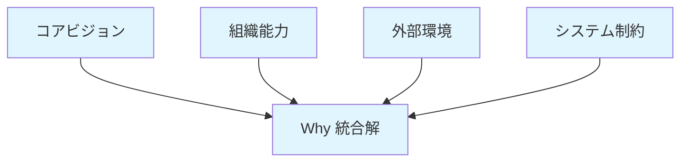
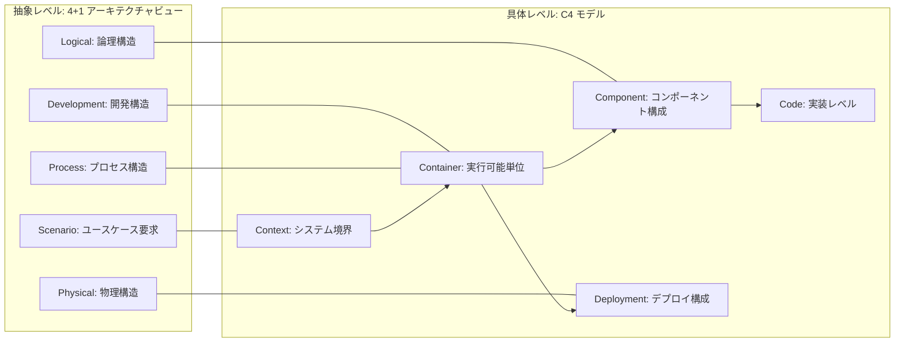
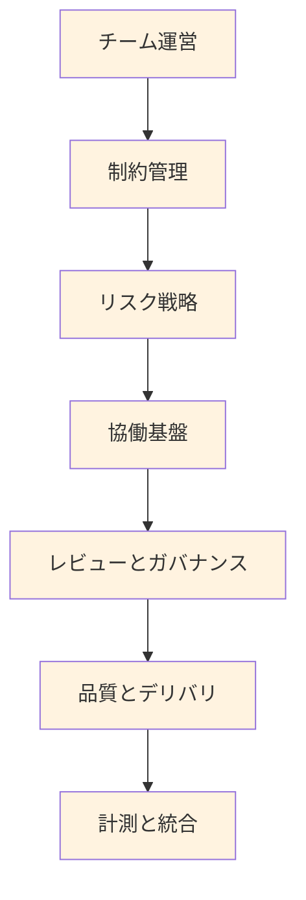

# 設計書体系構造

## 設計書体系概要とその論理的根拠

設計書は構造化 4 軸設計フレームワーク(Why/What/Contract/How)に従って体系化されます。各設計判断は「1 ファイル 1 判断」原則に基づき細分化され、前提 → 論理 → 結論構造で整理されます。

### 4+1 ビュー・Why/What/How・C4 モデルの統合構造

#### Why 系: 目的と背景の統合

#### What 系: 4+1 アーキテクチャビューと C4 階層化

#### How 系: プロセスと手法の段階的構築

### Why/What/Contract/How の基本的役割と境界線

**Why 系**はシステムの目的と背景を扱います。ビジネス課題や理想と現実の調整を行い、要件定義段階で顧客と共に明らかにします。Why は本質的にアジャイルで柔軟に見直すべき領域であり、Why の変化に対応することがアジャイル開発の本質です。

**What 系**は「何を作るか」を定義します。Kruchten の 4+1 アーキテクチャビュー(Logical, Development, Process, Physical + Scenarios)により機能・構造・技術選択の論理的根拠を確立します。技術は手段ではなく可能性の境界を定める制約であり、設計判断の基盤となる領域です。

**Contract 系**は「どのような実装契約で作るか」を定義します。C4 モデル(Context, Container, Component, Code)により What 系の設計判断を具体的な実装契約に落とし込みます。設計の論理的根拠と実装の橋渡しを行い、外部との整合性を保証する契約層です。

**How 系**は「どのような方法で作るか」を定義します。チーム運営、開発プロセス、品質保証の手法など、Contract 系で決定された実装契約を実現するための方法論を扱います。チーム内裁量で決められ、継続的な改善・学習により柔軟に変更可能な領域です。

**4+1 と C4 の逆転現象対策**として、What 系で論理的根拠をまず確立し、Contract 系で段階的に肉付けする 2 層構造を採用します。これによりトップダウンの「フェーズ化の罠」(Development/Process 軽視による実装破綻)とボトムアップの「論理化不足の罠」(Container 根拠不足によるアーキテクチャ不在)を相互補完で解決します。

**境界線の判定**は「設計判断」「実装契約」「実現方法」の違いです。論理的根拠に関わるものは What 系、具体的契約に関わるものは Contract 系、プロセス・手順に関わるものは How 系として扱います。「グレーゾーン」は実際には存在せず、この観点で明確に分類できます。

理想と現実のペアによる対比構造により、並行作業可能で柔軟性の高い設計書構造を実現します。各軸における理想と現実の建設的な対話により、早期のフィードバックループが形成されます。

## 設計書体系の定期振り返り

構造化 4 軸設計フレームワークは、1 ファイル 1 判断原則により認知負荷を軽減し、理想と現実の対比構造により読みやすさを実現しています。この特性を活かし、設計書体系は定期的な振り返りによる価値創出を前提として運用します。

### 振り返りの価値と意義

設計書の定期振り返りは、単なる文書メンテナンスではなく、組織学習と設計品質向上のための重要な活動です。

設計判断の前提条件や根拠を再確認することで、環境変化により陳腐化した判断を早期発見できます。市場環境、技術動向、組織能力の変化により、過去の合理的判断が現在は不適切になっている可能性があります。

チーム全体での設計意図の再共有により、暗黙知化していた設計判断を顕在化し、新規参加メンバーへの効果的な文脈伝達が可能になります。設計書を単独で読むよりも、チームでの振り返りを通じて設計意図の深い理解が得られます。

### 振り返りの実施タイミング

Why の実質的な寿命が 1 年以内という現実を踏まえ、変化に対応可能な頻度での振り返りを実施します。

定期振り返りは四半期ごとに実施し、Why 系の判断根拠の妥当性、What 系の制約条件の変化有無、How 系の手法改善余地を確認します。この頻度により、Why の変化を早期検出し、設計書体系の陳腐化を防止できます。

イベント駆動の振り返りとして、新規メンバー参加時の設計意図共有、重要な技術選択前の前提条件確認、Why 変化の兆候検出時の影響範囲評価を実施します。

### 振り返りの具体的観点

Why 系では、コアビジョン・組織能力・外部環境・システム制約の各判断が現在の状況に適合しているかを確認します。経営方針の転換、市場動向の変化、競合状況の変化などにより、根本的な前提が変わっていないかを評価します。

What 系では、ユーザー要求・システム構造・制約条件・最終設計の各判断が技術進歩や要求変化に対応できているかを確認します。新技術の出現、性能要件の変化、法規制の変更などにより、過去の制約が緩和されていないかを評価します。

How 系では、実装・運用手法が組織の成熟度向上や技術スタックの変化に対応できているかを確認します。チームスキルの向上、ツールチェーンの進歩、開発プロセスの改善などにより、より効率的な手法が適用可能になっていないかを評価します。

## 結論

構造化 4 軸設計フレームワークによる設計書体系により、並行作業可能な構造を実現します。理想と現実の対比により、早期のフィードバックループが形成され、各軸で建設的な対話が生まれます。
