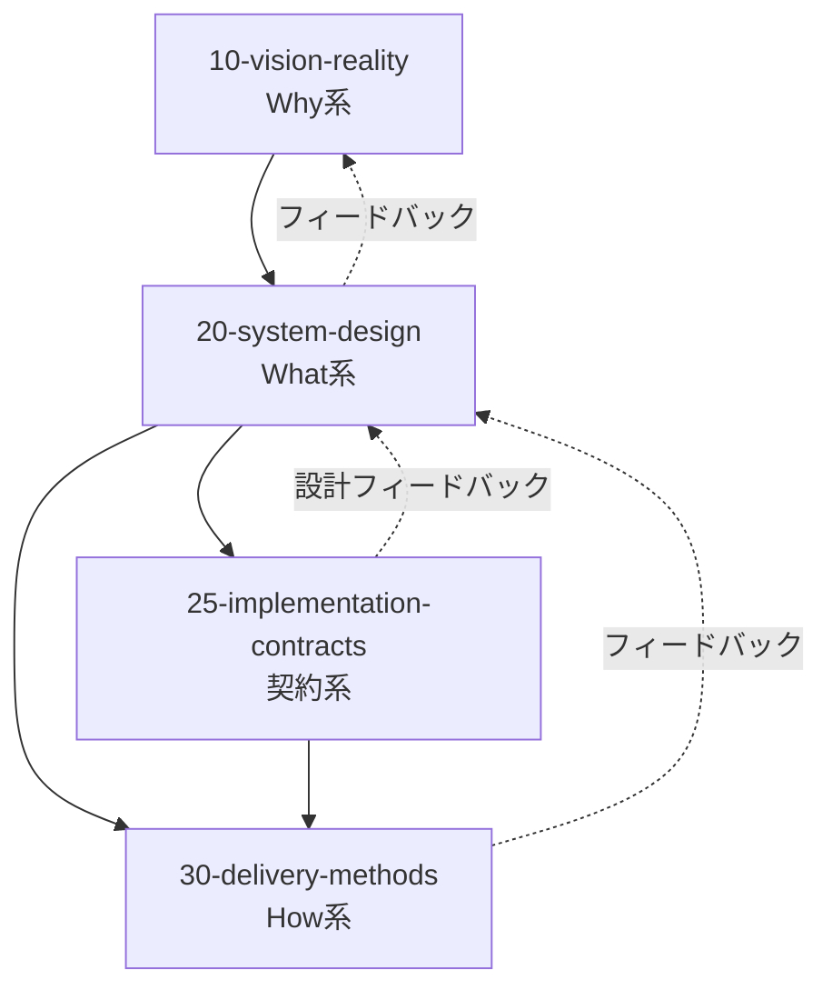
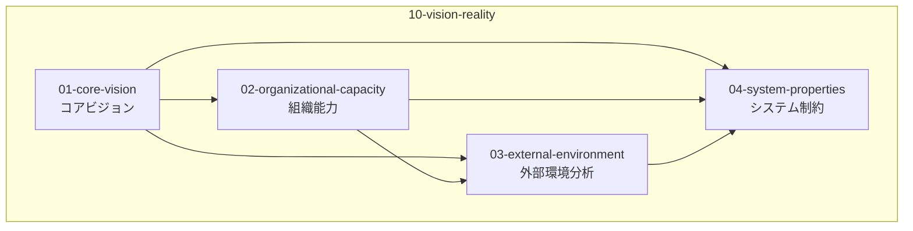
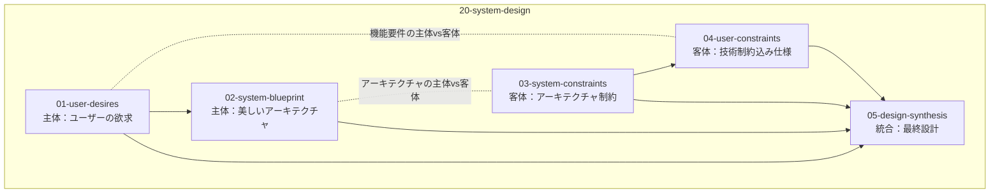
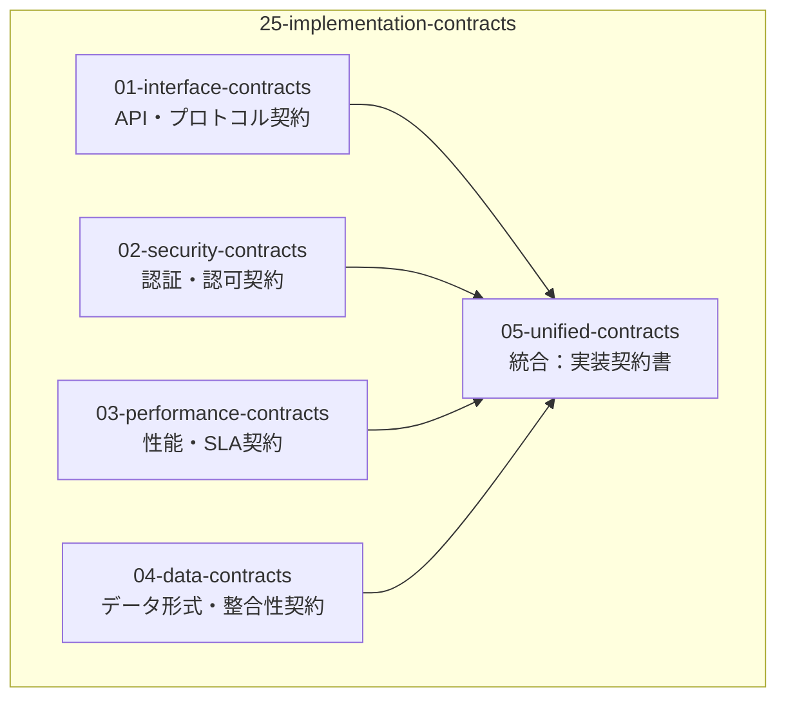
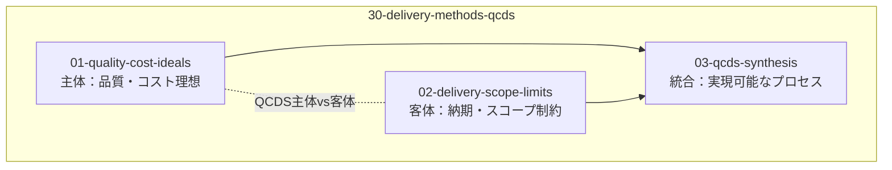
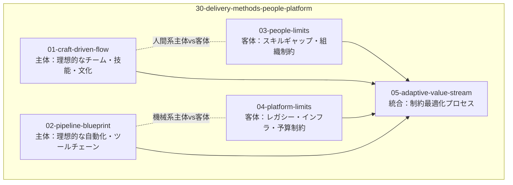
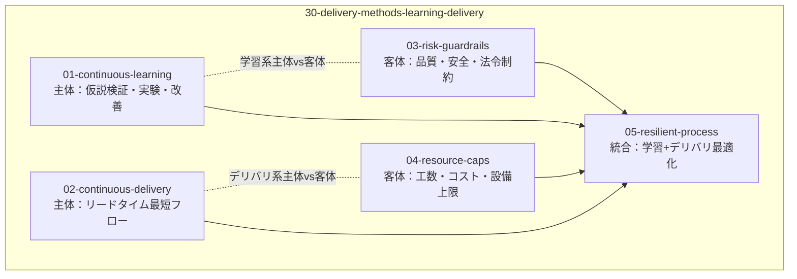
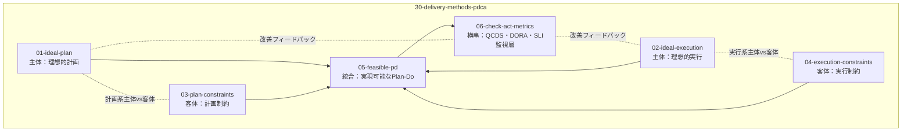

# 設計書体系ディレクトリ構造

## 概要

構造化 4 軸設計フレームワーク(Why/What/Contract/How)の実際のディレクトリ構成と、各ファイル間の依存関係を定義します。この文書は [design-structure.md](design-structure.md) で説明された論理的根拠を、具体的なファイル配置として実装するためのガイドです。

## 構造と依存関係

### 1. 全体構造：軸間の依存関係

### 2. Why 系内部：理想・現実制約・統合解

### 3. What 系内部：ユーザー・システム軸の正反合

### 4. 契約系内部：Design by Contract

### 5. How 系内部：複数パターン

#### パターン A: QCDS 分割モデル(個人開発向け)

#### パターン B: People/Platform モデル(チーム開発向け)

#### パターン C: Learning/Delivery モデル(DevOps 向け)

#### パターン D: PDCA 二段モデル(改善重視組織向け)

## Why 系における設計判断 - なぜ作るのか

Why 系では「なぜ作るのか」という根本的な問いに対して、4 つの観点で答えます。

### 01-core-vision：理想 - ビジョン&スコープ

プロダクトビジョン・設計原則・スコープを定義します。Why の理想像は「複数のシナリオ」として表現できます。インクリメンタルに進める場合は、1 つ目のシナリオを end-to-end で実現することが重要です。ただし、全シナリオを包含する骨格(What)は事前に定義し、2 つ目以降のシナリオで整合性が崩れることを防ぎます。

### 02-organizational-capacity：組織能力

開発体制・技術選択・品質基準等の組織の技術的能力、予算・時間・設備等のリソース制約と活用方針、競合・差別化・価値提案等の市場での立ち位置を定義します。これらは組織の特性に応じた直交分割により並列分析されます。

### 03-external-environment：外部環境分析

PEST 分析(Political・Economic・Social・Technological)に基づく外部環境要因を定義します。政治的要因、経済的要因、社会的要因、技術的要因を分析し、組織が直接コントロールできない外部環境がシステム設計に与える影響を評価します。

### 04-system-properties：システム制約

ISO/IEC 25010 システム及びソフトウェア品質モデルに基づく品質制約・非機能要件を定義します。機能適合性、性能効率性、互換性、ユーザビリティ、信頼性、セキュリティ、保守性、移植性の 8 つの品質特性を網羅的に扱います。

## What 系における設計判断 - 何を作るのか

What 系では「何を作るのか」という問いに対して、[20-system-design](../20-system-design/)でユーザーが本当に欲しいものの理想を描き、技術制約込みの実現可能な仕様という現実を扱います。

### 20-system-design：What 系 - システム設計判断

システム設計は Kruchten 4+1 アーキテクチャビューモデルに基づいて構成されています：

- [01-user-desires](../20-system-design/01-user-desires/) - Scenario View(+1)：ユーザーシナリオと要求
- [02-system-blueprint](../20-system-design/02-system-blueprint/) - 4 つのアーキテクチャビュー：
  - Logical View：論理構造とコンポーネント
  - Process View：プロセスと並行性
  - Development View：開発とモジュール構成
  - Physical View：物理配置と環境
- [03-system-constraints](../20-system-design/03-system-constraints/) - アーキテクチャ制約条件
- [04-user-constraints](../20-system-design/04-user-constraints/) - 技術制約込み実現可能仕様

## How 系における設計判断 - どう作るのか

How 系では「どう作るのか」という問いに対して、[25-implementation-contracts](../25-implementation-contracts/)で契約系を、[30-delivery-methods](../30-delivery-methods/)で実装・運用方法を扱います。

### 25-implementation-contracts：契約系 - Design by Contract

C4 モデルによる実装契約の定義では、Context(システム境界と外部システムとの関係)から Container(アプリケーション内部の構成要素間契約)、Component(コンテナ内部のコンポーネント間契約)、Code(クラス・インターフェース・データ契約)まで、階層的に契約を定義します。

TBD - 現在構築中

### 30-delivery-methods：How 系 - 実装・運用方法

実装・運用方法ではアジャイル開発の正しい理解が重要です。アジャイルは What の曖昧化ではなく、Why の変化に応じるための仕組みであることを明確にします。「要件を後から決める」や「仕様を曖昧にしておく」という誤解を避け、Why の変化に対応する柔軟性を持ちながらも、What は整合性のため最初に骨格を定義し、How は継続的に改善するという適切な運用を行います。

TBD - 現在構築中

## ディレクトリ構成の運用ガイド

### ファイル作成時のルール

1. **1 ファイル 1 判断原則**：各ファイルは単一の設計判断のみを扱う
2. **番号順序**：依存関係に基づいた論理的順序で番号を付与
3. **マーカー活用**：ファイル間の情報継承にはマーカーを使用

### 依存関係の管理

- **前方依存**：後続番号のファイルは前番号のファイルに依存可能
- **循環依存禁止**：同一軸内での循環依存は避ける
- **軸間依存**：Why → What → Contract → How の順序を守る

### 変更時の影響範囲

設計変更時は、依存関係図を参照して影響範囲を特定し、関連ファイルの整合性を確認する必要があります。特に統合ファイル(05-design-synthesis, 05-unified-contracts 等)は複数の前提ファイルに依存するため、変更時は注意深い検証が必要です。

## 結論

この実装構造により、論理的根拠に基づいた具体的なディレクトリ配置が実現され、設計書体系の保守性と拡張性が確保されます。
