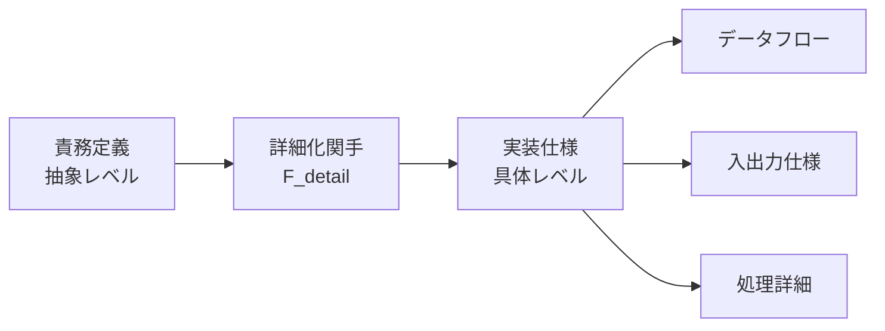

# はじめに

このファイルは、プロジェクトで用いる**ドキュメントの構成ポリシー**と、その背景となる考え方を説明します。

## アジャイル宣言と comprehensive documentation

アジャイル宣言では「包括的なドキュメントよりも動くソフトウェアを」と謳われていますが、本ドキュメントは、生成 AI によって情報の生成・整理コストが低下した現在、あえて **comprehensive documentation(包括的ドキュメント)** を試みる方針を述べるものです。

これは実験的な試みであり、ドキュメント主導の古い間違ったやり方を肯定するものはありません。あくまで GitLab のようなリモート組織や生成 AI によってドキュメントのコストが軽減しかつエージェントによるコーディングの重要性が増した結果としてプロダクト開発の新しい形を模索する試みです。繰り返しますが、1980 年代のドキュメント主導の古い間違ったやり方を肯定するものはありません。

## ドキュメントのタイプ

ドキュメントは大きく次の 3 種に分類します。

- **個別タイプ**：単体で完結する論理展開をもつもの
  - 前提 → 論理 → 結論(純粋関数的な型)
  - 前提 → 調査 → 論理 → 結論(外部 I/O を含む型)
- **統合型タイプ**：分解した要素を再び合成／統合して全体をまとめるもの
  - 網羅分割: `pattern-comprehensive`
  - 分割合成: `pattern-composite`
- **並列型タイプ**：分解した要素をそのまま並列で保持・管理するもの
  - 直交分割: `pattern-parallel`
- **段階型タイプ**：段階的なプロセスにより最終成果を構築するもの
  - 段階的詳細化：要素を段階的に詳細化して設計を構築
  - 解空間制限：制約を段階的に追加し、選択肢を絞り込み

それぞれ次の `doc_type` を持ちます。

- **個別タイプ**
  - 前提 → 論理 → 結論(純粋関数的な型): `pattern-logic`
  - 前提 → 調査 → 論理 → 結論(外部 I/O を含む型): `pattern-research`
  - 段階的リフレーミングによる創造(reframing 型): `pattern-reframing`
  - 責務から実装への詳細化(UI 要素型): `pattern-ui`
- **統合型タイプ**：分解した要素を再び合成／統合して全体をまとめるもの
  - 網羅分割: `pattern-comprehensive`
  - 分割合成: `pattern-composite`
- **並列型タイプ**：分解した要素をそのまま並列で保持・管理するもの
  - 直交分割: `pattern-parallel`
- **段階型タイプ**：段階的なプロセスにより最終成果を構築するもの
  - 段階的詳細化: `pattern-elaboration`
  - 解空間制限: `pattern-step`

## 個別タイプ

分解された要素は、次の 2 つの個別パターンに還元できます。

### 1. 前提 → 論理 → 結論(純粋関数的な型)

副作用のない関数のように、与えた前提と知識から結論が導かれる型です。時間経過の影響を受けにくい安定した論証に向きます。

**構成**：

> **注**：以下の見出しは**そのまま**使用してください。リンタでチェックされます。

- 前提
- 論理
- 結論

### 2. 前提 → 調査 → 論理 → 結論(外部 I/O を含む型)

技術選定のように、途中で情報収集や検証を含む型です。外部環境の変化に応じて結論も更新されます。

**構成**：

> **注**：以下の見出しは**そのまま**使用してください。リンタでチェックされます。

- 前提
- 調査
- 論理
- 結論

### 3. 段階的リフレーミングによる創造(reframing 型)

認知的リフレーミング関手の連続適用により、体験から理想解決策まで段階的に導出する型です。圏論的には「商構造による解空間の段階的収束」として表現されます。

**構成**：

> **注**：以下の見出しは**そのまま**使用してください。リンタでチェックされます。

- 入力対象
- 処理フロー: mermaid で流れを書きます(後述)
- リフレーミングプロセス
- 出力対象

**適用例**：

- 体験リフレーミング(個別体験 → 問題概念)
- 問題リフレーミング(課題 → 境界条件)
- 制約リフレーミング(制約 → ビジョン)
- 理想リフレーミング(ビジョン → アプローチ)
- 手法リフレーミング(アプローチ → 具体体験)

### 4. 責務から実装への詳細化(UI 要素型)

抽象的な責務定義から具体的な実装仕様への写像による変換を行う型です。圏論的には「詳細化関手による構造保存変換」として表現されます。関手の適用により、抽象圏の対象(責務)が具体圏の対象(実装仕様)に写され、その際に本質的な構造が保存されます。

**構成**：

> **注**：以下の見出しは**そのまま**使用してください。リンタでチェックされます。

- 責務
- 責務から仕様への詳細化
- データフロー
- 入力
- 処理
- 出力
- 備考

**圏論的解釈**：

- **抽象圏**: 責務や機能要求の圏。対象は「何をするか」の抽象定義
- **具体圏**: 実装仕様の圏。対象は「どうやるか」の具体定義
- **詳細化関手**: 抽象圏から具体圏への関手。構造保存性により本質的な責務が実装に正しく反映される
- **自然変換**: 異なる UI 要素間での詳細化プロセスの一貫性を保証

## 統合型タイプ

### 統合型タイプの分解

まず論理づけのために対象を分解します。分解には網羅性を重視する方式と独立性を重視する方式の 2 つがありますが、多くの場面では網羅性を優先します。網羅性を取る場合は、

- 根拠(参照・基準・判断理由)を明記する
- 可能なら**MECE**を目指す
- IEEE など外部の標準・分類の採用を検討する

といった原則に従います。

### 統合型タイプの合成・統合

分解後は、要素の結論を合成・統合します。手順は次のとおりです。

1. 各要素から**結論のみ**を抜き出す(後述のマーカーを用いる)。
2. 結論をまとめ、重複・冗長を整理し、必要に応じて分類・並べ替え・縮約を行う。

> 重要な運用ルール：
>
> - 1 ステップで 1 操作のみ行う。例：分類と重複削除を同時に行わない。ワーキングメモリの消費と認知負荷を抑えるためです。
> - 省略は明示的に行う。情報を落とす場合は、必ず 1 ステップを割き、根拠と差分を残します(勝手に省略しない)。

### 網羅分割の構成

> **注**：以下の見出しは**そのまま**使用してください。リンタでチェックされます。

- 目次
- 概要
- 処理フロー: mermaid で流れを書きます(後述)
- 網羅分割: なぜこの分割方法を選んだか、なぜ網羅しているかの根拠を記載してください。
- 並列処理: 子の Markdown 文書のリンクの説明とともに、結論を抜き出してください。
- 合成処理: 結論を結論集へ継承するためにステップバイステップで整理してください。

#### 直交分割の構成

> **注**：以下の見出しは**そのまま**使用してください。リンタでチェックされます。

- 目次: ページ内リンク形式で各セクションへのリンクを記載してください。
- 概要
- 処理フロー: mermaid で流れを書きます(後述)
- 直交分割: なぜ直交なのかの根拠を記載してください。
- 並列関係ファイル: 直交要素への個別リンクと各要素の概要を記載してください。

#### 分割合成の構成

> **注**：以下の見出しは**そのまま**使用してください。リンタでチェックされます。

- 目次
- 概要
- 処理フロー: mermaid で流れを書きます(後述)
- 独立分割: なぜ分割できるのかの根拠を記載してください。
- 並列処理: 子の Markdown 文書のリンクの説明とともに、結論を抜き出してください。
- 合成処理: 結論を結論集へ継承するためにステップバイステップで整理してください。

## 段階型タイプ

段階的なプロセスにより最終成果を構築する型です。段階的詳細化では要素を段階的に詳細化して設計を構築し、解空間制限では不確実な要件や広すぎる選択肢を段階的に狭めていきます。

### 段階的詳細化の構成

段階的詳細化は次の見出し構成に従います。設計の異なる観点を段階的に詳細化し、前のステップの結果が次のステップの前提となります。

> **注**：以下の見出しは**そのまま**使用してください。リンタでチェックされます。

- 目次
- 概要
- 処理フロー: mermaid で流れを書きます(後述)
- 段階的詳細化: なぜこの詳細化順序を選んだかの根拠を記載してください。
- 直列処理: ステップ 1 → ステップ 2 → ... の順序で、各ステップは子の Markdown 文書で作られます。前のステップの結果が次のステップの前提となります。
- 統合処理: 各ステップの結果を統合し、結論集への継承のために整理してください。

### 解空間制限の構成

解空間制限は次の見出し構成に従います。ステップ 1〜n は有向非巡回グラフであればよく、直線的である必要はありません。

> **注**：以下の見出しは**そのまま**使用してください。リンタでチェックされます。

- 目次
- 概要
- 処理フロー: mermaid で流れを書きます(後述)
- ステップ 1: まず解空間を制限するためのステップを 1 つ取り上げます。そのステップは子の Markdown 文書で作られます。
- ステップ 2: ステップ 1 の結果を元に、次のステップを組み立てます。同様に子の Markdown 文書で作られます。
- ステップ 3...ステップ n: 同様に進めます。

## マーカー仕様

ドキュメント間での情報継承や統合作業のマーカー仕様については[マーカー仕様](marker-specification.md)を参照してください。

## 統合方法

### 統合の目的と処理内容

統合は情報を蒸留する多様な目的を持つ。次の 3 つはあくまで例である。

- 優先度付けによる重要度判定
  - 大量の情報から「何が本当に重要か」を判定
  - 必須・任意・除外などのレベル分けで優先順位を明確化
- 重複排除による情報整理
  - 意図が全く同じ重複要素の除去
- 分類・体系化による構造整理
  - 散在する情報を体系的に分類・整理
  - 関係性や依存関係の明確化

### 統合のルール

統合方法は次のルールを適用する。

- 統合作業前にどういう観点で倒すべきかを必ずユーザーと相談して決めること。
- 統合は 1 ステップごとに 1 つの観点で行うこと。その際観点以外のところは一切触れず、そのままコピーすること。
  - 例えば「必須」「任意」「除外」と分類する際は、まずそれぞれが「必須」「任意」「除外」のどれかを決めることが 1 つのステップ。そして決めた分類ごとにまとめるのが次のステップ。この際、分類以外の内容は一切触れず、そのままコピーすること。
- 統合を「要約」「省略」「削除」と誤解して、重要な情報を勝手に落とすことは絶対禁止。必要な場合は必ず 1 つのステップとして独立して行い、観点はユーザーと相談して決めること。

### 禁止事項

- パターン確認なしでの統合作業開始
- マーカー内容の要約・省略・改変
- 処理手順の勝手な変更
- フィルタ処理の省略
