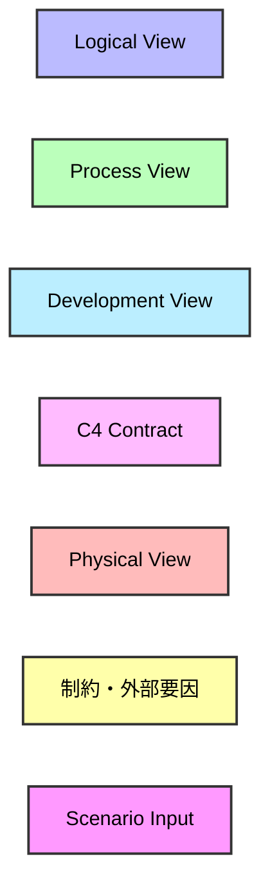
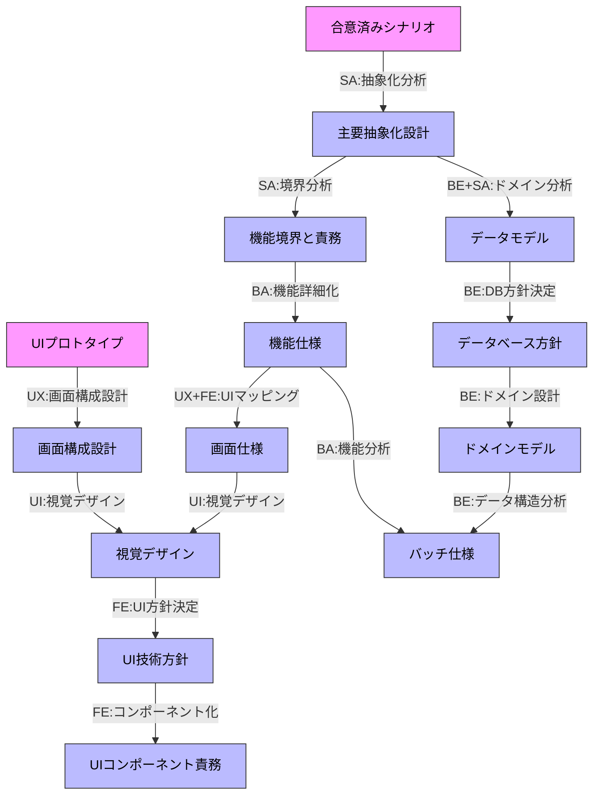
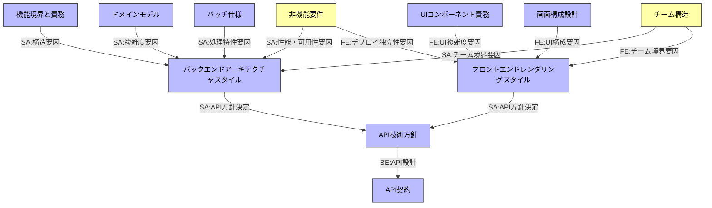
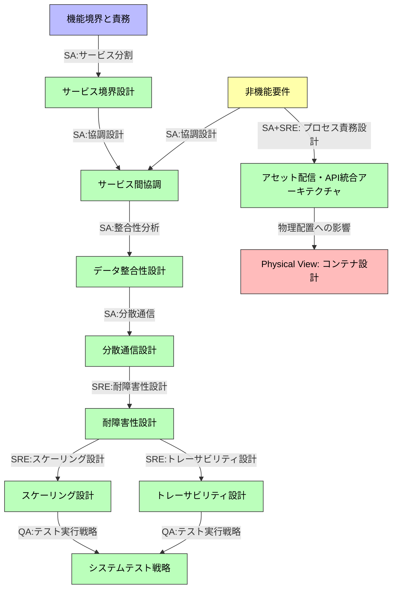
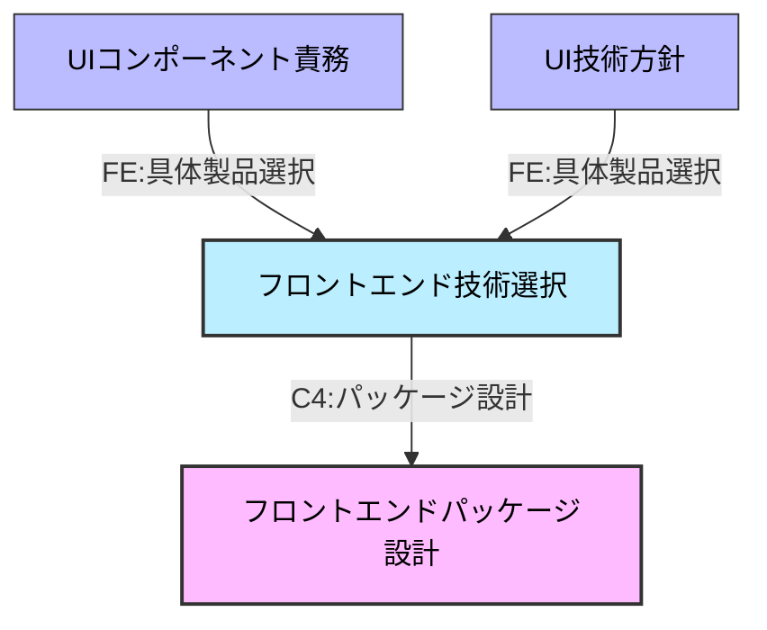
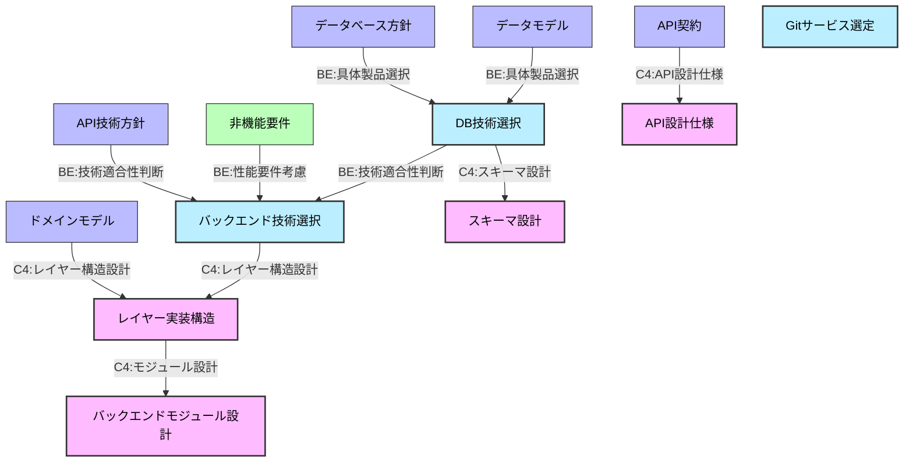
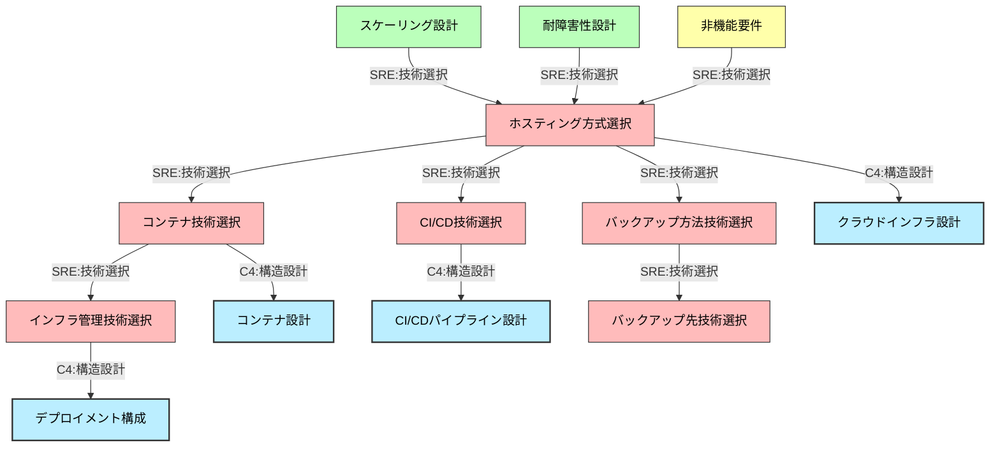
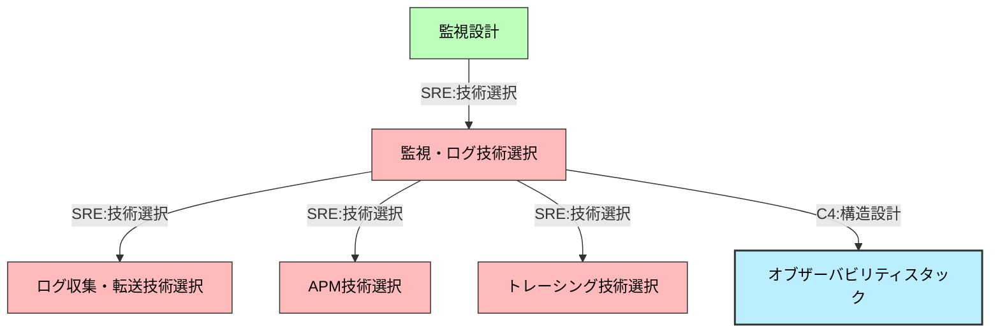
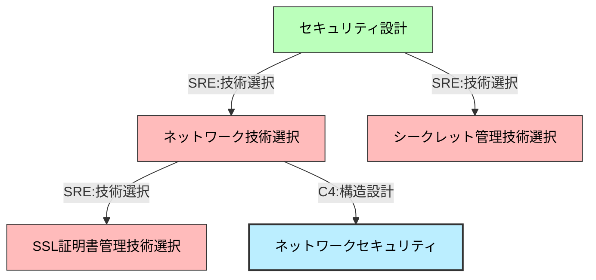

# Kruchten 4+1 アーキテクチャビューモデル分析

## はじめに

設計判断項目を Kruchten 4+1 アーキテクチャビューモデルの各ビューに適切に分類するため、原典の定義に基づいて各項目がどのビューに属するかを論理的に分析する。

## 図表の色の凡例

## 分析のアプローチ

各ビューの本質的な関心事を明確化し、設計判断項目がどのビューに最適に配置されるかを論理的に導出する。

## 分析

### 原典の定義

Kruchten 4+1 アーキテクチャビューモデルは、Philippe Kruchten が 1995 年に提唱したソフトウェアアーキテクチャの記述フレームワークである。4 つの主要ビュー(Logical、Process、Development、Physical)と、これらを統合する Scenario ビュー("+1")から構成される。

原典論文: <https://www.cs.ubc.ca/~gregor/teaching/papers/4%2B1view-architecture.pdf>

### 4+1 ビューの基本構造

**フィードバック関係**: 各ビューは相互に制約や影響を与え合う。例えば、Process View の性能制約が Logical View の設計を見直させ、Physical View の運用制約が Development View の技術選択に影響する。これにより、全体的に整合性のとれたアーキテクチャが実現される。

### Scenario

> The elements in the four views are shown to work together seamlessly by the use of a small set of important scenarios —instances of more general use cases—for which we describe the corresponding scripts (sequences of interactions between objects, and between processes) as described by Rubin and Goldberg.
> The scenarios are in some sense an abstraction of the most important requirements. Their design is expressed using object scenario diagrams and object interaction diagrams.
> This view is redundant with the other ones (hence the “+1”), but it serves two main purposes:
>
> - as a driver to discover the architectural elements during the architecture design as we will describe later
> - as a validation and illustration role after this architecture design is complete, both on paper and as the
>   starting point for the tests of an architectural prototype.

**職種説明**:

- **BA(ビジネスアナリスト)**: ユースケース分析、ユースケース仕様の作成を担当
- **UX(UX デザイナー)**: ユーザー体験設計、ジャーニーマップの作成を担当
- **UI(UI デザイナー)**: プロトタイプ設計を担当
- **FE(フロントエンドエンジニア)**: UI 実装可能性を考慮したプロトタイプ作成・検証に参加
- **QA(QA/テスト担当)**: テスト観点での仕様検証、UI 操作可能性検証を担当
- **PO(プロダクトオーナー)**: 価値確認と最終合意形成を担当

### Logical View

> The logical architecture primarily supports the functional requirements—what the system should provide in terms of services to its users. The system is decomposed into a set of key abstractions, taken (mostly) from the problem domain, in the form of objects or object classes. They exploit the principles of abstraction, encapsulation, and inheritance. This decomposition is not only for the sake of functional analysis, but also serves to identify common mechanisms and design elements across the various parts of the system. We use the Rational/Booch approach for representing the logical architecture, by means of class diagrams and class templates.
> A class diagram shows a set of classes and their logical relationships: association, usage, composition, inheritance, and so forth. Sets of related classes can be grouped into class categories. Class templates focus on each individual class; they emphasize the main class operations, and identify key object characteristics. If it is important to define the internal behavior of an object, this is done with state transition diagrams, or state charts. Common mechanisms or services are defined in class utilities.
> Alternatively to an OO approach, an application that is very data-driven may use some other form of logical view, such as E-R diagrams.

#### アーキテクチャスタイル決定前の設計フロー

#### アーキテクチャスタイル決定とその後の設計フロー

**技術方針決定**:

Logical View では機能要件から導出される技術方針レベルの判断を行う：

- **UI 技術方針**: SPA vs MPA、コンポーネント指向 vs ページ指向(ユーザーインタラクションの特性から)
- **API 技術方針**: REST vs GraphQL vs gRPC(データアクセスパターン、クライアント多様性から)
- **データベース方針**: RDBMS vs NoSQL、トランザクション vs 柔軟性(データ構造の複雑さ、整合性要件から)

これらは純粋に論理設計から導出可能な技術判断であり、具体的な製品選択は後続のビューで行う。

**データモデルとドメインモデルの設計アプローチ**:

この設計では**DOA(Data Oriented Approach)**に基づき「データモデル → ドメインモデル」の順序を採用している。データ構造を先に確定してからドメインロジックを設計する考え方である。

一方、**DDD(Domain Driven Design)**では「ドメインモデル → データモデル」の順序を取り、ビジネスロジックを先に設計してからデータ永続化を考える。プロダクトの性質に応じてアプローチを選択し、両者の協調設計も重要である。

**職種説明**:

- **SA(システムアーキテクト)**: システム全体の論理設計、抽象化、境界定義を担当
- **BA(ビジネスアナリスト)**: 機能要件の詳細化を担当
- **UX(UX デザイナー)**: 画面構成設計、UI マッピングを担当
- **UI(UI デザイナー)**: 視覚デザイン、デザインシステムを担当
- **FE(フロントエンドエンジニア)**: UI コンポーネント設計、実装を担当
- **BE(バックエンドエンジニア)**: データモデル、ドメインモデル、API 設計を担当

<!-- GLOBAL_CONCLUSION_BEGIN: logical-view -->

Logical View では以下の成果物を段階的に作成する:

1. **主要抽象化設計** - システムの根本概念を定義し、ドメインの本質的な概念を明確化する
2. **機能境界と責務** - Bounded Context を定義し、論理レベルでの境界設定を行う
3. **機能仕様** - 機能要件を詳細化し、具体的な機能定義を行う
4. **画面構成設計** - ユーザーインターフェースの構成を設計する
5. **視覚デザイン** - ユーザーインターフェースの視覚的設計を行う
6. **UI 技術方針** - UI 実装の技術的方針を決定する(SPA vs MPA 等)
7. **UI コンポーネント責務** - UI コンポーネントの責務と構造を定義する
8. **データモデル** - DOA に基づきデータ構造を確立する
9. **データベース方針** - データベース技術の方針を決定する(RDBMS vs NoSQL 等)
10. **ドメインモデル** - ビジネスロジックとドメイン設計を行う
11. **バッチ仕様** - バッチ処理要件を分析し仕様化する
12. **バックエンドアーキテクチャスタイル** - 機能境界・非機能要件・ドメイン複雑度・バッチ特性・チーム構造から総合判断する(レイヤード・マイクロサービス・モジュラーモノリス等)
13. **フロントエンドレンダリングスタイル** - UI 複雑度・画面構成・デプロイ独立性・チーム境界から総合判断する(CSR・SSR・SSG・マイクロフロントエンド等)
14. **API 技術方針** - 両アーキテクチャスタイルから API 実装の技術的方針を決定する(REST vs GraphQL vs gRPC、BFF 必要性等)
15. **API 契約** - システムに必要な API 群の論理的な契約を定義する

技術方針レベルの判断として、UI 技術方針、両アーキテクチャスタイル、API 技術方針、データベース方針を機能要件・非機能要件・チーム構造から導出する。具体的な製品選択は後続の Development View で行う。

<!-- GLOBAL_CONCLUSION_END: logical-view -->

### Process View

> The process architecture takes into account some non-functional requirements, such as performance and availability. It addresses issues of concurrency and distribution, of system's integrity, of fault-tolerance, and how the main abstractions from the logical view fit within the process architecture—on which thread of control is an operation for an object actually executed.
> The process architecture can be described at several levels of abstraction, each level addressing different concerns. At the highest level, the process architecture can be viewed as a set of independently executing logical networks of communicating programs (called "processes"), distributed across a set of hardware resources connected by a LAN or a WAN. Multiple logical networks may exist simultaneously, sharing the same physical resources.
> A process is a grouping of tasks that form an executable unit. Processes represent the level at which the process architecture can be tactically controlled (i.e., started, recovered, reconfigured, and shut down). In addition, processes can be replicated for increased distribution of the processing load, or for improved availability.
> The software is partitioned into a set of independent tasks. A task is a separate thread of control, that can be scheduled individually on one processing node.
> We can distinguish then: major tasks, that are the architectural elements that can be uniquely addressed and minor tasks, that are additional tasks introduced locally for implementation reasons (cyclical activities, buffering, time-outs, etc.). They can be implemented as Ada tasks for example, or light-weight threads.
> Major tasks communicate via a set of well-defined inter-task communication mechanisms: synchronous and asynchronous message-based communication services, remote procedure calls, event broadcast, etc. Minor tasks may communicate by rendezvous or shared memory. Major tasks shall not make assumptions about their collocation in the same process or processing node.

#### サービス間プロセス設計

#### サービス内プロセス設計

**機能境界とサービス境界の違い**:

「**機能境界と責務**」(Logical View)は論理的な関心事の分離であり、Bounded Context 的な概念レベルの境界を定義する。「どの機能がどんな責任を持つか」を抽象的に設計する段階である。

「**サービス境界設計**」(Process View)は実行時の分離方式であり、論理的な境界をどう実行するかの具体的な設計である。機能境界で定義された Bounded Context を、マイクロサービス、モジュラモノリス、Shared Kernel 等の様々な協調パターンでどう実現するかを決定する。論理的には分離されていても実行時は統合する場合もあれば、逆に論理的に一つでも実行時は複数に分ける場合もある。

**職種説明**:

- **SA(システムアーキテクト)**: サービス境界設計、データ整合性設計、分散通信設計の全体方針を担当
- **BE(バックエンドエンジニア)**: SA 協業でプロセスモデル、タスクアーキテクチャ、サービス内通信設計を担当
- **SRE(Site Reliability Engineer)**: 耐障害性、スケーリング、監視、セキュリティ、パフォーマンス設計を担当
- **QA(QA エンジニア)**: 分散システム全体のテスト実行戦略を担当

<!-- GLOBAL_CONCLUSION_BEGIN: process-view -->

Process View では以下の成果物を段階的に作成する:

#### サービス間レベル

1. **サービス境界設計** - 機能境界をサービス実行境界に変換する
2. **サービス間協調** - サービス間の協調パターンを設計する
3. **データ整合性設計** - 分散環境での整合性戦略を設計する
4. **分散通信設計** - サービス間通信の具体的設計を行う
5. **耐障害性設計** - 障害対応と復旧戦略を設計する
6. **スケーリング設計** - 負荷分散と拡張性を設計する
7. **トレーサビリティ設計** - 分散トレーシングと監視を設計する
8. **システムテスト戦略** - 分散システム全体のテスト戦略を策定する

#### サービス内レベル

1. **リクエスト処理設計** - サービス内のリクエスト処理フローを設計する
2. **バッチ処理設計** - バッチ処理の実行設計を行う
3. **トランザクション設計** - データ整合性とトランザクション境界を設計する
4. **セキュリティ設計** - サービス内のセキュリティ機構を設計する
5. **パフォーマンス設計** - 性能要件を満たす処理設計を行う
6. **監視設計** - サービス内の監視とメトリクス設計を行う
7. **サービス内テスト戦略** - 統合テストとユニットテストの戦略を策定する

<!-- GLOBAL_CONCLUSION_END: process-view -->

### Development View

> The development architecture focuses on the actual software module organization on the software development environment. The software is packaged in small chunks —program libraries, or subsystems- that can be developed by one or a small number of developers. The subsystems are organized in a hierarchy of layers, each layer providing a narrow and well-defined interface to the layers above it.
> The development architecture of the system is represented by module and subsystem diagrams, showing the 'export' and 'import' relationships. The complete development architecture can only be described when all the elements of the software have been identified. It is, however, possible to list the rules that govern the development architecture: partitioning, grouping, visibility.

#### フロントエンド開発構造設計

#### バックエンド開発構造設計

**技術選択から実装組織化への変換**:

Logical View で決定された技術方針(SPA/MPA、REST/GraphQL、RDBMS/NoSQL)を受けて、具体的な製品選択と実装組織化を行う：

- **技術方針 → 具体製品選択**: React vs Vue vs Angular、PostgreSQL vs MySQL vs MongoDB
- **製品特性 → モジュール構造**: 選択技術の特性に応じたディレクトリ構造、依存関係設計
- **実装制約 → チーム編成**: 技術スタック、開発体制、スキルセットに基づく責任分担

**職種説明**:

- **FE(フロントエンドエンジニア)**: フロントエンド 技術選択、フロントエンドパッケージ設計を担当
- **BE(バックエンドエンジニア)**: API 実装構造設計、バックエンド技術選択、DB 技術選択、モジュール設計、スキーマ設計を担当
- **TL(テックリード)**: システム統合設計、チーム編成を担当

<!-- GLOBAL_CONCLUSION_BEGIN: development-view -->

Development View では以下の成果物を段階的に作成する:

### Frontend Development Structure

1. **フロントエンド技術選択** - UI 技術方針を具体的な製品選択に変換する

### Backend Development Structure

1. **DB 技術選択** - データベース方針を具体的な製品選択に変換する
2. **バックエンド技術選択** - バックエンド技術の具体的な製品選択を行う
3. **Git サービス選定** - バージョン管理システムを選定する

Logical View で決定された技術方針を具体的な製品選択に変換し、開発チームが効率的に作業できる技術基盤を確立する。

<!-- GLOBAL_CONCLUSION_END: development-view -->

### Physical View

> The physical architecture takes into account primarily the non-functional requirements of the system such as availability, reliability (fault-tolerance), performance (throughput), and scalability. The software executes on a network of computers, or processing nodes (or just nodes for short). The various elements identified —networks, processes, tasks, and objects— need to be mapped onto the various nodes. We expect that several different physical configurations will be used: some for development and testing, others for the deployment of the system for various sites or for different customers. The mapping of the software to the nodes therefore needs to be highly flexible and have a minimal impact on the source code itself.

#### 基盤インフラ設計

#### 監視・オブザーバビリティ設計

#### セキュリティ・ネットワーク設計

**クラウド前提の物理設計**:

Physical View ではクラウドネイティブなインフラ設計を行う：

- **クラウドインフラ設計**: AWS/GCP/Azure 上でのリソース配置、Auto Scaling、Load Balancer
- **コンテナ設計**: Docker/Kubernetes 基盤でのコンテナ構成、Pod 配置
- **デプロイメント構成**: CI/CD パイプライン、Blue-Green デプロイメント、カナリアリリース
- **ネットワークセキュリティ**: VPC、Security Group、WAF、CDN
- **オブザーバビリティスタック**: Prometheus/Grafana、ELK Stack、分散トレーシング
- **環境構成管理**: Development/Staging/Production 環境の管理

**職種説明**:

- **SRE(Site Reliability Engineer)**: すべての物理設計とインフラ運用を担当

<!-- GLOBAL_CONCLUSION_BEGIN: physical-view -->

Physical View では以下の成果物を段階的に作成する:

### 基盤インフラ技術選択

1. **ホスティング方式選択** - セルフホスト/マネージドサービス/分散構成等の運用方式を選択する
2. **コンテナ技術選択** - コンテナランタイムとオーケストレーション技術を選択する
3. **CI/CD 技術選択** - 継続的インテグレーション・デプロイメント技術を選択する
4. **インフラ管理技術選択** - インフラストラクチャ管理・自動化技術を選択する
5. **バックアップ方法技術選択** - データ保護のためのバックアップ実行技術を選択する
6. **バックアップ先技術選択** - バックアップデータの保存先技術を選択する

### 監視・オブザーバビリティ技術選択

1. **監視・ログ技術選択** - システム監視・ログ管理技術を選択する
2. **ログ収集・転送技術選択** - アプリケーションログを監視基盤に送信する技術を選択する
3. **APM 技術選択** - アプリケーション性能監視機能の提供技術を選択する
4. **トレーシング技術選択** - 分散トレーシング機能の提供技術を選択する

### セキュリティ・ネットワーク技術選択

1. **ネットワーク技術選択** - 負荷分散・CDN・セキュリティ技術を選択する
2. **シークレット管理技術選択** - 認証情報・API キー等の安全な管理技術を選択する
3. **SSL 証明書管理技術選択** - HTTPS 通信のための証明書管理技術を選択する

Process View での設計要件と Development View での技術選択を受けて、物理的な運用基盤に必要な具体的技術を選定する。非機能要件(可用性・信頼性・性能・拡張性)を満たすクラウドネイティブなインフラ設計を行う。

<!-- GLOBAL_CONCLUSION_END: physical-view -->
