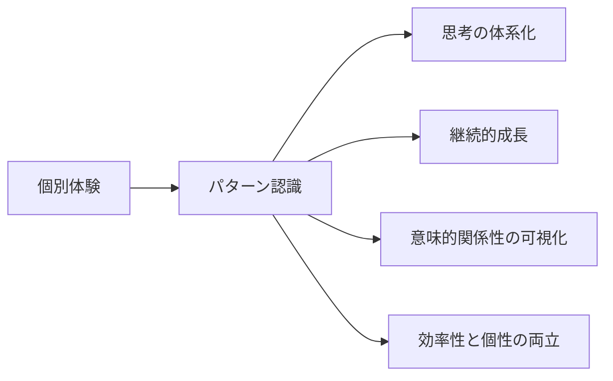

# CogitoWeave：問題意識と解決アプローチ

## 入力対象: 個別体験

### Bliki との出会い：概念中心アプローチの発見

CogitoWeave の根底にあるアイデアは、Martin Fowler の Bliki に遡る。2003 年に Ward Cunningham が命名した Bliki は「Blog + Wiki」の造語で、ブログのように短い思考を投稿でき、Wiki のように相互リンクされた知識体系を構築できるシステムだった。

Martin Fowler 自身が「形成中のアイデア」や「短すぎて正式な記事にならない内容」の投稿場所として活用し、「1 年後にも価値のある相互リンクされたコンテンツ」を目指していた。これは現在の CogitoWeave の「概念中心のアプローチ」「短い思考の蓄積」「相互リンクによる知識体系」「時間を経ても価値のある内容」という設計思想と完全に一致している。

興味深いのは、Martin Fowler 氏が「用語を作って概念を明確化し、それを広める天才」として業界で有名だということだ。Dependency Injection、Refactoring、Microservices 等の重要概念の定義と普及に大きく貢献している。これらの概念は、既存の用語では不十分だったり、より明確な表現が必要だったりする考え方を整理するために、独自に作られた語彙である。

概念で使用する語彙は本質的に個人的なものであり、一般的な学術用語や辞書的定義とは一致する場合もあれば、全く異なる個人的な意味を持つ場合もある。この個人化された語彙体系こそが、その人独自の思考枠組みを形成する重要な要素である。本人は「I don't come up with original ideas, but do a pretty good job of recognizing and packaging the ideas of others」と述べているが、これこそが「情報を整理して価値ある形で提示する」能力の証明である。

### 個人サイトでの実装：更新停滞の挫折

Martin Fowler の Bliki に着想を得て、実際の概念中心アプローチを個人サイトで実装した。「SHA-256」という概念でページを作成し、辞書(概念説明)とマニュアル(使い方)を分離したアプローチを採用した。この実験により、概念を中心とした情報管理の可能性を感じることができた。

従来の文書中心アプローチでは、同じ概念について複数の場所で言及される際に情報が分散してしまう。しかし概念中心では、異なる情報源(理論的説明、実践的使用法、個人的体験)が概念を軸に自然に統合され、理解の段階的深化が期待できる。この Bliki ベースの実装経験により、概念中心設計の潜在的な可能性を示唆する結果を得ている。

ただし、この個人サイトは作成後の更新が停滞している。1000 ページ以上を作成したものの、中身は薄く、継続的な情報追加や関係性の発展が困難になった。既存の静的サイト構築では、新しい概念の追加や既存概念間の関係性構築に手間がかかりすぎ、思考のスピードに追いつかない。この経験から、概念中心設計の可能性を感じつつも、実装方法には根本的な改善が必要であることが明らかになった。

### Obsidian での挫折：グラフの限界

Bliki アプローチの実装手段として、Obsidian を試用した経験がある。Obsidian のリンク機能は確かに優秀で、`[[概念名]]`でノート間を簡単に接続できる仕組みは理想的だった。

しかし、Obsidian のグラフビューは期待外れだった。数十、数百のノードが画面に表示されるものの、それは単なる「単語のつながり」であり、「意味のつながり」ではなかった。ノードをクリックしても関連ノードが強調されるだけで、なぜそれらが関連しているのか、どういう関係性なのかが全く分からない。

たくさんのノードを見せるだけでは発想に繋がらない。重要なのは「React と JavaScript は基盤技術の関係」「デザインパターンとリファクタリングは改善手法の関係」といった意味的な関係性を視覚的に表現することだ。グラフは単に単語をつなげるだけではなく、関係の意味を理解して表示する必要がある。

この体験から、関係性の可視化における意味理解の問題を強く実感した。複雑な情報構造を直感的に理解できるインターフェースがなければ、せっかくの概念ネットワークも活用できない。

### Infinite Wiki との出会い：効率性と個性の両立

Twitter で Infinite Wiki という興味深いプロジェクトを見かけた。すべての単語がハイパーリンクになっており、クリックすると説明がリアルタイムで生成される仕組みだった。これを見て、従来のナレッジベース構築の課題について考えることになった。

ゼロからナレッジを作るのは非常に大変である。完全に LLM に任せると自分の意思が入らない。そこで「LLM に作らせて、ツッコミを入れる」というアプローチの可能性を考えた。LLM が叩き台を高速生成し、人間が批判的思考で修正・補強することで、効率性と個性の両立が実現できるのではないかという仮説を持った。

個人の考えをまとめることに特化したシステムが欲しい。Wikipedia を辿るようなイメージで概念を探索し、アップデートで個人の考えを書いていくイメージである。

## 処理フロー

## リフレーミングプロセス: パターン認識

4つの異なる体験に共通する問題パターンを発見するため、各体験で「何が期待され、何が実現されず、なぜ挫折したか」を分析した。

- **Bliki体験**: 概念中心アプローチの有効性は確認できたが、個人での実装・維持が困難
- **個人サイト体験**: 概念体系構築の可能性は示唆されたが、継続的更新・関係性発展が停滞  
- **Obsidian体験**: リンク機能は優秀だが、関係性の意味的理解・可視化が不十分
- **Infinite Wiki体験**: 効率性と個性の両立可能性を発見したが、具体的実装手法は未確立

これらの分析から、個別の挫折要因を超えて、現代の知識労働者が共通して直面する4つの根本課題が浮き彫りになった。

## 出力対象: 4つの課題

これらの体験を通じて、現代の知識労働者が直面する根本的な問題を4つの観点で整理できた：

<!-- GLOBAL_CONCLUSION_BEGIN: problem-statement -->

1. **思考の体系化**: 断片的な思考を価値ある知識体系に発展させる仕組みの欠如
2. **継続的な成長**: 一度作った知識を継続的に育て、深化させる仕組みの必要性
3. **意味的関係性の可視化**: 複雑な関係性を直感的に管理できるインターフェースの重要性
4. **効率性と個性の両立**: ゼロからの知識構築は困難だが、完全自動化では個人の視点が失われる

<!-- GLOBAL_CONCLUSION_END: problem-statement -->
