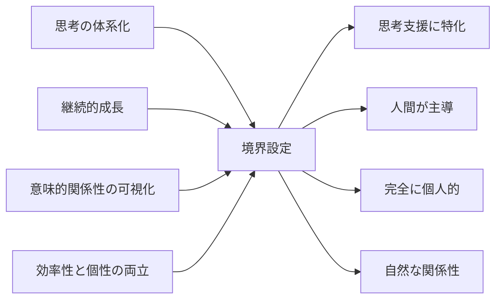

# CogitoWeave 設計境界線 - やらないことの明確化

## 入力対象: 4つの課題

CogitoWeave は「個人の思考プロセス支援」という明確な目的を持っている。しかし、機能を無制限に追加していくと、必ずこの目的がブレてしまう。最終的に「なんでもできるけど、何も得意じゃない」平凡なツールになってしまうのは目に見えている。

これらの 4 つの課題を真に解決するためには、むしろ「やらないこと」を明確にして、エネルギーを集中させる必要がある。

<!-- PREMISE_BEGIN: problem-statement -->

1. **思考の体系化**: 断片的な思考を価値ある知識体系に発展させる仕組みの欠如
2. **継続的な成長**: 一度作った知識を継続的に育て、深化させる仕組みの必要性
3. **意味的関係性の可視化**: 複雑な関係性を直感的に管理できるインターフェースの重要性
4. **効率性と個性の両立**: ゼロからの知識構築は困難だが、完全自動化では個人の視点が失われる

<!-- PREMISE_END: problem-statement -->

## 処理フロー

## リフレーミングプロセス: 境界設定

### 1. なんでもできるツールにはならない

**やらないこと**: タスク管理、プロジェクト管理、チーム機能、文書作成、スケジュール管理

「何でもできます」というアプローチは採らない。これらの機能を追加すると、思考支援ツールではなく、単なる情報管理ツールになってしまう。タスクを管理したければタスク管理ツール、文書を書きたければ文書作成ツールを使えばいい。CogitoWeave は思考を深めることだけに特化する。

### 2. 頭の中身を LLM に丸投げしない

**やらないこと**: 概念名の自動生成、思考プロセスの完全自動化、「AI が考えてくれる」機能

概念に名前をつけるのは、思考の最も重要な部分だ。Martin Fowler が「Dependency Injection」や「Refactoring」という概念を作ったように、自分なりの言葉で物事を整理することで初めて深い理解が生まれる。これを LLM に任せてしまったら、ただの高級検索エンジンと変わらない。

LLM は「叩き台を作ってもらう」程度に留める。考えるのは人間、整理するのも人間。LLM は材料を提供するアシスタントに過ぎない。

**重要な区別**: 概念の**自動生成**は行わないが、**既存概念からの検索・発見支援**は提供する。これは新しい概念を作り出すのではなく、個人が過去に作成・学習した概念体系の中から関連するものを見つけやすくする機能である。思考の主体は常に人間であり、LLM は個人の知識体系を効率的に活用するための道具として機能する。

### 3. 個人以外はスコープ外

**やらないこと**: 知識共有、チーム機能、コラボレーション、企業向け機能、大規模データ処理

思考というのは本質的に個人的なものだ。他人と共有することを前提にした瞬間、「みんなに理解してもらえる形」を意識してしまい、自然な思考プロセスが歪んでしまう。

また、企業が欲しがるような「大量のデータを処理して」「チームで共有して」「統計を出して」という機能も一切提供しない。個人が一人で使うことだけを考える。

**重要な区別**: **ツール自体は個人利用に閉じる**が、**個人が作成した成果物の外部転用は自由**である。CogitoWeave で整理した思考を基にブログを書く、Stack Overflow で回答する、技術記事を投稿するなどは、個人の自由な判断と行動である。ツールは個人の思考支援に特化し、その成果をどう活用するかは個人の選択に委ねる。これにより、個人の思考プロセスの純粋性を保ちながら、社会的な価値創造も可能になる。

**補足**: LLM を活用した意味的検索機能を提供するが、これは個人スケールでのデータ量を前提としており、企業レベルの大量データ処理とは本質的に異なる。個人の知識体系に最適化された規模での高度な検索を目指す。

### 4. 既存の分類枠に無理やり当てはめない

**やらないこと**: 図書館分類、学術的分類、「正しい」知識体系の強制

人間の思考は本来、矛盾だらけで曖昧なものだ。それを図書館の分類みたいにきれいに整理しようとすると、かえって思考が窮屈になってしまう。KJ 法の川喜田二郎も、「あたまでっかちな分類」を批判していた。

自分の頭の中から自然に出てくる関係性を大切にする。論理的に矛盾していても、重複があっても、それが自分の思考パターンなら尊重する。完璧な体系なんて目指さない。

## 出力対象: 4つの制約

これらの境界線により、CogitoWeave は他のツールとは明確に異なる価値を提供できる。

<!-- GLOBAL_CONCLUSION_BEGIN: design-boundries -->

1. **思考支援に特化**: 万能ツールではなく、考えをまとめることだけに集中
2. **人間が主導**: LLM は叩き台提供のみ、考える楽しみは人間が味わう
3. **完全に個人的**: 他人の評価ではなく、自分の問題解決が価値基準
4. **自然な関係性**: 学術的分類ではなく、個人の思考パターンを重視

<!-- GLOBAL_CONCLUSION_END: design-boundries -->
