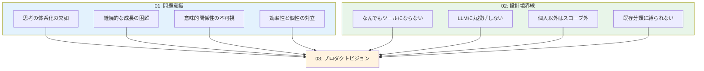

# CogitoWeave プロダクトビジョン - 小さな思想家のための思考体系化支援

## 入力対象: 問題+制約

現代の知識労働者が直面している根本的な課題は4つある。

<!-- PREMISE_BEGIN: problem-statement -->

1. **思考の体系化**: 断片的な思考を価値ある知識体系に発展させる仕組みの欠如
2. **継続的な成長**: 一度作った知識を継続的に育て、深化させる仕組みの必要性
3. **意味的関係性の可視化**: 複雑な関係性を直感的に管理できるインターフェースの重要性
4. **効率性と個性の両立**: ゼロからの知識構築は困難だが、完全自動化では個人の視点が失われる

<!-- PREMISE_END: problem-statement -->

しかし、これらの課題を解決する際に、よくあるやり方ではなく、改めて考えた結果、4つの方針を採る。

<!-- PREMISE_BEGIN: design-boundries -->

1. **思考支援に特化**: 万能ツールではなく、考えをまとめることだけに集中
2. **人間が主導**: LLM は叩き台提供のみ、考える楽しみは人間が味わう
3. **完全に個人的**: 他人の評価ではなく、自分の問題解決が価値基準
4. **自然な関係性**: 学術的分類ではなく、個人の思考パターンを重視

<!-- PREMISE_END: design-boundries -->

この二つの制約条件から、CogitoWeave が実現すべき理想未来像を論理的に導出する。

## 処理フロー

## リフレーミングプロセス: 価値統合

### 課題の構造的分析

4つの根本課題を俯瞰すると、いずれも「個人の思考プロセス」という共通の核を持っている。体系化、継続的成長、関係性の可視化、効率性と個性の両立——これらは全て、考える人間が本来持っている認知能力の**支援**を求めている。

### 制約の方向性分析

4つの設計制約が指し示すのは、明確な価値観である。思考支援への特化、人間主導、個人的価値基準、自然な関係性——これらは「考える楽しみを奪わない」という一貫した哲学を表している。

### 洞察: 全ての人が持つ「小さな思想家」の可能性

課題が求める「支援」と制約が示す「楽しみを奪わない哲学」の交点に、重要な発見がある。特別な才能を持つ人だけでなく、**全ての考える人が持つ潜在的な思想家としての可能性**である。

Martin Fowler が「用語を作って概念を明確化し、それを広める天才」なら、私たちは「小さな思想家」だ。規模は違っても、本質的には同じ営みを行っている：

- 日常的な疑問: 「React と Vue の違いって、結局何だろう？」
- 洞察の萌芽: 「リモートワークで大切なのは、コミュニケーションより信頼関係かも」
- 概念の整理: 「デザインパターンって、要するに『よくある解決策に名前をつけただけ』なのかな」

これらの思考は断片的だが、実は深い洞察の種を含んでいる。問題は、これらの「考え」が散逸してしまい、体系化されず、問題解決に活用されないことだ。

### 転換点: 思考の民主化

重要な認識は：

- **思考の規模は関係ない**: 個人的な問題解決も、業界を変える洞察も、同じ思考プロセスから生まれる
- **体系化の力**: 散在する思考を整理し、関係性を発見することで、新しい洞察が生まれる
- **個人的な価値**: 他人に認められなくても、自分の問題が解決できれば十分価値がある

この「小さな思想家」を支援することこそが、CogitoWeave の理想未来像である。

## 出力対象: ビジョン

### ビジョン: 全ての考える人が小さな思想家になれる世界

<!-- FOUNDATION_BEGIN: product-vision -->

「全ての考える人（小さな思想家）が自分の考えを体系化し、自らの問題解決に役立てるための仕組みを作る」

<!-- FOUNDATION_END: product-vision -->

これは、特別な才能や専門知識を持つ人だけでなく、日常的に「考える」ことを大切にする全ての人が、自分なりの思考体系を育て、実際の問題解決に活用できる環境の実現を意味する。

### 体験される具体的な変化

#### 朝のひらめきを育てる楽しみ

「そういえば昨日読んだ記事の『非同期コミュニケーション』って、先月考えた『信頼関係構築』と関係がありそう」——そんな小さなひらめきを大切に育て、自分なりの洞察として結実させる喜びを味わえる。

#### 過去の思考が現在に活きる驚き

3 ヶ月前に「React のフック」について考えていたことが、今日直面した「状態管理の課題」解決に意外な角度から貢献し、「あの時の思考が今につながった」という発見の喜びを得られる。

#### 複雑さを整理する達成感

頭の中でごちゃごちゃしていた「リモートワーク」「ツール選択」「チーム運営」「個人の集中」といった概念の関係性が整理され、「自分なりの理解ができた」という達成感を味わえる。

#### 問題解決への応用力

整理された思考体系を使って、実際に直面している課題——「新しいプロジェクトのアーキテクチャをどう設計するか」「チームのコミュニケーションをどう改善するか」——に対して、自分なりの解決策を導き出せる。

### 価値提案: 思考する人のためのパートナーシップ

個人の思考プロセスに寄り添い、散在する考えを体系化し、実際の問題解決に活用できる形に発展させる支援を提供する。

これは単なる情報管理ツールではない。「考える人」が持つ潜在的な思想家としての可能性を引き出し、個人的な問題解決能力を向上させるパートナーシップの提供だ。

### 存在意義: 思考の民主化

CogitoWeave は思考を民主化する。Martin Fowler のような影響力ある思想家だけでなく、日々考え、悩み、解決策を模索する全ての人が、自分なりの思考体系を持ち、それを問題解決に活用できる世界を実現する。

「小さな思想家」という表現には、謙虚さと誇りが同居している。規模は小さくても、自分なりに考え、体系化し、問題を解決する——それは立派な思想家の営みだ。

CogitoWeave が実現するのは、そんな「小さな思想家」たちが自信を持って思考し、成長し、問題を解決できる世界である。
