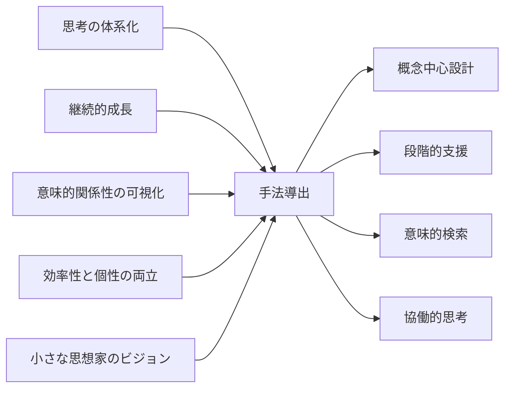

# CogitoWeave 解決アプローチ - 小さな思想家を支える 4 つの仕組み

## 入力対象: ビジョン

問題意識で体験した様々なツールとの格闘—Martin Fowler の Bliki への憧れから個人サイト挫折、Obsidian のグラフビュー失望、Infinite Wiki での効率性と個性の両立可能性への気づき。そしてプロダクトビジョンで描いた理想未来像の実現。

この根本的な未来を実現するには、問題意識の分析で特定された 4 つの根本的な課題を解決する必要がある：

<!-- PREMISE_BEGIN: problem-statement -->

1. **思考の体系化**: 断片的な思考を価値ある知識体系に発展させる仕組みの欠如
2. **継続的な成長**: 一度作った知識を継続的に育て、深化させる仕組みの必要性
3. **意味的関係性の可視化**: 複雑な関係性を直感的に管理できるインターフェースの重要性
4. **効率性と個性の両立**: ゼロからの知識構築は困難だが、完全自動化では個人の視点が失われる

<!-- PREMISE_END: problem-statement -->

これらの課題に、プロダクトビジョンで定義された「小さな思想家」が日常的に直面している。そして、その理想的な未来像として：

<!-- PREMISE_BEGIN: product-vision -->

「全ての考える人（小さな思想家）が自分の考えを体系化し、自らの問題解決に役立てるための仕組みを作る」

<!-- PREMISE_END: product-vision -->

これらの課題を解決するため、4 つの創発的なアプローチを導き出した。

## 処理フロー

## リフレーミングプロセス: 手法導出

### 発想の転換 1: 断片から体系へ - 概念中心設計

小さな思想家の思考は断片的に始まる。「React って結局何なんだろう？」「リモートワークで大切なのは何だろう？」——こうした素朴な疑問こそが、深い洞察の出発点だ。

従来のツールは「文書を管理する」発想だった。でも小さな思想家の頭の中は概念で動いている。「React」について考えるとき、頭の中では「JavaScript」「コンポーネント」「状態管理」といった概念が飛び交い、それらの関係性が新しい理解を生む。

Martin Fowler の Bliki がまさにこれを証明している。彼は「Dependency Injection」「Refactoring」といった概念を作り、それぞれの概念ページに異なる角度からの情報を蓄積していった。結果として、業界全体の理解を深める知識体系が自然に育った。

**概念中心設計**では、小さな思想家の思考の最小単位である「概念」を軸とする。すると、同じ概念について学んだ複数の情報源—理論的説明、実践的使用法、個人的体験—が自然に統合され、概念の理解が段階的に深化していく。

### 発想の転換 2: 静的から動的へ - 段階的知識深化

小さな思想家の思考は成長する。最初は「React って便利そう」程度の理解でも、使ってみて、調べて、失敗して、また調べて——という過程を経て、深い洞察に発展する。

でも既存ツールで一度作ったノートは、そのまま放置されがちだ。新しい記事を読んでも、過去の知識とのつながりが見えず、知識が分断されてしまう。

小さな思想家にとって本当の学習は「知識の成熟プロセス」だ。最初は LLM が生成した叩き台、次に自分で書いた文献メモ、最終的に深く考え抜いた永続的な洞察。この 3 段階を経ることで、情報が真の知識へと変化する。

**段階的知識深化**では、外部ソースからの新しい情報を既存の概念と関連付けながら取り込む。すると、3 ヶ月前に学んだ概念が、今日読んだ記事によって突然新しい意味を持ち始める。知識が生きたネットワークとして成長し続ける。

### 発想の転換 3: 線形から空間へ - 視覚的・空間的アプローチ

小さな思想家の理解は空間的だ。複雑な関係性を文字だけで表現するのは限界がある。「React と JavaScript は基盤技術の関係」「デザインパターンとリファクタリングは改善手法の関係」—これらの関係を文字で説明されても、全体像が見えない。

人間の脳は空間的な関係性を理解するのが得意だ。KJ 法で付箋を並べるとき、近くに置いた概念同士に思わぬ関係性を発見することがある。Obsidian のグラフビューが惜しかったのは、空間に意味がなかったからだ。

**視覚的・空間的アプローチ**では、概念の配置そのものが意味を持つ。似た概念は近くに、対立する概念は遠くに。グルーピングや関係線によって、複雑な思考構造が一目で理解できるようになる。

小さな思想家は、自分の思考地図を眺めながら「ここがつながってなかったな」「この関係は意外だった」という発見を楽しめる。

### 発想の転換 4: 対立から協働へ - LLM 協働アプローチ

小さな思想家は効率性と個性の間で悩む。「AI に任せると個性が失われる」「人間だけでやると効率が悪い」—これは二択の発想だ。でも本当は、AI と人間は異なる得意分野を持っている。

LLM は「叩き台を高速生成」するのが得意。小さな思想家は「批判的に吟味して個性を注入」するのが得意。この組み合わせが「LLM に作らせて、ツッコミを入れる」アプローチだ。

**LLM 協働**では、効率性と個性が両立する。LLM が提供する叩き台に対して「ここは違う」「この視点が抜けてる」「自分の体験では...」とツッコミを入れることで、短時間で個性的な知識が完成する。

小さな思想家は「考える時間」を確保しながら「作業時間」を大幅に短縮し、本質的な思考活動に集中できる。

## 出力対象: 4 つの手法

これら 4 つのアプローチにより、小さな思想家は断片的な思考を価値ある知識体系に発展させ、実際の問題解決に活用できる環境を得る。

### 4 つのアプローチによる課題解決マトリクス

各アプローチが 4 つの根本課題をどの程度解決するかを整理すると以下のようになる：

| 手法＼課題                   | 思考の体系化 | 継続的な成長 | 関係性の可視化 | 効率性と個性の両立 |
| ---------------------------- | ------------ | ------------ | -------------- | ------------------ |
| **概念中心設計**             | ◎ 主要解決   | ○ 支援効果   | △ 間接効果     | -                  |
| **段階的知識深化**           | ○ 支援効果   | ◎ 主要解決   | △ 間接効果     | ○ 支援効果         |
| **視覚的・空間的アプローチ** | △ 間接効果   | ○ 支援効果   | ◎ 主要解決     | -                  |
| **LLM 協働アプローチ**       | ○ 支援効果   | ○ 支援効果   | -              | ◎ 主要解決         |

**凡例**: ◎ 主要解決（その課題の中心的解決策）、○ 支援効果（他手法と組み合わせて効果発揮）、△ 間接効果（副次的な改善効果）、-直接関係なし

この解決マトリクスから分かる通り、各手法は特定の課題に対する主要解決策として機能しつつ、他の課題に対しても支援的効果を発揮する。重要なのは、4 つの課題すべてに対して「主要解決策」が存在することであり、どの課題も未解決のまま残らない点である。

CogitoWeave は、これら 4 つの相互作用するアプローチで「小さな思想家のためのパートナー」を実現する。自分のペースで、自分のスタイルで、思考の民主化された世界を実現する。

<!-- FOUNDATION_BEGIN: solution-approach -->

- **概念中心設計**: 小さな思想家の思考の最小単位である概念を軸とした知識構築
- **段階的知識深化**: 概念に文献メモを積み重ね、永続メモとして深化させるプロセスを支援
- **視覚的・空間的アプローチ**: 複雑な関係性の直感的理解・管理による思考地図提供
- **LLM 協働**: 「LLM に作らせて、ツッコミを入れる」効率的な個性発揮の実現

<!-- FOUNDATION_END: solution-approach -->
