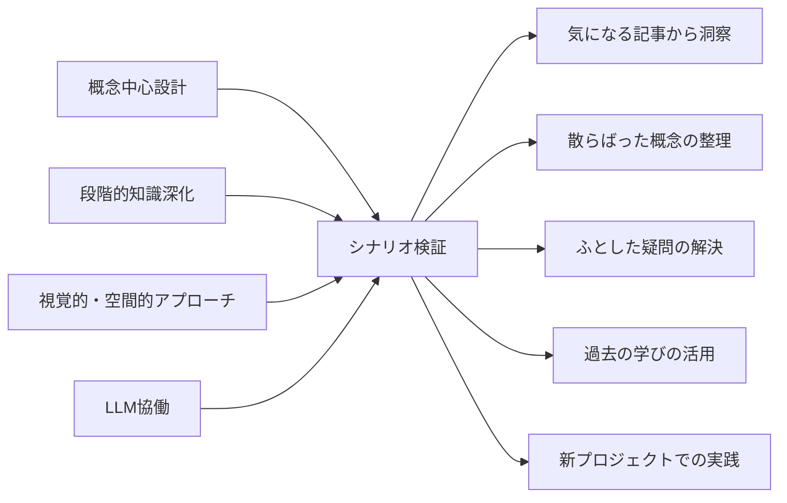

# CogitoWeave ユーザーシナリオ - 小さな思想家の日常

## 入力対象: 4つの手法

[問題意識](01-problem-statement.md)で体験した Martin Fowler の Bliki への憧れから個人サイト挫折、Obsidian 失望、Infinite Wiki での発見に至る体験と、[解決アプローチ](04-solution-approach.md)で導出された 4 つの創発的手法に基づき、小さな思想家が日常的に体験する典型的な場面での問題解決体験を具体的なシナリオとして明確にする。

### 小さな思想家が抱える根本課題

<!-- PREMISE_BEGIN: problem-statement -->

1. **思考の体系化**: 断片的な思考を価値ある知識体系に発展させる仕組みの欠如
2. **継続的な成長**: 一度作った知識を継続的に育て、深化させる仕組みの必要性
3. **意味的関係性の可視化**: 複雑な関係性を直感的に管理できるインターフェースの重要性
4. **効率性と個性の両立**: ゼロからの知識構築は困難だが、完全自動化では個人の視点が失われる

<!-- PREMISE_END: problem-statement -->

### 小さな思想家のビジョンと解決アプローチ

そして、これらの課題解決を目指すプロダクトビジョンが確立されている。

<!-- PREMISE_BEGIN: product-vision -->

「全ての考える人(小さな思想家)が自分の考えを体系化し、自らの問題解決に役立てるための仕組みを作る」

<!-- PREMISE_END: product-vision -->

このビジョンを実現するため、4 つの解決アプローチが導出されている。

<!-- PREMISE_BEGIN: solution-approach -->

- **概念中心設計**: 小さな思想家の思考の最小単位である概念を軸とした知識構築
- **段階的知識深化**: 概念に文献メモを積み重ね、永続メモとして深化させるプロセスを支援
- **視覚的・空間的アプローチ**: 複雑な関係性の直感的理解・管理による思考地図提供
- **LLM 協働**: 「LLM に作らせて、ツッコミを入れる」効率的な個性発揮の実現

<!-- PREMISE_END: solution-approach -->

## 処理フロー

## リフレーミングプロセス: シナリオ検証

小さな思想家の典型的な日常場面を 5 つ考え、4 つの解決アプローチが実際に課題解決に役立つかを効果検証する

### 気になる記事 → 自分なりの洞察

**小さな思想家の現状**: 「React のパフォーマンス最適化」記事を Hacker News で発見。「面白そうだし、今のプロジェクトにも関係ありそう」と思ってブックマークしたが、後で読んでも「ふーん、そうなんだ」で終わってしまい、自分の知識として定着していない。

<!-- GLOBAL_CONCLUSION_BEGIN: scenario-1 -->

**CogitoWeave での解決体験**: **概念中心設計**により記事が断片的情報ではなく、個人の概念体系内で「パフォーマンス最適化」「React フック」といった既存概念との関係で意味を持つ知識として位置づけられる。**LLM 協働**により「LLM の叩き台＋個人のツッコミ」で効率的に個性を注入でき、ゼロからの要約作成負荷を削減しながら自分の体験・視点を反映できる。この組み合わせで「記事をブックマークして終わり」から「個人の概念体系に根ざした実用的な文献メモの即座作成」への体験変革が実現される。

<!-- GLOBAL_CONCLUSION_END: scenario-1 -->

**解決効果**: **概念中心設計**により記事が個人の概念体系の中で意味を持つ知識として位置づけられ、**LLM 協働**により効率的に個人の洞察を注入できる。「記事をブックマークして終わり」から「自分の概念体系に根ざした実用的な文献メモの即座作成」への体験変革により、断片的な情報が体系的な知識として蓄積される。

### 散らばった概念 → 整理された思考地図

**小さな思想家の現状**: 最近「リモートワーク」「非同期コミュニケーション」「チーム生産性」「個人の集中」といった概念について考えることが多いが、これらがどう関係しているのか頭の中で整理できていない。「なんとなく関係ありそう」は分かるが、その関係性を明確にできずにいる。

<!-- GLOBAL_CONCLUSION_BEGIN: scenario-2 -->

**CogitoWeave での解決体験**: **視覚的・空間的アプローチ**により概念間の複雑な関係性を空間配置で直感的に理解・操作でき、**概念中心設計**により個人の関係語彙で関係性を定義できる。この組み合わせで「頭の中でモヤモヤ」から「空間上での明確な関係性整理」への体験変革が実現され、複雑な思考が視覚的に管理可能な思考地図として外化される。

<!-- GLOBAL_CONCLUSION_END: scenario-2 -->

**解決効果**: モヤモヤした 4 つの概念が「個人の集中が確保されないとリモートチーム全体の生産性も上がらない」という核心洞察に結実し、複雑な関係性が直感的に理解・管理できる思考地図として整理される。

### ふとした疑問 → 関係性の発見

**小さな思想家の現状**: 「そういえば『デザインパターン』と『リファクタリング』って、どちらも『コードを良くする』話だけど、具体的にどう違うんだろう？」という疑問が浮かんだ。でも、この関係性を調べたり整理したりする適切な方法が分からず、疑問のまま放置してしまっている。

<!-- GLOBAL_CONCLUSION_BEGIN: scenario-3 -->

**CogitoWeave での解決体験**: **概念中心設計**により 2 つの概念間の関係性を「適用タイミング」「アプローチ」「共通目標」といった個人的な関係軸で体系的に定義でき、漠然とした疑問が明確な判断基準として整理される。この関係性の明示化により「なんとなく似てる」から「具体的な使い分け基準の確立」への体験変革が実現される。

<!-- GLOBAL_CONCLUSION_END: scenario-3 -->

**解決効果**: 疑問のまま放置されていた 2 つの概念の関係が「新規設計時はデザインパターン、既存コード改善時はリファクタリング」という実用的な判断基準として明確化される。

### 質問への回答 → 過去の学びの活用

**小さな思想家の現状**: Stack Overflow で「React のパフォーマンス問題」について質問されている。自分も似たような経験があり、答えてあげたいが、「あれ、どこで読んだんだっけ？」「確か良い解決策があったはずだが...」と思い出せず、結局回答できずに終わってしまう。

<!-- GLOBAL_CONCLUSION_BEGIN: scenario-4 -->

**CogitoWeave での解決体験**: **概念中心設計**により質問内容が関連概念で自動分類され、**段階的知識深化**により各概念に蓄積された文献メモが統合的に活用できる。この組み合わせで「過去の学びが思い出せない」から「概念軸での知識資産の即座活用」への体験変革が実現され、散発的だった学びが現在の問題解決で統合的に機能する。

<!-- GLOBAL_CONCLUSION_END: scenario-4 -->

**解決効果**: 散発的だった過去の学びが現在の問題解決で活用できる知識資産として統合され、一度作った知識が継続的に育ち、深化する仕組みとして機能する。

### 漠然とした考え → 論理的な記事

**小さな思想家の現状**: 「最近のフロントエンド開発の複雑さについて」ブログ記事を書きたいと思っている。頭の中には「フレームワークの選択肢が多すぎる」「流行に流されやすい」「開発者体験がよくなってきている」「長期保守性が軽視される傾向」などの断片的な考えがあるが、これを論理的な文章として構成できずにいる。

<!-- GLOBAL_CONCLUSION_BEGIN: scenario-5 -->

**CogitoWeave での解決体験**: **視覚的・空間的アプローチ**により断片的思考を関係性マップとして空間配置でき、**概念中心設計**により「選択肢の多さ」→「長期視点の欠如」→「人気に流される」といった論理的関係連鎖を明確化できる。この組み合わせで「漠然とした考えの集合」から「論理構造を持った価値ある情報発信」への体験変革が実現され、断片的思考が体系的な論理として外化される。

<!-- GLOBAL_CONCLUSION_END: scenario-5 -->

**解決効果**: 漠然とした断片的思考が「課題提起 → 原因分析 → 解決提案 → 文脈別適用」という明確な論理構造を持った価値ある情報発信として体系化される。

## 出力対象: 5つの体験

5 つのシナリオで 4 つの解決アプローチの効果を検証した。各シナリオでアプローチの組み合わせにより、小さな思想家の日常的な課題が解決されることが確認された。

これらのシナリオは、CogitoWeave ビジョンの段階的実現を判断するプロダクトゴールとして機能する。
