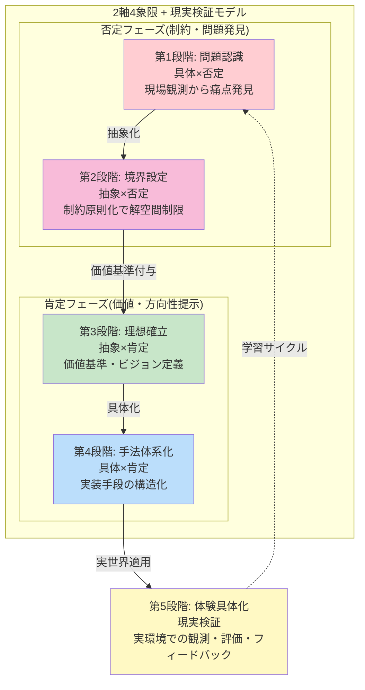

# ビジョン・スコープ定義 - 内部理想の基盤

CogitoWeave システムの内部理想を定義する。外部制約を考慮せず、自分で決められる純粋な理想・価値観・やらないことを整理し、「小さな思想家」のビジョンに基づく思考の民主化を内部理想として確立する。

## 目次

- [概要](#概要)
- [処理フロー](#処理フロー)
- [ステップ 1: 問題認識](#ステップ-1-問題認識)
- [ステップ 2: やらないこと](#ステップ-2-やらないこと)
- [ステップ 3: ビジョン](#ステップ-3-ビジョン)
- [ステップ 4: アプローチ](#ステップ-4-アプローチ)
- [ステップ 5: ユーザーシナリオ](#ステップ-5-ユーザーシナリオ)

## 概要

本文書は、CogitoWeave システムの内部理想を「解空間制限タイプ」の手法で段階的に定義する。

まず問題認識により、現代の知識労働者が抱える思考体系化の課題を明確化し、可能な解空間を定義する。次に「やらないこと」の境界設定により、無数の解決手法から自分のポリシーに合わないものを除外し、解空間を制限する。その制限された空間の中で、理想的なビジョンを確立し、具体的な実現アプローチを体系化する。最後に、ユーザーシナリオによってそのアプローチが実際の問題解決に機能するかを検証する。

この 5 段階のプロセスを通じて、外部制約を考慮せずに「小さな思想家のための思考民主化」という内部理想を論理的に構築する。各段階では前段階の結果を前提として次段階の判断を行うため、段階的な論理展開により最終的な内部理想が確立される。

### 参考: プロダクトゴールとしてのユーザーシナリオ

05-user-scenarios.md は、個人開発における「プロダクトゴール」の代替として機能する。企業開発でのプロダクトゴールは「測定可能な中間目標」だが、個人開発では「実現される具体的な体験変化」がより適切な成功指標となる。

各シナリオの「解決後の体験」が達成された時点で、小さな思想家のための CogitoWeave ビジョンが段階的に実現されたと判断する。これは段階的論理展開における最終的な体験具体化として機能し、[解決アプローチ](04-solution-approach.md)の 4 つの手法の有効性を検証する役割を果たす。

## 処理フロー

## ステップ 1: 問題認識

まず 01 の問題認識において、個別の問題や可能性を取り上げる。これにより課題を空間にマッピングする。これにより可能な解空間が定義される。

<!-- REFERENCE_BEGIN: problem-statement -->

1. **思考の体系化**: 断片的な思考を価値ある知識体系に発展させる仕組みの欠如
2. **継続的な成長**: 一度作った知識を継続的に育て、深化させる仕組みの必要性
3. **意味的関係性の可視化**: 複雑な関係性を直感的に管理できるインターフェースの重要性
4. **効率性と個性の両立**: ゼロからの知識構築は困難だが、完全自動化では個人の視点が失われる

<!-- REFERENCE_END: problem-statement -->

## ステップ 2: やらないこと

ステップ 1 で特定された 4 つの課題に対する解決手法は無数に存在するが、その中には自分のポリシーや価値観に合わないものも含まれる。そこでステップ 2 では、解空間に制限を加えることで、本当に作りたいシステムの方向性を明確化する。

万能ツール化、完全自動化、他人の評価を重視するシステム、学術的分類の強制といった方向性を明示的に除外し、解空間を大幅に狭める。この制限により、次段階のビジョン確立における選択肢が管理可能な範囲まで絞り込まれる。

<!-- REFERENCE_BEGIN: design-boundries -->

1. **思考支援に特化**: 万能ツールではなく、考えをまとめることだけに集中
2. **人間が主導**: LLM は叩き台提供のみ、考える楽しみは人間が味わう
3. **完全に個人的**: 他人の評価ではなく、自分の問題解決が価値基準
4. **自然な関係性**: 学術的分類ではなく、個人の思考パターンを重視

<!-- REFERENCE_END: design-boundries -->

## ステップ 3: ビジョン

ステップ 2 で制限された解空間の中から、本当に自分が作りたいシステムの理想像を確立する。設計境界により排除された方向性を除外した上で、残された可能性の中から最も価値のある目標を選択する。

この段階では、技術的実現性や外部制約は考慮せず、純粋に「こんなシステムがあったら素晴らしい」という理想を定義することで、解空間をさらに焦点化する。

<!-- REFERENCE_BEGIN: product-vision -->

「全ての考える人(小さな思想家)が自分の考えを体系化し、自らの問題解決に役立てるための仕組みを作る」

<!-- REFERENCE_END: product-vision -->

## ステップ 4: アプローチ

ステップ 3 で確立されたビジョンを実現するための具体的な手法を体系化する。抽象的な理想像から、技術的に実装可能な具体的なアプローチへと落とし込むことで、解空間を制御可能な範囲まで狭める。

4 つの技術的アプローチを組み合わせることで、「小さな思想家のための思考民主化」というビジョンを現実的に達成する道筋を明確化する。

<!-- REFERENCE_BEGIN: solution-approach -->

- **概念中心設計**: 小さな思想家の思考の最小単位である概念を軸とした知識構築
- **段階的知識深化**: 概念に文献メモを積み重ね、永続メモとして深化させるプロセスを支援
- **視覚的・空間的アプローチ**: 複雑な関係性の直感的理解・管理による思考地図提供
- **LLM 協働**: 「LLM に作らせて、ツッコミを入れる」効率的な個性発揮の実現

<!-- REFERENCE_END: solution-approach -->

## ステップ 5: ユーザーシナリオ

ステップ 4 で体系化された 4 つのアプローチが、実際の問題解決に機能するかを具体的なユーザーシナリオで検証する。理論的な手法が実践的な体験変化を生み出せるかを確認することで、内部理想の実現可能性を最終検証する。

5 つのシナリオは「現状の課題 → アプローチ適用 → 解決効果」の構造で設計されている。各シナリオが成功すれば、4 つのアプローチが組み合わさることで小さな思想家の思考民主化が実現されることを意味する。

### シナリオ 1: 気になる記事 → 自分なりの洞察

<!-- REFERENCE_BEGIN: scenario-1 -->

**CogitoWeave での解決体験**: **概念中心設計**により記事が断片的情報ではなく、個人の概念体系内で「パフォーマンス最適化」「React フック」といった既存概念との関係で意味を持つ知識として位置づけられる。**LLM 協働**により「LLM の叩き台＋個人のツッコミ」で効率的に個性を注入でき、ゼロからの要約作成負荷を削減しながら自分の体験・視点を反映できる。この組み合わせで「記事をブックマークして終わり」から「個人の概念体系に根ざした実用的な文献メモの即座作成」への体験変革が実現される。

<!-- REFERENCE_END: scenario-1 -->

### シナリオ 2: 散らばった概念 → 整理された思考地図

<!-- REFERENCE_BEGIN: scenario-2 -->

**CogitoWeave での解決体験**: **視覚的・空間的アプローチ**により概念間の複雑な関係性を空間配置で直感的に理解・操作でき、**概念中心設計**により個人の関係語彙で関係性を定義できる。この組み合わせで「頭の中でモヤモヤ」から「空間上での明確な関係性整理」への体験変革が実現され、複雑な思考が視覚的に管理可能な思考地図として外化される。

<!-- REFERENCE_END: scenario-2 -->

### シナリオ 3: ふとした疑問 → 関係性の発見

<!-- REFERENCE_BEGIN: scenario-3 -->

**CogitoWeave での解決体験**: **概念中心設計**により 2 つの概念間の関係性を「適用タイミング」「アプローチ」「共通目標」といった個人的な関係軸で体系的に定義でき、漠然とした疑問が明確な判断基準として整理される。この関係性の明示化により「なんとなく似てる」から「具体的な使い分け基準の確立」への体験変革が実現される。

<!-- REFERENCE_END: scenario-3 -->

### シナリオ 4: 質問への回答 → 過去の学びの活用

<!-- REFERENCE_BEGIN: scenario-4 -->

**CogitoWeave での解決体験**: **概念中心設計**により質問内容が関連概念で自動分類され、**段階的知識深化**により各概念に蓄積された文献メモが統合的に活用できる。この組み合わせで「過去の学びが思い出せない」から「概念軸での知識資産の即座活用」への体験変革が実現され、散発的だった学びが現在の問題解決で統合的に機能する。

<!-- REFERENCE_END: scenario-4 -->

### シナリオ 5: 漠然とした考え → 論理的な記事

<!-- REFERENCE_BEGIN: scenario-5 -->

**CogitoWeave での解決体験**: **視覚的・空間的アプローチ**により断片的思考を関係性マップとして空間配置でき、**概念中心設計**により「選択肢の多さ」→「長期視点の欠如」→「人気に流される」といった論理的関係連鎖を明確化できる。この組み合わせで「漠然とした考えの集合」から「論理構造を持った価値ある情報発信」への体験変革が実現され、断片的思考が体系的な論理として外化される。

<!-- REFERENCE_END: scenario-5 -->
