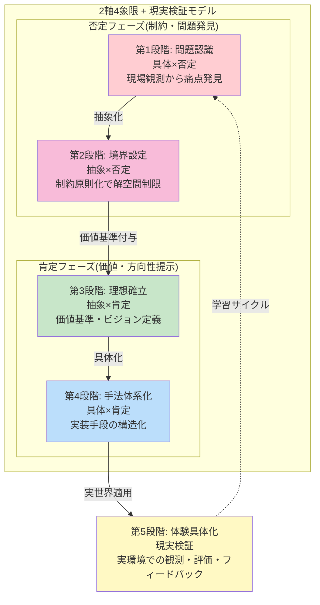

# ビジョン・スコープ定義 - 内部理想の基盤

CogitoWeave システムの内部理想を定義する。外部制約を考慮せず、自分で決められる純粋な理想・価値観・やらないことを整理し、「小さな思想家」のビジョンに基づく思考の民主化を内部理想として確立する。

## 目次

- [概要](#概要)
- [処理フロー](#処理フロー)
- [ステップ 1: 問題認識](#ステップ-1-問題認識)
- [ステップ 2: やらないこと](#ステップ-2-やらないこと)
- [ステップ 3: ビジョン](#ステップ-3-ビジョン)
- [ステップ 4: アプローチ](#ステップ-4-アプローチ)
- [ステップ 5: ユーザーシナリオ](#ステップ-5-ユーザーシナリオ)

## 概要

本文書は、CogitoWeave システムの内部理想を「解空間制限タイプ」の手法で段階的に定義する。

まず問題認識により、現代の知識労働者が抱える思考体系化の課題を明確化し、可能な解空間を定義する。次に「やらないこと」の境界設定により、無数の解決手法から自分のポリシーに合わないものを除外し、解空間を制限する。その制限された空間の中で、理想的なビジョンを確立し、具体的な実現アプローチを体系化する。最後に、ユーザーシナリオによってそのアプローチが実際の問題解決に機能するかを検証する。

この 5 段階のプロセスを通じて、外部制約を考慮せずに「小さな思想家のための思考民主化」という内部理想を論理的に構築する。各段階では前段階の結果を前提として次段階の判断を行うため、段階的な論理展開により最終的な内部理想が確立される。

### 参考: プロダクトゴールとしてのユーザーシナリオ

05-user-scenarios.md は、個人開発における「プロダクトゴール」の代替として機能する。企業開発でのプロダクトゴールは「測定可能な中間目標」だが、個人開発では「実現される具体的な体験変化」がより適切な成功指標となる。

各シナリオの「解決後の体験」が達成された時点で、小さな思想家のための CogitoWeave ビジョンが段階的に実現されたと判断する。これは段階的論理展開における最終的な体験具体化として機能し、[解決アプローチ](04-solution-approach.md)の 4 つの手法の有効性を検証する役割を果たす。

## 処理フロー

## ステップ 1: 問題認識

まず 01 の問題認識において、個別の問題や可能性を取り上げる。これにより課題を空間にマッピングする。これにより可能な解空間が定義される。

## ステップ 2: やらないこと

ステップ 1 で特定された 4 つの課題に対する解決手法は無数に存在するが、その中には自分のポリシーや価値観に合わないものも含まれる。そこでステップ 2 では、解空間に制限を加えることで、本当に作りたいシステムの方向性を明確化する。

万能ツール化、完全自動化、他人の評価を重視するシステム、学術的分類の強制といった方向性を明示的に除外し、解空間を大幅に狭める。この制限により、次段階のビジョン確立における選択肢が管理可能な範囲まで絞り込まれる。

## ステップ 3: ビジョン

ステップ 2 で制限された解空間の中から、本当に自分が作りたいシステムの理想像を確立する。設計境界により排除された方向性を除外した上で、残された可能性の中から最も価値のある目標を選択する。

この段階では、技術的実現性や外部制約は考慮せず、純粋に「こんなシステムがあったら素晴らしい」という理想を定義することで、解空間をさらに焦点化する。

## ステップ 4: アプローチ

ステップ 3 で確立されたビジョンを実現するための具体的な手法を体系化する。抽象的な理想像から、技術的に実装可能な具体的なアプローチへと落とし込むことで、解空間を制御可能な範囲まで狭める。

4 つの技術的アプローチを組み合わせることで、「小さな思想家のための思考民主化」というビジョンを現実的に達成する道筋を明確化する。

## ステップ 5: ユーザーシナリオ

ステップ 4 で体系化された 4 つのアプローチが、実際の問題解決に機能するかを具体的なユーザーシナリオで検証する。理論的な手法が実践的な体験変化を生み出せるかを確認することで、内部理想の実現可能性を最終検証する。

5 つのシナリオは「現状の課題 → アプローチ適用 → 解決効果」の構造で設計されている。各シナリオが成功すれば、4 つのアプローチが組み合わさることで小さな思想家の思考民主化が実現されることを意味する。
