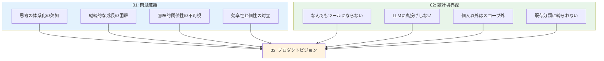

# CogitoWeave プロダクトビジョン - 小さな思想家のための思考体系化支援

## 前提: 考える人が直面する現実と制約

[問題意識](01-problem-statement.md)で明らかになった現代の知識労働者の体験——Martin Fowler の Bliki に憧れながらも個人サイトは更新停滞、Obsidian のグラフビューに失望、Infinite Wiki で効率性と個性の両立可能性に気づく。そして [設計境界線](02-design-boundaries.md)で確立された厳格な制約——個人の思考プロセス支援以外は一切やらないという決意。

この二つの制約条件から、CogitoWeave が実現すべき理想未来像を論理的に導出する。

## 論理的導出: 全ての人が持つ「小さな思想家」への着目

### 発見: 誰もが持つ思考への欲求

01 で体験した Martin Fowler の Bliki は、単なるツールではなく「考えをまとめる喜び」を教えてくれた。概念を作り、関係性を発見し、自分なりの語彙体系を育てる——これは特別な人だけの活動ではない。

私たちは皆、日常的に考えている：

- 「React と Vue の違いって、結局何だろう？」
- 「リモートワークで大切なのは、コミュニケーションより信頼関係かも」
- 「デザインパターンって、要するに『よくある解決策に名前をつけただけ』なのかな」

これらの思考は断片的だが、実は深い洞察の種を含んでいる。問題は、これらの「考え」が散逸してしまい、体系化されず、問題解決に活用されないことだ。

### 転換点: 「小さな思想家」の可能性

Martin Fowler が「用語を作って概念を明確化し、それを広める天才」なら、私たちは「小さな思想家」だ。彼ほど影響力はないかもしれないが、自分なりの考えを持ち、それを育て、活用したいと願っている。

重要なのは：

- **思考の規模は関係ない**: 個人的な問題解決も、業界を変える洞察も、同じ思考プロセスから生まれる
- **体系化の力**: 散在する思考を整理し、関係性を発見することで、新しい洞察が生まれる
- **個人的な価値**: 他人に認められなくても、自分の問題が解決できれば十分価値がある

### 設計境界線が示す方向性

[設計境界線](02-design-boundaries.md)の 4 つの制約は、「小さな思想家」支援の方向性を明確に示している：

1. **思考支援に特化**: 万能ツールではなく、考えをまとめることだけに集中
2. **人間が主導**: LLM は叩き台提供のみ、考える楽しみは人間が味わう
3. **完全に個人的**: 他人の評価ではなく、自分の問題解決が価値基準
4. **自然な関係性**: 学術的分類ではなく、個人の思考パターンを重視

これらの制約下で「小さな思想家」を支援した状態こそが、CogitoWeave の理想未来像だ。

## 結論: CogitoWeave が実現する新しい思考体験

### ビジョン: 全ての考える人が小さな思想家になれる世界

「全ての考える人（小さな思想家）が自分の考えを体系化し、自らの問題解決に役立てるための仕組みを作る」

これは、特別な才能や専門知識を持つ人だけでなく、日常的に「考える」ことを大切にする全ての人が、自分なりの思考体系を育て、実際の問題解決に活用できる環境の実現を意味する。

### 体験される具体的な変化

#### 朝のひらめきを育てる楽しみ

「そういえば昨日読んだ記事の『非同期コミュニケーション』って、先月考えた『信頼関係構築』と関係がありそう」——そんな小さなひらめきを大切に育て、自分なりの洞察として結実させる喜びを味わえる。

#### 過去の思考が現在に活きる驚き

3 ヶ月前に「React のフック」について考えていたことが、今日直面した「状態管理の課題」解決に意外な角度から貢献し、「あの時の思考が今につながった」という発見の喜びを得られる。

#### 複雑さを整理する達成感

頭の中でごちゃごちゃしていた「リモートワーク」「ツール選択」「チーム運営」「個人の集中」といった概念の関係性が整理され、「自分なりの理解ができた」という達成感を味わえる。

#### 問題解決への応用力

整理された思考体系を使って、実際に直面している課題——「新しいプロジェクトのアーキテクチャをどう設計するか」「チームのコミュニケーションをどう改善するか」——に対して、自分なりの解決策を導き出せる。

### 価値提案: 思考する人のためのパートナーシップ

個人の思考プロセスに寄り添い、散在する考えを体系化し、実際の問題解決に活用できる形に発展させる支援を提供する。

これは単なる情報管理ツールではない。「考える人」が持つ潜在的な思想家としての可能性を引き出し、個人的な問題解決能力を向上させるパートナーシップの提供だ。

### 存在意義: 思考の民主化

CogitoWeave は思考を民主化する。Martin Fowler のような影響力ある思想家だけでなく、日々考え、悩み、解決策を模索する全ての人が、自分なりの思考体系を持ち、それを問題解決に活用できる世界を実現する。

「小さな思想家」という表現には、謙虚さと誇りが同居している。規模は小さくても、自分なりに考え、体系化し、問題を解決する——それは立派な思想家の営みだ。

CogitoWeave が実現するのは、そんな「小さな思想家」たちが自信を持って思考し、成長し、問題を解決できる世界である。

---

この理想未来像の具体的な実現方法については [解決アプローチ](04-solution-approach.md) で詳細化している。
