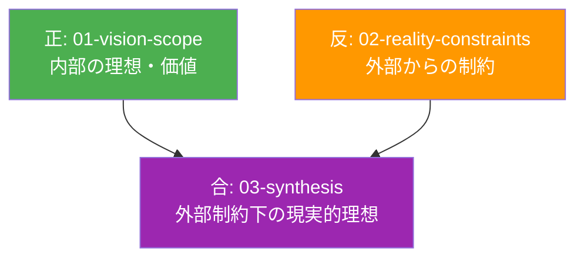
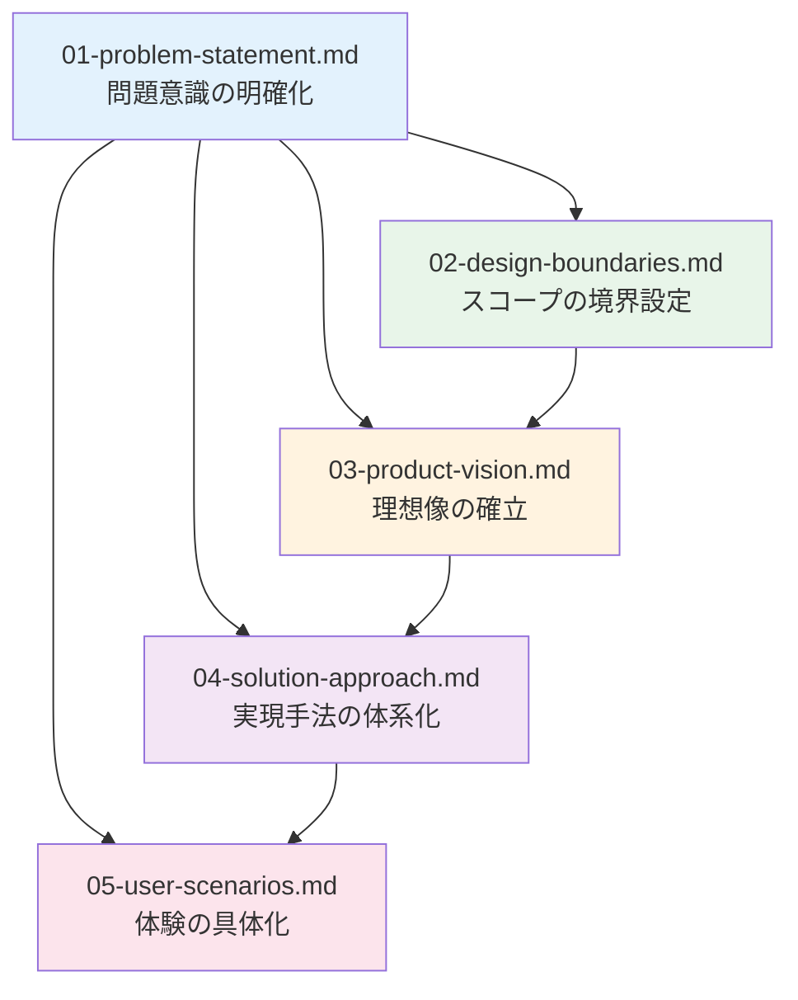

# ビジョン・スコープ定義 (Why 系・理想) - 小さな思想家のための理想基盤

CogitoWeave システムのビジョン・スコープについて、Why/What/How 軸における「Why 系の理想」として、弁証法的正反合構造の「正」を担う内部理想を体系的に整理している。「小さな思想家」のビジョンに基づく思考の民主化を理想とする。

## 弁証法的位置づけ：「正」としての内部理想

本ディレクトリは、外部制約を考慮しない状態での純粋な理想・価値・スコープを定義し、02-reality-constraints の外部制約と対立することで、03-synthesis での現実的統合解を導出する弁証法的構造の出発点として機能する。

## 小さな思想家ビジョンの核心理念

### 思考の民主化

「全ての考える人（小さな思想家）が自分の考えを体系化し、自らの問題解決に役立てるための仕組みを作る」というビジョンは、思考することの価値を民主化し、特別な才能や専門知識を持つ人だけでなく、日常的に考える全ての人の思考力を尊重する。

### 小さな思想家の定義

Martin Fowler のような影響力ある思想家と対比して、規模は小さくても自分なりに考え、体系化し、問題を解決する人々を「小さな思想家」と定義。この表現には謙虚さと誇りが同居し、思考することの本質的価値を表現している。

## 段階的論理展開による統合設計

本ディレクトリの構成は、理想・手法・体験が5段階の論理展開により統合設計される構造を採用している。

### 5段階の論理的依存関係

各段階は前段階の成果を基盤として、次段階への明確な入力を提供する：

- **第1段階：問題認識**（01 で明確化）：既存ツールとの格闘体験から根本課題を特定
- **第2段階：境界設定**（02 で決定）：4つの「やらないこと」による範囲明確化
- **第3段階：理想確立**（03 で統合）：問題と境界から小さな思想家ビジョンを導出
- **第4段階：手法体系化**（04 で具体化）：理想実現のための4つの創発的アプローチ
- **第5段階：体験具体化**（05 で検証）：手法が日常場面でどう機能するかの体験設計

この5段階の論理展開により、抽象的な問題意識から具体的な日常体験まで一貫した設計思想を実現している。

## 構成要素：段階的論理展開

### ファイル間依存関係

### 段階的論理展開の流れ

#### 第一段階：問題の発見と分析

[問題意識と解決アプローチ](01-problem-statement.md)：Martin Fowler の Bliki に着想を得た概念中心アプローチの可能性と既存ツール（個人サイト、Obsidian、Infinite Wiki）との格闘体験から導かれる課題分析

#### 第二段階：境界の設定

[設計境界線](02-design-boundaries.md)：4 つの「やらないこと」による個人思考支援への特化とスコープ明確化

#### 第三段階：理想像の確立

[プロダクトビジョン](03-product-vision.md)：問題と境界を統合した「小さな思想家のための思考体系化支援」理想未来像の確立

#### 第四段階：解決手法の体系化

[解決アプローチ](04-solution-approach.md)：小さな思想家の4つの根本課題を解決する創発的手法の導出

#### 第五段階：体験の具体化

[ユーザーシナリオ](05-user-scenarios.md)：4つの手法が5つの日常場面でどう活用されるかの具体的体験設計

各シナリオの文章中の括弧内表記により、[解決アプローチ](04-solution-approach.md)の4つの創発的手法がどのシナリオで活用されるかを確認できる：

- **概念中心設計**: 全シナリオで活用（小さな思想家の思考の最小単位である概念を軸とした整理・検索・関連付け）
- **段階的知識深化**: シナリオ1, 4, 5で活用（LLM生成→文献メモ→永続メモの自然な成熟プロセス支援）
- **視覚的・空間的アプローチ**: シナリオ2, 3, 5で活用（複雑な関係性の直感的理解・管理による思考地図提供）
- **LLM協働**: シナリオ1, 4で活用（「LLMに作らせて、ツッコミを入れる」効率的な個性発揮の実現）

## プロダクトゴールとしてのユーザーシナリオ

05-user-scenarios.md は、個人開発における「プロダクトゴール」の代替として機能する。企業開発でのプロダクトゴールは「測定可能な中間目標」だが、個人開発では「実現される具体的な体験変化」がより適切な成功指標となる。

各シナリオの「解決後の体験」が達成された時点で、小さな思想家のためのCogitoWeaveビジョンが段階的に実現されたと判断する。これは段階的論理展開における最終的な体験具体化として機能し、[解決アプローチ](04-solution-approach.md)の4つの手法の有効性を検証する役割を果たす。

## Why 系内部理想の統合効果

### 内部で決定可能な価値・理想の確立

本ディレクトリで定義される全ての要素は、チーム・組織が内部で決定できる理想・価値観・スコープである：

- **問題認識**：個人の価値観と体験に基づく課題特定
- **設計境界**：内部方針としての「やらないこと」決定
- **ビジョン**：小さな思想家のための理想未来像の内部合意
- **アプローチ**：思考支援に特化した4つの手法の内部選択
- **体験**：日常的な思考場面での期待される変化の内部定義

### 外部制約との対立準備

これらの内部理想は、02-reality-constraints で定義される外部制約（経済・法規制・技術・市場・組織制約）と対立し、03-synthesis での統合解導出の基盤となる。

## 結論：小さな思想家のための理想基盤の確立

CogitoWeave のビジョン・スコープとして、段階的論理展開に基づく内部理想を確立している。Martin Fowler の Bliki 体験から始まる5段階の論理展開により、外部制約に対抗する強固な理想基盤を構築している。

### 実現される 5 つの日常的体験（最終段階の具体化）

1. **気になる記事 → 自分なりの洞察**：興味深い情報を個人的な概念体系に統合する体験
2. **散らばった概念 → 整理された思考地図**：関係性の可視化による理解の整理体験
3. **ふとした疑問 → 関係性の発見**：個人的な関係語彙による思考パターン体系化体験
4. **質問への回答 → 過去の学びの活用**：蓄積知識の自動活用による問題解決体験
5. **漠然とした考え → 論理的な記事**：視覚的思考マップから論理的文章への発展体験

### 支える 4 つの創発的手法（第四段階の成果）

1. **概念中心設計**：小さな思想家の思考の最小単位である概念を軸とした知識構築環境
2. **段階的知識深化**：LLM 生成 → 文献メモ → 永続メモの自然な成熟プロセス支援
3. **視覚的・空間的アプローチ**：複雑な関係性の直感的理解・管理による思考地図提供
4. **LLM 協働**：「LLM に作らせて、ツッコミを入れる」効率的な個性発揮の実現

### 小さな思想家の価値実現サイクル

これらの段階的論理展開により実現される統合的思考支援環境は、小さな思想家が「考える → 整理する → 発見する → 活用する → 発信する」という成長サイクルを体験し、思考する人としての自信と成長を獲得することを支援する。

この理想基盤は、02-reality-constraints の外部制約と対立し、03-synthesis において「外部制約下の現実的理想」として統合され、CogitoWeave の最終的なビジョンを形成する弁証法的基盤となる。
