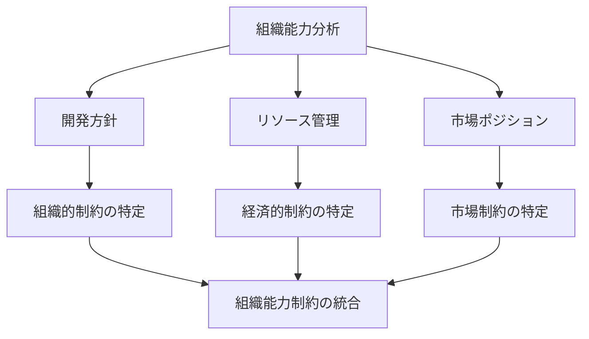

# 02-organizational-capacity - 組織能力

## 目次

- [概要](#概要)
- [処理フロー](#処理フロー)
- [直交分割](#直交分割)
- [並列関係ファイル](#並列関係ファイル)

## 概要

システム開発における組織能力を定義する。インセプションデッキの「ご近所さんを探せ」で示される、プロジェクトを支える関係者（ステークホルダー）の特定と、それを踏まえた組織内部の制約・能力・方針の明確化を行う。

組織能力は直交分割により複数の観点から並列分析される。各観点は独立した判断軸として機能し、組織の特性に応じて適切な分割が選択される。

## 処理フロー

組織能力の分析は以下の並列プロセスで実行される:

各分析は独立して実行可能であり、最終的に統合された組織能力制約として出力される。

## 直交分割

組織能力は組織の特性に応じて直交分割される：

**組織規模による分割例**：

- **個人開発**: 技術力・時間管理・事業理解
- **小規模チーム**: 開発能力・運営能力・外部連携能力
- **中規模組織**: 技術部門・事業部門・管理部門
- **大規模企業**: CTO・CFO・CMO・COO 等の CxO 体制

**プロダクト特性による分割例**：

- **B2B**: 技術・営業・サポート
- **B2C**: 技術・マーケティング・カスタマーサクセス
- **内製ツール**: 技術・運用・ユーザー部門連携

## 並列関係ファイル

本プロダクト（個人開発）における組織能力の分割：

- [開発方針](development.md) - 開発体制・技術選択・品質基準等の技術的な組織方針
- [リソース管理](resources.md) - 予算・時間・設備等のリソース制約と活用方針
- [市場ポジション](positioning.md) - 競合・差別化・価値提案等の市場での立ち位置

これらは個人開発という特定の組織形態における分割例であり、他の組織では異なる分割が適切となる。
