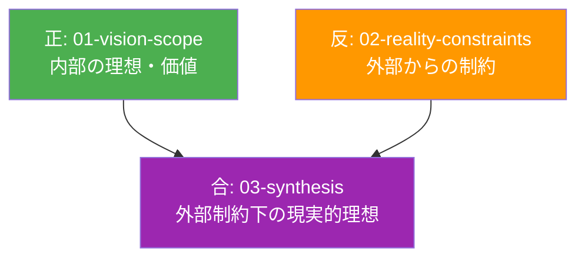
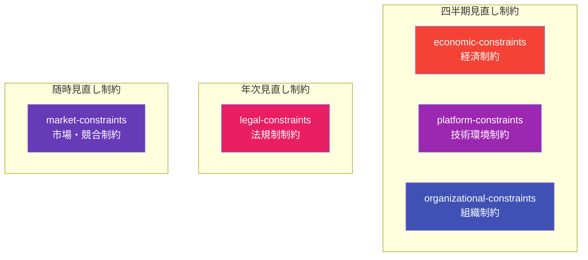

# 現実制約 (Why 系・現実)

CogitoWeave システムの現実制約について、Why/What/How 軸における「Why 系の現実」として、弁証法的正反合構造の「反」を担う外部制約を体系的に整理している。

## 弁証法的位置づけ：「反」としての現実制約

本ディレクトリは、01-vision-scope が描く理想に対する「現実の制約」として機能し、主観的理想と客観的制約の両方を考慮した意思決定構造を実現する。これらの制約は全て設定から次回見直しまでの期間中は変更しない前提条件という共通特性を持つ。制約の明文化により、主観的な理想だけでなく客観的な制約も考慮した現実的バランスを強制し、実現可能性を無視した一方的な判断を防ぐ。

## 外部制約の判定基準

### Why 系制約テスト

1. **現実制約テスト**: この制約は現実的に考慮すべき条件か？
2. **前提固定テスト**: この制約は設定から次回見直しまでの期間中は変更しない前提とするか？

### Why 系制約の動的性質

**重要**: Why 系制約は「その時点での開発前提条件」を記録します。

## 制約分類体系：5つの制約カテゴリと管理特性

### 制約カテゴリと変更可能性の対応関係

| 制約カテゴリ | 変更可能性 | 見直し頻度 | 重要度 | 判定理由 |
|-------------|------------|------------|--------|----------|
| 経済制約 | 前提制約 | 四半期 | 高 | 個人開発の継続性に直結、変更可能だが期間中は固定 |
| 法規制制約 | 絶対制約 | 年次 | 高 | 法的リスク回避必須、個人では変更不可能 |
| プラットフォーム制約 | 交渉制約 | 四半期 | 高 | 実装可能性を左右、技術選択により変更可能 |
| 組織制約 | 前提制約 | 四半期 | 中 | 開発方針に影響、変更可能だが期間中は固定 |
| 市場制約 | 交渉制約 | 随時 | 中 | 競争力維持に影響、差別化戦略により変更可能 |

### 制約の変更可能性定義

- **絶対制約**: 法規制等、誰も変更できない制約
- **交渉制約**: 技術選択・戦略変更により変更可能な制約
- **前提制約**: 個人が変更可能だが、設定から次回見直しまでの期間中は変更しない前提制約

### 重要度の判定基準

- **重要度高**: プロジェクト継続性・法的リスク・実装可能性に直結する制約
- **重要度中**: 開発効率・競争力に影響するが致命的ではない制約

### 見直し頻度の根拠

- **四半期見直し**: 変化が早く、定期的な調整が必要な制約
- **年次見直し**: 安定性が高く、頻繁な変更が不要な制約  
- **随時見直し**: 外部環境の突発的変化に応じた柔軟な対応が必要な制約

**制約変更時の対応**:

1. 制約内容を更新
2. 変更理由を記録
3. 影響する What/How 系設計の見直し実施

**注意**: 制約変更は設計変更を意味するため、関連する設計への影響を必ず確認すること。

### 制約管理の可視化

### 個人開発における制約管理の統合ルール

**効率的な見直し管理**: 限られたリソースでの効果的な制約追跡を実現するため、変化速度と重要度に応じた優先順位管理を実施。

**緊急見直し対応**: 重大な外部環境変化時（デバイス故障、生活環境激変、重要な技術革新等）には、見直し頻度に関わらず全制約の緊急見直しを実施。

**制約変更時の統合対応**:

1. 制約内容を更新
2. 変更理由を記録  
3. 影響するWhat/How系設計の見直し実施

**注意**: 制約変更は設計変更を意味するため、関連する設計への影響を必ず確認すること。

## 結論: 論理的制約体系による理想と現実の統合基盤

CogitoWeaveの現実制約は、5つの制約カテゴリを変更可能性・見直し頻度・重要度の3軸で体系的に管理する動的制約体系として機能する。

### 制約体系の統合効果

**論理的一貫性の確保**: 制約カテゴリと変更可能性の明確な対応関係により、どの制約がどのような性質を持つかが明確化され、矛盾のない制約管理を実現。

**効率的リソース配分**: 重要度の判定基準(プロジェクト継続性・法的リスク・実装可能性)に基づく優先順位管理により、限られたリソースでの効果的な制約追跡を実現。

**動的な制約管理**: 見直し頻度の根拠(変化速度・安定性・突発性)に応じた柔軟な管理により、外部環境変化への適応力を確保。

### 弁証法的統合への貢献

これらの体系的制約管理により、01-vision-scope で確立された内部理想に対する現実的な制約条件を論理的に提供し、03-synthesis での創発的統合解導出の強固な基盤を構築している。

**統合の追跡性確保**: 上記結論は、個別制約ファイル群(economic-constraints, legal-constraints, market-constraints, organizational-constraints, platform-constraints)の結論を、新しい制約分類体系に基づいて論理的に統合している。経済・法規制・プラットフォーム制約(重要度高)、組織・市場制約(重要度中)の重み付けにより、優先的管理とバランス重視の現実的制約体系を構築。
