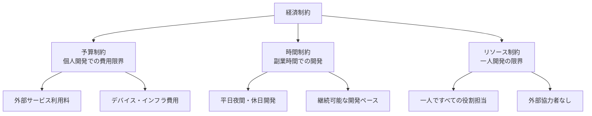

# 経済制約

## 前提条件とスコープ

CogitoWeave システムの経済制約について、個人開発環境における予算・時間・リソースの外部制約を統合的に管理している。これらは個人の経済状況という外部環境により決定され、チーム・組織の意思では変更できない制約として機能する。

**このカテゴリのスコープ**: 経済制約に関する設計判断のみ。具体的な予算管理や時間管理手法はスコープ外。

## 構成要素

## 経済制約における設計判断

CogitoWeave の経済制約として、個人開発環境での現実的な制約を受容し、持続可能な開発体制を前提とした設計判断を行う。

### 予算制約の受容

- 外部サービス利用は月額数千円程度に限定
- 無料・低コストソリューションの積極活用
- 高額なエンタープライズサービスは除外

### 時間制約の受容

- 本業に影響しない範囲での開発時間確保
- 週末・平日夜間での継続的な開発体制
- 短期集中ではなく長期継続可能なペース

### リソース制約の受容

- 一人開発による意思決定の迅速性活用
- 外部依存を最小限に抑えた自己完結設計
- 複雑な協調作業を必要としないアーキテクチャ

## 結論

CogitoWeave の経済制約として、個人開発環境での現実的な制約を正面から受容し、制約を前提とした合理的な設計判断を行う。これにより、持続可能な開発体制と実用的なシステム実現を両立する外部制約として機能する。
