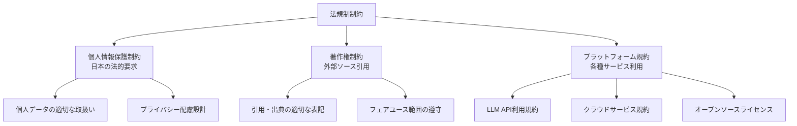

# 法規制制約

## 前提条件とスコープ

CogitoWeave システムの法規制制約について、個人開発環境で遵守すべき法的・規約的制約を統合的に管理している。これらは外部の法制度・プラットフォーム規約により決定され、チーム・組織の意思では変更できない制約として機能する。

**このカテゴリのスコープ**: 法規制制約に関する設計判断のみ。具体的な法的手続きや規約対応実装はスコープ外。

## 構成要素

## 法規制制約における設計判断

CogitoWeave の法規制制約として、個人開発でも遵守すべき基本的な法的・規約的要求を受容し、コンプライアンス重視の設計判断を行う。

### 個人情報保護制約の受容

- 個人の思考・知識データの適切な管理
- 外部サービス連携時のプライバシー配慮
- データ保存・共有における透明性確保

### 著作権制約の受容

- 外部記事・書籍からの情報取り込み時の適切な引用
- 要約・抜粋における著作権法の遵守
- フェアユース範囲での利用に限定

### プラットフォーム規約制約の受容

- Gemini API 等の利用規約遵守
- GitHub 等のオープンソース化時のライセンス適用
- 各種クラウドサービスの利用条件受容

## 結論

CogitoWeave の法規制制約として、個人開発であっても遵守すべき法的・規約的制約を正面から受容し、コンプライアンス重視の設計判断を行う。これにより、法的リスクを回避しつつ持続可能な開発・運用を実現する外部制約として機能する。
