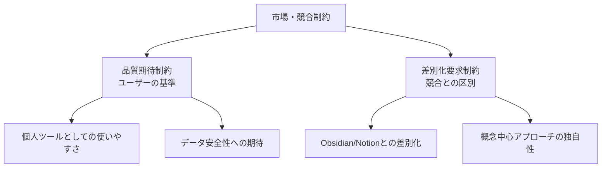

# 市場・競合制約

## 前提条件とスコープ

CogitoWeave システムの市場・競合制約について、既存の個人知識管理ツール市場における品質期待・差別化要求を統合的に管理している。これらは市場環境・競合状況により決定され、チーム・組織の意思では変更できない制約として機能する。

**このカテゴリのスコープ**: 市場・競合制約に関する設計判断のみ。具体的なマーケティング戦略や競合分析はスコープ外。

## 構成要素

## 市場・競合制約における設計判断

CogitoWeave の市場・競合制約として、既存の個人知識管理ツール市場で形成された品質期待を受容し、差別化を前提とした設計判断を行う。

### 品質期待制約の受容

- Notion や Obsidian レベルの基本的な使いやすさ
- 個人データの安全性・プライバシー保護
- 継続的な利用に耐える安定性・信頼性

### 差別化要求制約の受容

- 既存ツールでは実現困難な概念中心アプローチ
- LLM 協働による効率性と個性の両立
- 視覚的・空間的な関係性表現の独自性

## 結論

CogitoWeave の市場・競合制約として、既存ツール市場で形成された品質期待を正面から受容しつつ、明確な差別化価値を提供する設計判断を行う。これにより、市場での競争力と独自価値を両立する外部制約として機能する。
