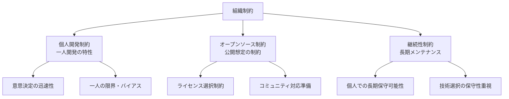

# 組織制約

## 前提条件とスコープ

CogitoWeave システムの組織制約について、個人開発環境とオープンソース化想定における組織的制約を統合的に管理している。これらは開発体制・公開方針により決定され、技術的判断とは独立した制約として機能する。

**このカテゴリのスコープ**: 組織制約に関する設計判断のみ。具体的な開発プロセスやコミュニティ運営はスコープ外。

## 構成要素

## 組織制約における設計判断

CogitoWeave の組織制約として、個人開発の特性とオープンソース化想定を受容し、持続可能な開発・運営体制を前提とした設計判断を行う。

### 個人開発制約の受容

- 意思決定の迅速性を活かした柔軟な方向転換
- 一人の視点・バイアスの限界を認識した設計
- 複雑な協調作業を避けたシンプルな構造

### オープンソース制約の受容

- MIT/Apache 等の適切なライセンス選択
- コードの可読性・拡張性を重視した実装
- 将来のコミュニティ貢献を想定した設計

### 継続性制約の受容

- 個人で長期間メンテナンス可能な技術選択
- 複雑な依存関係を避けた保守性重視
- 知識の属人化を避けたドキュメント整備

## 結論

CogitoWeave の組織制約として、個人開発とオープンソース化の特性を正面から受容し、持続可能な開発・運営体制を前提とした設計判断を行う。これにより、現実的な開発体制と将来の拡張性を両立する外部制約として機能する。
