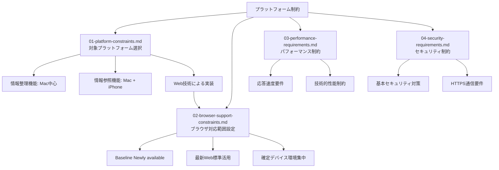

# プラットフォーム制約における段階的設計判断

## 前提条件とスコープ

CogitoWeaveシステムの最も基本的な制約として、対象プラットフォームとブラウザ対応範囲を段階的に判断し、全ての他の制約の前提となる技術基盤を決定する。

**このカテゴリのスコープ**: プラットフォーム制約とブラウザ対応制約の順序的判断。具体的な技術実装詳細はスコープ外。

## 構成要素

## 段階的論理展開

第一段階として、[プラットフォーム制約](01-platform-constraints.md)により、作成者の実際のデバイス環境と利用パターンに基づき、対象プラットフォームを決定している。iPhone・Macでの利用要求から、情報整理機能はMac中心、情報参照機能はMacとiPhoneの両方での利用を前提とし、Web技術による単一コードベースでの実装を選択している。これにより、複数デバイス間でのデータ共有や知識管理の継続性を確保し、開発効率と保守性を高めている。

第二段階では、[ブラウザ対応制約](02-browser-support-constraints.md)により、Web技術による実装を前提とした具体的なブラウザ対応範囲を設定している。作成者の確定デバイス環境（iPhoneのSafari、MacのChrome）に集中し、Baseline Newly availableを基準とした最新Web標準のみを採用することで、高品質な実装と迅速な開発を両立している。古いブラウザや非対応環境は除外し、限定された環境での最適化を徹底している。

第三段階として、[パフォーマンス制約](03-performance-requirements.md)により、個人用知識管理ツールとして必要な技術的性能要件を設定している。概念ページ読み込み2秒以内、検索結果表示1秒以内等の具体的な応答速度要件を定め、既存ツール（Obsidian・Notion）レベルの品質期待に応える技術制約を確立している。

第四段階では、[セキュリティ制約](04-security-requirements.md)により、個人開発環境での基本的なセキュリティ対策レベルを決定している。HTTPS通信、SQLインジェクション対策、XSS対策等の基本実装を必須とし、プロトタイプ段階での合理的なセキュリティレベルを設定している。

## 結論

CogitoWeaveのプラットフォーム制約は、作成者のデバイス環境(Mac + iPhone)に最適化した合理的な制約設定を段階的に行うことで、開発効率と実用性の最適化を図っている。Web技術による単一コードベースでの複数環境対応、確定デバイス環境でのBaseline Newly available活用、既存ツールレベルの性能要件、基本的なセキュリティ対策により、高品質な実装と効率的な開発を両立する包括的な技術基盤を提供している。
