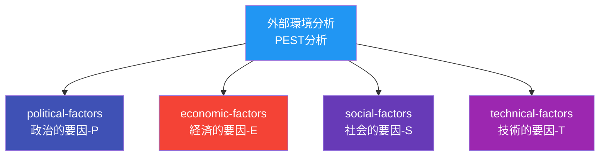

# 外部環境分析

## 目次

- [概要](#概要)
- [処理フロー](#処理フロー)
- [網羅分割](#網羅分割)
- [並列処理](#並列処理)
- [合成処理](#合成処理)

## 概要

CogitoWeave システムの設計判断における**外部環境要因**を分析する。PEST 分析(Political, Economic, Social, Technological)フレームワークを個人開発向けに調整し、組織が直接コントロールできない外部要因がシステム設計に与える影響を評価する。

## 処理フロー

## 網羅分割

### PEST分析の一般的定義

PEST分析(Political, Economic, Social, Technological)は外部環境分析の基本フレームワーク。

- **政治的要因(Political)**: 法律・規制・政治的安定性・政府政策・税制
- **経済的要因(Economic)**: 経済成長率・インフレ・金利・為替・景気動向
- **社会的要因(Social)**: 人口動態・文化的トレンド・ライフスタイル変化・価値観・教育水準
- **技術的要因(Technological)**: 技術革新・研究開発動向・自動化・特許・技術普及率

### 個人開発向けPEST分析

上記の一般的なPEST分析を個人開発における外部環境要因として調整したものである。

- **政治的要因(Political)**: 個人情報保護法・著作権法・プラットフォーム利用規約・審査基準
- **経済的要因(Economic)**: クラウドサービス価格体系・広告収益市場・決済手数料
- **社会的要因(Social)**: デジタルサービス利用傾向・プライバシー意識・アクセシビリティ要求
- **技術的要因(Technological)**: Web標準仕様・ブラウザサポート・API提供状況

## 並列処理

PEST分析における4つの外部環境要因を並列分析する。

### 技術的要因

Web標準仕様・ブラウザサポート・API提供状況等の技術環境要因を分析する。

## 合成処理

PEST分析による外部環境要因の分析結果を統合し、システム設計戦略への影響を評価する。

### 外部環境影響の統合

4つのPEST要因を統合して、CogitoWeaveシステム設計における外部環境影響を定義する。

- **政治的影響**: 個人情報保護法・著作権法・プラットフォーム利用規約・審査基準による設計制約
- **経済的影響**: クラウドサービス価格体系・広告収益市場・決済手数料によるコスト制約  
- **社会的影響**: デジタルサービス利用傾向・プライバシー意識・アクセシビリティ要求による機能要件
- **技術的影響**: Web標準仕様・ブラウザサポート・API提供状況による技術選択制約
