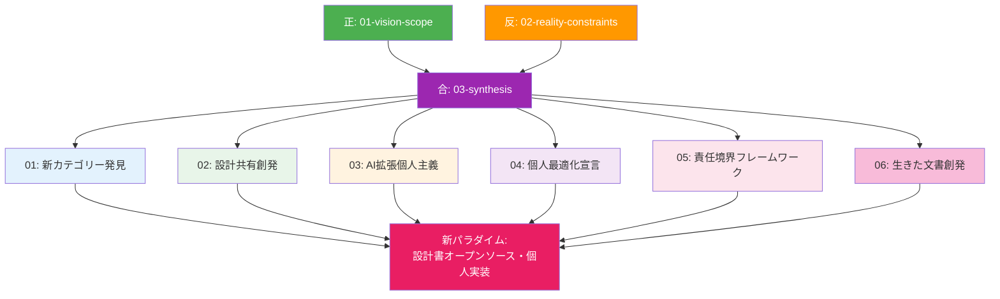

# 統合解の創発 (Why 系・統合) - 正反合による新価値の発見

CogitoWeave システムの統合解について、Why/What/How 軸における「Why 系の統合」として、弁証法的正反合構造の「合」を担う創発的統合解を体系的に整理している。理想と制約の対立から質的に新しい価値を創造する統合プロセスを実現している。

## 弁証法的位置づけ：「合」としての創発的統合

本ディレクトリは、01-vision-scope の内部理想と 02-reality-constraints の外部制約の対立から、単純な妥協や折衷案ではない、質的に新しい統合解を創発し続ける弁証法的実践の場として機能する。

## 真の弁証法的統合とは何か

### 偽物の統合：単純な妥協・折衷・調整

多くの設計プロセスで「統合」と呼ばれているものは、実は弁証法的統合ではない。理想を 70%実現し、制約を 30%受け入れるような量的調整、理想の一部を諦めて制約に適応するような妥協、複数の要素を機械的に組み合わせるような折衷案。これらは対立する要素の表面的な組み合わせに過ぎない。

偽物の統合では、元の理想も制約も本質的には変化しない。理想は「制約によって制限された理想」になり、制約は「理想によって緩和された制約」になるだけで、両者の根本的性質は変わらない。結果として生まれるのは、どちらの本来の価値も完全には実現されない中途半端な解決策である。

### 真の弁証法的統合：質的転換による新価値創発

真の弁証法的統合は、対立する要素同士の化学反応によって、全く新しい価値カテゴリーを創発する過程である。理想と制約が相互作用することで、どちらでもない第三の可能性が生まれる。この第三の可能性は、元の理想や制約を単純に足し合わせたものではなく、対立の緊張関係から生まれる創造的な跳躍である。

CogitoWeave における真の統合は、「小さな思想家のための理想的ツール」と「個人開発の現実的制約」の対立から、「個人思想家による個人思想家のためのツール」という全く新しいツールカテゴリーを創発することである。この新カテゴリーは、既存のどのツール分類にも属さない独自の価値を持つ。

## 対立から創発される新価値の構造

### 開発者とユーザーの一体性による体験創発

従来のツール開発では、開発者とユーザーは分離された存在として前提されてきた。開発者は市場調査や理論に基づいてツールを設計し、ユーザーは完成されたツールを利用する。この分離構造が、多くのツールの限界を生み出してきた。

CogitoWeave では、開発者自身が小さな思想家であり、自分自身の思考プロセスを支援するツールを作る。この一体性から、体験の即座性、価値観の一貫性、成長の共有という従来のツールでは不可能だった体験が創発する。機能を実装した瞬間にその効果を直接体験でき、思考の微細な変化を即座に改善に反映できる創発的な開発プロセスが実現される。

### 制約の建設的活用による本質抽出

個人開発の制約は、従来の発想では「理想の実現を阻む障害」として捉えられがちである。しかし真の統合では、制約が本質的価値の抽出と純度向上を促進する建設的な力として機能する。

経済制約による機能の選択的実装は、思考支援の核心のみを抽出する。技術制約による実装の簡素化は、システムの透明性を高め、思考プロセスへの意識的参加を促進する。組織制約による開発スピードの制限は、一つ一つの機能が思考に与える影響を深く検証する時間を提供する。これらの制約が、表面的でない真の思考支援を実現する創造的な力となる。

### 共感に基づく深層理解の実現

開発者が小さな思想家として自分自身のためのツールを作る時、ユーザーのニーズは推測や調査の対象ではなく、直接的な体験となる。複雑な情報を整理する時の認知負荷、新しい概念を理解する時の困惑、関連性を発見する時の喜び。これらの微細な認知・感情プロセスを、開発者は自分自身の体験として深く理解している。

この共感に基づく理解は、従来のユーザー調査や市場分析では決して得られない深さを持つ。思考プロセスの本質的構造と、そこで生じる感情的体験の両方を包含した総合的理解が、既存ツールでは提供できない、思考者の内面に深く寄り添うツールを可能にする。

## 創発された新ツールカテゴリーの特徴

### 認知的拡張としてのツール

従来のツールは、人間の外部にある道具として機能していた。ユーザーはツールを使って作業を行うが、ツールと人間は明確に分離されている。しかし創発された新カテゴリーでは、ツールは思考者の認知的拡張として機能する。

ツールは外部から与えられる道具ではなく、思考者が自分自身の思考を拡張するために作り出す認知的な器官となる。思考プロセスとツールの機能が有機的に統合され、境界が曖昧になる。この統合により、思考能力そのものが向上する体験が実現される。

### 動的進化するシステム

従来のツールは、開発完了後は基本的に静的なシステムとして機能する。機能追加やバグ修正はあるが、ツールの本質的性格は変わらない。しかし新カテゴリーでは、ツールは使用者である開発者の成長と共に動的に進化し続ける。

開発者が思考者として成長していく過程で、必要とする支援の質も変化していく。ツールはこの変化に応じて継続的に進化し、より高度な思考支援を提供するようになる。使用者の成長とツールの進化が相互に促進し合う、動的な共進化システムが実現される。

### 本質的価値への純化

市場競争や多様なニーズへの対応を考慮する必要がない個人開発環境では、思考支援の本質的価値のみを追求できる。機能の多さや見た目の華やかさではなく、思考能力の向上に直接寄与する要素のみに集中したツールが実現される。

この純化プロセスにより、思考支援の本質とは何かがより明確に見えてくる。複雑な機能や過度な自動化ではなく、思考者の能動的な参加を促し、メタ認知能力を向上させる環境の提供が重要であることが明らかになる。

## 統合解の 6 段階展開

弁証法的統合から創発された新価値は、以下の 6 段階を通じて「設計書オープンソース・個人実装」という創発的パラダイムとして具体化される。

### [01-emergent-category-discovery.md](01-emergent-category-discovery.md)

**新ツールカテゴリーの発見** - 「個人思想家による個人思想家のためのツール」という既存分類を超越した全く新しい価値カテゴリーの発見。開発者とユーザーの一体性から生まれる創発的体験の理論的基盤。

### [02-design-sharing-emergence.md](02-design-sharing-emergence.md)

**設計共有の創発** - オープンソースのバザールモデルとは異なる「設計書オープンソース・個人実装」モデル。思考の共有と実装の個別化による新しい共創パラダイムの確立。

### [03-ai-augmented-individuality.md](03-ai-augmented-individuality.md)

**AI 拡張個人主義** - Vibe Coding の個人活用による AI 時代の個人開発の創発。多人数向けサービスの危険性を回避し、個人用途に特化した AI 活用の可能性。

### [04-personal-optimization-manifesto.md](04-personal-optimization-manifesto.md)

**個人最適化宣言** - 市場の最大公約数を無視し、完全に個人の思考プロセスに最適化されたツール設計の宣言。究極のカスタマイズ自由度の実現。

### [05-responsibility-boundary-framework.md](05-responsibility-boundary-framework.md)

**責任境界フレームワーク** - セキュリティリスクを個人レベルに限定し、エンジニアの専門性と個人開発の自由度を両立する責任境界の設計原則。

### [06-living-document-emergence.md](06-living-document-emergence.md)

**生きた文書の創発** - 死んだドキュメント文化からの解放による新しい技術文書パラダイム。アジャイル宣言との相互補完により、思考プロセスを生きた形で記録・共有する文書文化の創発。

これら 6 つの展開が統合され続けることで、「設計書オープンソース・個人実装」という全く新しい開発パラダイムが展開され、思考支援ツールの概念を根本から創発的に変化させ続ける。

## 結論：新価値創造による既存市場の超越

CogitoWeave の統合解は、既存の思考支援ツール市場での競争を回避し、全く新しい価値カテゴリーを創造することで問題を根本的に解決する。

「個人思想家による個人思想家のためのツール」という新カテゴリーから、さらに「設計書オープンソース・個人実装」という創発的開発パラダイムが創発された。これはオープンソースのバザールモデルとは異なるアプローチとして、思考の共有と実装の個別化、AI 時代の個人開発支援、完全個人最適化、責任境界の明確化、生きた文書文化という 6 つの特徴を統合した全く新しい価値体系である。

この新パラダイムにより、思考支援ツールは単なるソフトウェアから認知的拡張へと質的転換し、個人の思考能力向上を支援する新しい文化的・技術的基盤が確立される。従来のエンジニアリング価値観と両立しながら、AI 時代の個人開発の可能性を最大化する道筋が明確に示された。

弁証法的統合の本質である質的転換が実現され、理想と制約の対立から創発した新価値が、既存のあらゆる開発パラダイムを超越する独自性と存在意義を確立している。小さな思想家のための思考支援という当初の理想は、制約を建設的な力として活用することで、想像を超えた純粋で創発的な形で実現される。
