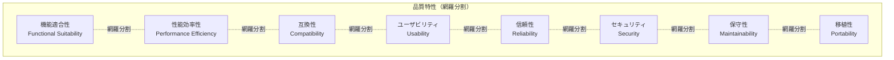

# システム制約 - 非機能要件の網羅的定義

## 目次

TBD

## 概要

CogitoWeave システムの内部品質制約として、ISO/IEC 25010 システム及びソフトウェア品質モデルに基づいた非機能要件を網羅的に定義する。これらの制約はシステム設計の全段階で参照される基盤的な品質基準となる。

## 処理フロー

## 直交分割

TBD

## 並列関係ファイル

### ISO/IEC 25010 品質特性

これらは互いに排他的で網羅的な品質特性であり、決定順序に依存関係はない：

- [機能適合性](functional-suitability.md) - システムが指定された機能を提供する度合い
- [性能効率性](performance.md) - 指定された条件の下で、使用されるリソースの量に関するパフォーマンス
- [互換性](compatibility.md) - 同じハードウェア環境で他システムと情報交換する度合い
- [ユーザビリティ](usability.md) - 指定された利用者が効果・効率・満足を達成する度合い
- [信頼性](reliability.md) - 指定された条件下で指定された期間機能を実行する度合い
- [セキュリティ](security.md) - 情報・データを許可なく参照・変更されない度合い
- [保守性](maintainability.md) - 有効性・効率性をもって修正できる度合い
- [移植性](portability.md) - 1つの環境から他の環境に移すことができる度合い

### 不足している品質特性の追加

以下の品質特性がまだ定義されていないため、今後追加が必要：

- **効率性** (efficiency.md) - リソース使用効率（性能効率性の細分化が必要な場合）
- **アクセシビリティ** (accessibility.md) - 障害者や高齢者を含む多様なユーザーの利用可能性
- **スケーラビリティ** (scalability.md) - 負荷増加に対する拡張性
- **可用性** (availability.md) - システムの稼働率・利用可能性
