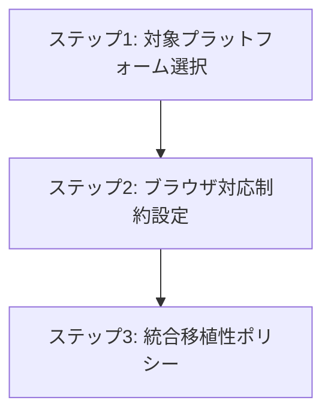

# 移植性制約における段階的絞り込み

## 目次

TBD

## 概要

CogitoWeave システムの移植性制約として、対象プラットフォーム選択からブラウザ対応範囲まで段階的に設計判断を行う。個人用デジタルツェッテルカステンとしての用途特性、機能レベルでの利用パターンの違い、作成者の実際のデバイス環境を前提とする。

## 処理フロー

## ステップ 1: 対象プラットフォーム選択

CogitoWeave のプラットフォーム制約は、作成者の実際のデバイス環境と機能レベルでの利用パターンの違いを基準として設定する必要がある。

まず、作成者の基本的な使用要求として、iPhone・Mac での利用が前提となる。個人のデジタルツェッテルカステンは、思考の外在化と情報管理を目的とするため、普段使用しているデバイスでの利用が必須である。iPhone での移動中の情報アクセスと、Mac での本格的な作業環境での利用により、知識管理の継続性を確保する必要がある。

ただし、実際の利用パターンを考慮すると、情報の更新作業（文献メモ作成・概念間関係の入力・グラフ編集等）は大画面・物理キーボード・精密なポインティングデバイスがなければ効率的に行えない。一方、情報参照機能（閲覧・検索・ナビゲーション）は小画面でも十分に機能する。このため、更新機能はデスクトップ環境中心、参照機能はモバイル環境対応という機能分離が必要になる。

この異なるデバイス・OS での動作要求を効率的に実現するため、Web 技術による実装を選択する。ネイティブアプリ開発では iOS・macOS で別々の実装が必要になり、個人開発では現実的でない。Web 技術により単一のコードベースで両環境に対応し、開発効率と保守性を確保する。

ただし、iPhone と Mac での利用を実現するには、両デバイス間でのデータ同期が必要となる。Mac で作成した文献メモや概念関係を iPhone で参照し、逆に iPhone で収集した情報を Mac で整理する継続的な知識管理プロセスを支援するためである。ローカルストレージのみでは各デバイスが独立してしまい、統一された知識ベースとして機能しない。このため、複数デバイス間でのデータ共有を前提とした設計が必要である。

## ステップ 2: ブラウザ対応制約設定

CogitoWeave のブラウザ対応制約は、作成者の実際のデバイス環境と Web 技術による実装効率を基準として設定する必要がある。

まず、作成者の確定デバイス環境として、iPhone（iOS Safari）と Mac（Chrome）での動作が必須となる。個人のデジタルツェッテルカステンは日常的に使用するツールであるため、実際に所有しているデバイスでの確実な動作が最優先である。この 2 つの環境での動作確保が基本要件となる。

次に、Web 標準の採用基準として、Baseline Newly available を基準とする。Baseline Newly available は主要ブラウザすべてで対応が確認された最新の Web 標準を示すため、実装の信頼性と最新機能の活用を両立できる。Baseline Newly available で利用可能な機能のみを使用することで、確定デバイス以外でも基本的な動作互換性を期待できる。

この実際のデバイス環境と Baseline Newly available 基準に集中することで、開発効率の最大化を図る。Internet Explorer や古いバージョンのブラウザ対応は完全に除外し、Baseline Newly available で利用可能なモダン Web 標準を積極的に活用する。限定された環境での最適化により、高品質な実装と迅速な開発を両立する。

## ステップ 3: 統合移植性ポリシー

ステップ 1-2 の設計判断を統合した、CogitoWeave の最終的な移植性制約：

<!-- FOUNDATION_BEGIN: target-platforms -->

- 必須対応
  - 情報整理機能: Mac (Chrome) - デスクトップ環境中心
  - 情報参照機能: Mac (Chrome) + iPhone (Safari) - 全環境対応
  - 実行環境: Web 技術による実装、複数デバイス間でのデータ共有を前提
- 任意対応
  - 作成者環境外での動作は妨げないが保証しない
  - Web 技術による実装のため、一般的なモダンブラウザで基本動作は期待できる
- 除外対応
  - ネイティブアプリ開発（iOS・macOS 別実装）
  - ローカルストレージのみによる単一デバイス運用

<!-- FOUNDATION_END: target-platforms -->

<!-- FOUNDATION_BEGIN: browser-support -->

- 必須対応
  - 対応ブラウザ: iOS Safari（iPhone）、Chrome（Mac）
  - 採用 Web 標準: Baseline Newly available を基準とした機能のみ使用
  - 対応方針: 確定デバイスでの完全動作確保
- 任意対応
  - 他環境での動作は Baseline Newly available による副次的効果として期待
- 除外対応
  - Internet Explorer・古いブラウザとの互換性は考慮しない
  - Baseline Newly available 未対応の機能は使用しない

<!-- FOUNDATION_END: browser-support -->

### 移植性の意図的制限

この移植性制約は、**意図的な制限**による価値創造を目指している：

- **制限による集中**: 限定環境での完璧な体験実現
- **開発効率**: 無制限対応による複雑性回避
- **品質保証**: 確定環境での徹底的な動作検証
- **技術採用**: 最新 Web 標準の積極活用

全環境対応ではなく、**選択的移植性**による戦略的価値創造である。
