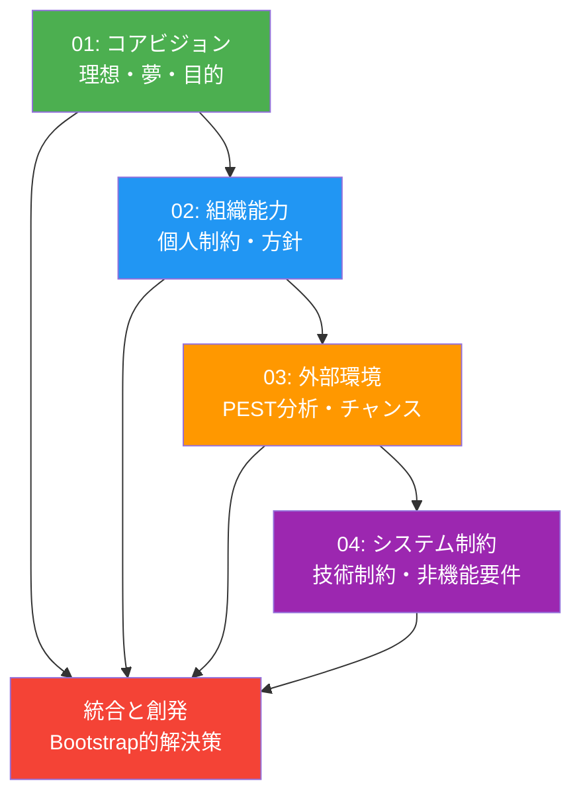

# ビジョンと現実の統合 - 同心円的設計フレームワーク

CogitoWeave システムの設計判断を、コアビジョンから外部環境まで同心円的に拡張する 4 段階のフレームワークで整理する。理想と現実の統合から創発的な新価値を生み出す Bootstrap 的開発アプローチを実現する。

## 目次

- [概要](#概要)
- [処理フロー](#処理フロー)
- [ステップ 1: コアビジョン](#ステップ-1-コアビジョン)
- [ステップ 2: 組織能力](#ステップ-2-組織能力)
- [ステップ 3: 外部環境](#ステップ-3-外部環境)
- [ステップ 4: システム制約](#ステップ-4-システム制約)
- [ステップ 5: 統合と創発](#ステップ-5-統合と創発)

## 概要

同心円的に拡張する設計判断プロセス：

1. **コアビジョン**: チーム/プロダクトの夢と理想
2. **組織能力**: 個人開発の制約と方針決定
3. **外部環境**: 外部制約とチャンスの分析
4. **システム制約**: 最終的な技術制約の決定

## 処理フロー

## ステップ 1: コアビジョン

[コアビジョン](01-core-vision/README.md)では、プロダクトの核となる理想と夢を定義する。

### やらないこと

<!-- PREMISE_BEGIN: design-boundries -->

1. **思考支援に特化**: 万能ツールではなく、考えをまとめることだけに集中
2. **人間が主導**: LLM は叩き台提供のみ、考える楽しみは人間が味わう
3. **完全に個人的**: 他人の評価ではなく、自分の問題解決が価値基準
4. **自然な関係性**: 学術的分類ではなく、個人の思考パターンを重視

<!-- PREMISE_END: design-boundries -->

### アプローチ

<!-- PREMISE_BEGIN: solution-approach -->

- **概念中心設計**: 小さな思想家の思考の最小単位である概念を軸とした知識構築
- **段階的知識深化**: 概念に文献メモを積み重ね、永続メモとして深化させるプロセスを支援
- **視覚的・空間的アプローチ**: 複雑な関係性の直感的理解・管理による思考地図提供
- **LLM 協働**: 「LLM に作らせて、ツッコミを入れる」効率的な個性発揮の実現

<!-- PREMISE_END: solution-approach -->

## ステップ 2: 組織能力

[組織能力](02-organizational-capacity/README.md)では、個人開発における制約と方針を決定する。

## ステップ 3: 外部環境

[外部環境](03-external-environment/README.md)では、組織能力を踏まえた外部制約とチャンスを分析する。

個人開発の Web アプリケーション開発に影響する外部環境要因を PEST 分析により整理し、技術選択の根拠とする。

## ステップ 4: システム制約

[システム制約](04-system-properties/README.md)では、前 3 段階を統合した最終的な技術制約を決定する。

コアビジョン・組織構造・外部環境の交点として、実現可能なシステムの非機能要件を定義する。

## ステップ 5: 統合と創発

### Bootstrap 的創発解

ステップ 1 の理想(包括的設計書による思考支援)とステップ 2 の制約(週 7 時間の限界)から、「**設計書作成プロセス自体が思考支援ツール**」という Bootstrap 的創発解が導出される。

### 対立から創発される新価値

**従来の対立**:

- 理想: 生成 AI 時代の包括的ドキュメント作成による思考整理
- 制約: 限られた時間で動くソフトウェアを完成させる必要性

**創発された統合解**:
CogitoWeave を作る設計書作成プロセスが、既に CogitoWeave 的思考支援体験そのものになっている。メタ循環的な価値創造により、開発プロセス自体がプロダクト価値を提供する。

### 実現される価値

<!-- GLOBAL_CONCLUSION_BEGIN: bootstrap-development-approach -->

- CogitoWeave の設計書作成プロセスは、完成前から思考支援効果を提供する。
  - Bootstrap 的開発により、開発プロセス自体がプロダクト価値となるため。
- 開発プロセスと改善プロセスが継続的に最適化される。
  - ツールを使いながら改善する循環により、プロセス品質が向上し続けるため。
- 思考支援ツール制作を通じて、開発者のメタ認知能力が向上する。
  - 思考プロセスを意識化・体系化する経験により、思考能力そのものが強化されるため。

<!-- GLOBAL_CONCLUSION_END: bootstrap-development-approach -->
