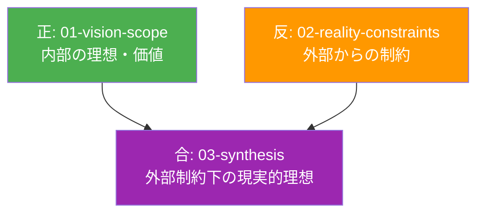

# ビジョンと現実の弁証法的統合 - Why 系における設計判断

CogitoWeave システムのビジョンと現実について、Why/What/How 軸における「Why 系」として、弁証法的正反合構造による理想と制約の創発的統合を体系的に整理している。小さな思想家のための思考支援ツールという理想が、現実制約との対立を通じて「設計書オープンソース・個人実装」という全く新しい開発パラダイムを創発する統合プロセスを実現している。

## 正反合の弁証法的構造

この構造により、非対等な意思決定構造を防ぎ、ビジネス側とエンジニア側が対等に意思決定に参加できる設計プロセスを実現します。

## 弁証法的統合の三段階プロセス

### 第一段階：正 - 内部理想の確立 (01-vision-scope)

**小さな思想家のための理想基盤**として、外部制約を考慮しない純粋な理想・価値・スコープを段階的論理展開により体系的に定義している。

#### 段階的論理展開による統合設計 (5 段階の論理的依存関係)

1. **問題認識** (01-problem-statement.md): 既存ツールとの格闘体験から根本課題を特定
2. **境界設定** (02-design-boundaries.md): 4 つの「やらないこと」による範囲明確化
3. **理想確立** (03-product-vision.md): 問題と境界から小さな思想家ビジョンを導出
4. **手法体系化** (04-solution-approach.md): 理想実現のための 4 つの創発的アプローチ
5. **体験具体化** (05-user-scenarios.md): 手法が日常場面でどう機能するかの体験設計

#### 実現される価値体系

**5 つの日常的体験**:

- 気になる記事 → 自分なりの洞察
- 散らばった概念 → 整理された思考地図
- ふとした疑問 → 関係性の発見
- 質問への回答 → 過去の学びの活用
- 漠然とした考え → 論理的な記事

**4 つの創発的手法**:

- 概念中心設計：小さな思想家の思考の最小単位である概念を軸とした知識構築環境
- 段階的知識深化：LLM 生成 → 文献メモ → 永続メモの自然な成熟プロセス支援
- 視覚的・空間的アプローチ：複雑な関係性の直感的理解・管理による思考地図提供
- LLM 協働：「LLM に作らせて、ツッコミを入れる」効率的な個性発揮の実現

### 第二段階：反 - 外部制約の受容 (02-reality-constraints)

**現実制約の体系的管理**として、理想に対する客観的制約条件を変化速度に応じて効率的に管理する動的制約体系を確立している。

#### 制約分類と管理体系

**四半期見直し制約** (変化が早い):

- 経済制約: 予算状況、時間確保、個人の経済環境変化
- 技術制約: 技術標準、デバイス環境、開発ツール変化
- 組織制約: 個人開発体制、公開方針、メンテナンス方針変化

**年次見直し制約** (変化が遅い):

- 法規制制約: 法律改正、プラットフォーム規約変更、業界標準変化

**随時見直し制約** (突発的変化):

- 市場制約: 競合状況、ユーザー期待レベル、業界動向の急激変化

#### 制約の性質分類

- **絶対制約**: 法規制等、誰も変更できない制約
- **交渉制約**: 外部主体との交渉により変更可能な制約
- **前提制約**: 個人が変更可能だが期間中は変更しない前提制約

### 第三段階：合 - 創発的統合解 (03-synthesis)

**正反合による新価値の発見**として、理想と制約の対立から質的に新しい価値カテゴリーを創発し続ける弁証法的実践を展開している。

#### 真の弁証法的統合の実現

単純な妥協・折衷・調整ではない、対立する要素同士の化学反応による全く新しい価値カテゴリーの創発。「小さな思想家のための理想的ツール」と「個人開発の現実的制約」の対立から「個人思想家による個人思想家のためのツール」という既存分類を超越した新ツールカテゴリーが創発される。

#### 創発された新価値の構造

**開発者とユーザーの一体性による体験創発**: 体験の即座性、価値観の一貫性、成長の共有
**制約の建設的活用による本質抽出**: 制約が本質的価値の抽出と純度向上を促進
**共感に基づく深層理解の実現**: 推測ではない直接的体験による総合的理解

#### 創発的統合解の 6 段階展開

1. **新カテゴリー発見** (01-emergent-category-discovery.md): 既存分類超越の新ツールカテゴリー発見
2. **設計共有創発** (02-design-sharing-emergence.md): 「設計書オープンソース・個人実装」モデルの確立
3. **AI 拡張個人主義** (03-ai-augmented-individuality.md): AI 時代の個人開発パラダイムの創発
4. **個人最適化宣言** (04-personal-optimization-manifesto.md): 完全個人最適化ツール設計の宣言
5. **責任境界フレームワーク** (05-responsibility-boundary-framework.md): エンジニア専門性と個人開発自由度の両立
6. **生きた文書創発** (06-living-document-emergence.md): 死んだドキュメント文化からの解放による新文書パラダイム

## ディレクトリ構成

- [01-vision-scope](01-vision-scope/) - 正：内部の理想・ビジョン&スコープ
- [02-reality-constraints](02-reality-constraints/) - 反：外部からの制約・現実制約
- [03-synthesis](03-synthesis/) - 合：外部制約下の実現可能なビジョン

## 創発された新開発パラダイム: 「設計書オープンソース・個人実装」

弁証法的統合プロセスから創発された「設計書オープンソース・個人実装」パラダイムは、従来のオープンソース開発とは異なる全く新しい共創モデルである。

### パラダイムの特徴

**思考の共有と実装の個別化**: 設計思想・アーキテクチャ・設計判断プロセスはオープンに共有しながら、実装は完全に個人に最適化する二層構造

**AI 時代の個人開発支援**: Vibe Coding を個人活用することで、多人数向けサービスの危険性を回避し個人用途に特化した AI 活用を実現

**完全個人最適化**: 市場の最大公約数を無視し、完全に個人の思考プロセスに最適化されたツール設計

**責任境界の明確化**: セキュリティリスクを個人レベルに限定し、エンジニアの専門性と個人開発の自由度を両立

**生きた文書文化**: 死んだドキュメント文化からの解放による、思考プロセスを生きた形で記録・共有する新しい技術文書パラダイム

### 既存市場の超越

この新パラダイムにより、CogitoWeave は既存の思考支援ツール市場での競争を回避し、全く新しい価値カテゴリーを創造することで問題を根本的に解決する。思考支援ツールは単なるソフトウェアから認知的拡張へと質的転換し、個人の思考能力向上を支援する新しい文化的・技術的基盤が確立される。

## 弁証法的統合による価値創造の循環

### 理想と現実の建設的統合

弁証法的正反合構造により実現される統合効果：

- **正（理想）**: 段階的論理展開による小さな思想家の価値体系確立
- **反（現実）**: 変化速度別の動的制約管理による現実受容
- **合（統合）**: 制約を建設的活用した新価値カテゴリーの創発

### 成長する統合プロセス

理想の純化、制約の建設的活用、統合解の創発が相互促進する動的システムにより、使用者の成長とツールの進化が共進化し続ける持続可能な発展構造を実現している。

## 結論: 新価値創造による思考支援の革新

CogitoWeave の弁証法的統合は、理想と制約の対立から創発した新価値が既存のあらゆる開発パラダイムを超越する独自性と存在意義を確立している。小さな思想家のための思考支援という当初の理想は、制約を建設的な力として活用することで、想像を超えた純粋で創発的な形で実現される。

**統合の追跡性確保**: 上記結論は、下記 3 つの個別ディレクトリの結論を網羅的に統合している。

### 各ディレクトリの結論詳細

#### 01-vision-scope の結論（正: 内部理想の確立）

段階的論理展開に基づく内部理想を確立し、Martin Fowler の Bliki 体験から始まる 5 段階の論理展開により、外部制約に対抗する強固な理想基盤を構築。5 つの日常的体験と 4 つの創発的手法により、小さな思想家が「考える → 整理する → 発見する → 活用する → 発信する」成長サイクルを体験し、思考する人としての自信と成長を獲得する支援を実現。

#### 02-reality-constraints の結論（反: 外部制約の受容）

個人開発環境における 5 つの外部制約カテゴリを変化速度に応じて効率的に管理する動的な制約体系として機能。経済・法規制・プラットフォーム制約(重要度高)、組織・市場制約(重要度中)の重み付けにより、優先的管理とバランス重視の現実的制約体系を構築し、理想と現実の統合基盤を提供。

#### 03-synthesis の結論（合: 創発的統合解）

真の弁証法的統合の本質である質的転換が実現され、理想と制約の対立から創発した「設計書オープンソース・個人実装」という新パラダイムが、既存のあらゆる開発パラダイムを超越する独自性を確立。従来のエンジニアリング価値観と両立しながら、AI 時代の個人開発の可能性を最大化する道筋を明確に提示。
