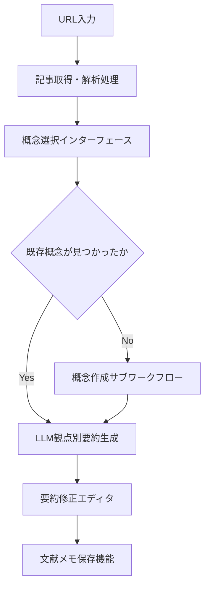
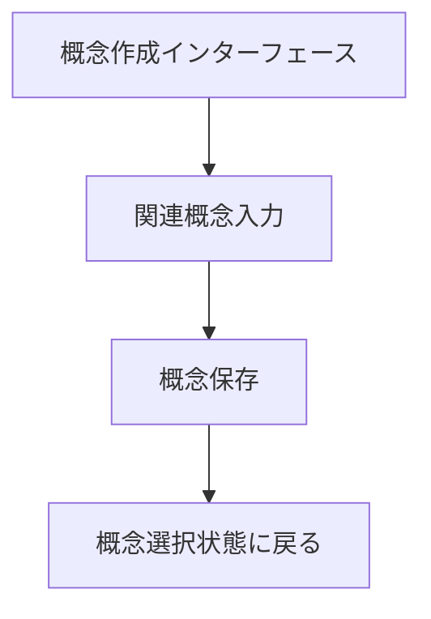

# シナリオ 1 からの UI 要素導出: 記事発見から文献メモ作成への体験分析

## 前提

### シナリオ 1: 気になる記事 → 自分なりの洞察

<!-- PREMISE_BEGIN: scenario-1 -->

**CogitoWeave での解決体験**: **概念中心設計**により記事が断片的情報ではなく、個人の概念体系内で「パフォーマンス最適化」「React フック」といった既存概念との関係で意味を持つ知識として位置づけられる。**LLM 協働**により「LLM の叩き台＋個人のツッコミ」で効率的に個性を注入でき、ゼロからの要約作成負荷を削減しながら自分の体験・視点を反映できる。この組み合わせで「記事をブックマークして終わり」から「個人の概念体系に根ざした実用的な文献メモの即座作成」への体験変革が実現される。

<!-- PREMISE_END: scenario-1 -->

## 論理

Scenario-based Design の手法でユーザー体験から必要 UI 要素を導出し、さらにプロトタイプ作成により具体的な操作フローを検証・詳細化する。

### 膨らませたシナリオ

**小さな思想家の現状**: 「React のパフォーマンス最適化」という記事を Hacker News で見つけた。「面白そうだし、今のプロジェクトにも関係ありそう」と思ってブックマークしたが、後で読んでも「ふーん、そうなんだ」で終わってしまい、自分の知識として定着していない。

**CogitoWeave での体験**: 記事 URL を入力後、「この記事をどの概念の観点から読みたいか？」と聞かれる。自分の概念体系から「パフォーマンス最適化」を選択すると、LLM がその概念に関連する叩き台要約を生成。「あー、ここは自分の体験と違うな」「この部分は今のプロジェクトに使えそう」と思いながら補足・修正して、1 つ目の文献メモが完成。さらに「React フック」の観点からも読み直して 2 つ目のメモを作成。1 つの記事から複数の概念への学びが蓄積される。

シナリオ 1 は、ユーザーが「記事を見つけた瞬間から自分なりの洞察を得るまで」の体験を描いている。このシナリオから、必要な UI 要素を論理的に導出する。

### 体験フロー分析

理想的な体験を分析すると、以下のステップが必要である：

1. **URL 入力**: 外部記事の URL 入力
2. **記事取り込み**: URL 指定により外部記事をシステムに取得・解析
3. **概念検索・選択**: 読む観点となる概念を個人の概念体系から検索・選択
4. **概念新規作成**: 必要に応じて新しい概念を作成
5. **叩き台生成**: LLM が記事内容を選択した概念の観点で要約を作成
6. **個人化**: LLM が作成した要約を自分の体験や理解に合わせて修正
7. **保存**: 修正した内容を文献メモとして個人の知識体系に保存
8. **多角化**: 同一記事を別の概念の観点でも読み直し

### UI 要素の必要性

上記のステップを実現するため、各ステップに対応する UI 要素が論理的に必要となる：

1. URL 入力 → **URL 入力フィールド**
2. 記事取り込み → **記事取得・解析処理**
3. 概念検索・選択 → **概念検索・選択インターフェース**
4. 概念新規作成 → **概念新規作成インターフェース**
5. 叩き台生成 → **LLM による観点別要約生成機能**
6. 個人化 → **要約修正エディタ**
7. 保存 → **文献メモ保存機能**
8. 多角化 → **複数概念適用機能**

## 結論

シナリオ 1 の体験フロー分析により、以下の UI 要素とシステム処理フローが必要であることが特定される：

### シナリオ 1 UI 要素

<!-- GLOBAL_CONCLUSION_BEGIN: scenario-01-ui-elements-list -->

1. **URL 入力フィールド** - 外部記事の URL 入力
2. **記事取得・解析処理** - URL 指定による外部記事の取得と内容解析
3. **概念検索・選択インターフェース** - 読む観点となる概念の検索・選択
4. **概念新規作成インターフェース** - 新しい概念の作成
5. **LLM による観点別要約生成機能** - 選択した概念の観点で記事内容を要約
6. **要約修正エディタ** - LLM が作成した要約を個人の理解に合わせて修正
7. **文献メモ保存機能** - 修正した内容を個人の知識体系に保存
8. **複数概念適用機能** - 同一記事を別の概念の観点でも読み直し

<!-- GLOBAL_CONCLUSION_END: scenario-01-ui-elements-list -->

### シナリオ 1 システム処理フロー

#### 文献読み込み・要約作成ワークフロー

<!-- GLOBAL_CONCLUSION_BEGIN: literature-reading-workflow -->

- **目的**: 外部文献を概念に紐付けて知識を蓄積する
- **トリガ**: ユーザーが URL 入力フィールドに URL を入力
- **終了条件**: 文献メモが概念に関連付けられて保存される
- **境界越え**: 外部記事取得 API、LLM 要約生成 API

<!-- GLOBAL_CONCLUSION_END: literature-reading-workflow -->

#### 概念作成サブワークフロー

<!-- GLOBAL_CONCLUSION_BEGIN: concept-creation-subworkflow -->

- **目的**: 新しい概念をシステムに追加する
- **トリガ**: 概念選択時に既存概念が見つからない場合
- **終了条件**: 新規概念が作成され選択可能になる
- **境界越え**: なし (内部処理)

<!-- GLOBAL_CONCLUSION_END: concept-creation-subworkflow -->

これらの UI 要素とシステム処理フローにより、従来の「保存するだけ」から「即座の文献メモ作成」への体験変革が実現される。
