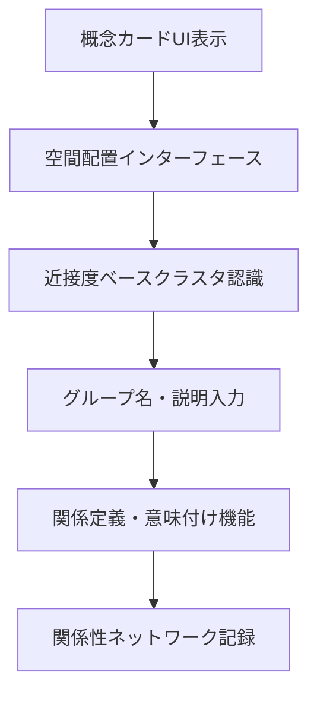

# シナリオ 2 からの UI 要素導出: 散らばった概念から思考地図への体験分析

## 前提

### シナリオ 2: 散らばった概念 → 整理された思考地図

<!-- PREMISE_BEGIN: scenario-2 -->

**CogitoWeave での解決体験**: **視覚的・空間的アプローチ**により概念間の複雑な関係性を空間配置で直感的に理解・操作でき、**概念中心設計**により個人の関係語彙で関係性を定義できる。この組み合わせで「頭の中でモヤモヤ」から「空間上での明確な関係性整理」への体験変革が実現され、複雑な思考が視覚的に管理可能な思考地図として外化される。

<!-- PREMISE_END: scenario-2 -->

## 論理

Scenario-based Design の手法でユーザー体験から必要 UI 要素を導出し、さらにプロトタイプ作成により具体的な操作フローを検証・詳細化する。

### 膨らませたシナリオ

**小さな思想家の現状**: 画面に「Java」「Python」「犬」「猫」「リンゴ」「バナナ」といった概念カードが散らばって表示されている。

**CogitoWeave での体験**: 「Java」と「Python」をドラッグして近づけると点線で枠が表示される。＋アイコンをクリックして「プログラミング言語」とラベルを付ける。「犬」と「猫」も同様にグループ化して「動物」とラベルを付ける。散らばっていた概念カードがグループ分けされ、全体が見やすくなる。

シナリオ 2 は、ユーザーが「散らばった概念カードをグループ化して見やすく整理する」体験を描いている。このシナリオから、必要な UI 要素を論理的に導出する。

### 体験フロー分析

理想的な体験を分析すると、以下のステップが必要である：

1. **概念の視覚化**: 概念をカード形式で表示し操作可能にする
2. **空間配置**: ドラッグ&ドロップで直感的に位置を決める
3. **近接クラスタ認識**: 近くに置いた概念同士が自動的にクラスタとして認識され、境界が視覚的に表示される
4. **名前付け**: グループに名前や説明を後から付けて体系化

### UI 要素の必要性

上記のステップを実現するため、各ステップに対応する UI 要素が論理的に必要となる：

1. 概念の視覚化 → **概念カード UI**
2. 空間配置 → **ドラッグ&ドロップ空間配置機能**
3. 近接クラスタ認識 → **近接度ベースクラスタ認識・境界表示機能**
4. 名前付け → **グループ名・説明入力機能**

## 結論

シナリオ 2 の体験フロー分析により、以下の UI 要素とシステム処理フローが必要であることが特定される：

<!-- GLOBAL_CONCLUSION_BEGIN: scenario-02-ui-elements -->

### シナリオ 2 UI 要素

1. **概念カード UI** - 概念を視覚的に操作可能なカード形式で表示
2. **ドラッグ&ドロップ空間配置機能** - 直感的な位置決めインターフェース
3. **近接度ベースクラスタ認識・境界表示機能** - 近くに置かれた概念のクラスタ認識と視覚的境界表示
4. **グループ名・説明入力機能** - 形成されたグループへの名前や説明の後付け入力

### シナリオ 2 システム処理フロー

#### 概念関係性構築ワークフロー

- **目的**: 概念間の関係を発見・定義して知識ネットワークを構築する  
- **トリガ**: ユーザーが空間配置インターフェースで概念を操作  
- **終了条件**: 概念関連が定義されてネットワークに記録される  
- **境界越え**: クラスタ認識アルゴリズム

<!-- GLOBAL_CONCLUSION_END: scenario-02-ui-elements -->

これらの UI 要素とシステム処理フローにより、従来の「タグ機能による分類」から「KJ 法的な直感的整理」への体験変革が実現される。
