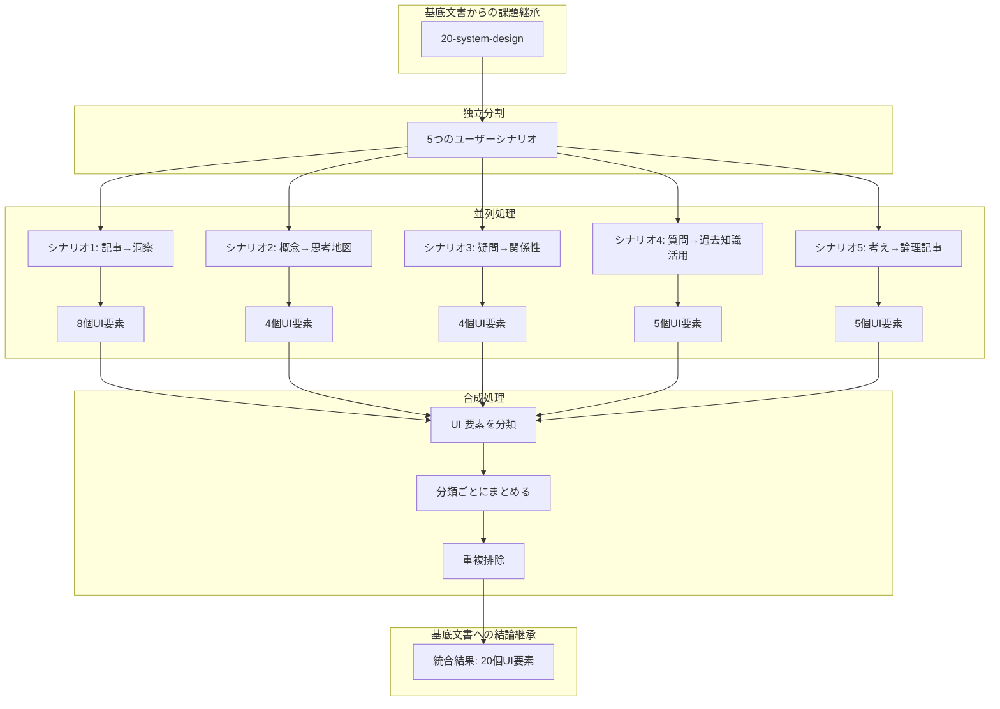

# UI 設計統合判断 - 合成型処理による UI 要素抽出

## 目次

- [概要](#概要)
- [処理フロー](#処理フロー)
- [独立分割](#独立分割)
- [並列処理](#並列処理)
- [合成処理](#合成処理)

## 概要

CogitoWeave の UI 設計における理想は、ユーザーが自らの思考や学びを最大限に活かし、直感的かつ一貫性のある体験を通じて知識を深められることにある。ユーザーは「自分なりの洞察を得たい」「複雑な概念を整理したい」「関係性を発見したい」「過去の学びを活用したい」「断片的な考えを論理的にまとめたい」といった多様な欲求を持つ。

本ドキュメントでは、**合成型（独立分割 + 並列処理）パターン**を適用し、5 つの独立したユーザーシナリオから UI 要素を並列抽出し、分類および重複排除により統合的な UI 設計判断を導出する。

## 処理フロー

## 独立分割

継承した 5 つのユーザーシナリオを、**独立分割**します。各シナリオは相互に影響しない独立した要素として扱われ、並列処理が可能です。この分割により、シナリオごとの個別分析と、後続の合成処理が効率的に実行できます。

## 並列処理

各シナリオは独立しているため、並列で処理できます。以下では、各シナリオから抽出される UI 要素を示し、その検討結果をそのまま抽出します。

### シナリオ別 UI 要素検討

各シナリオの詳細分析は以下の個別ファイルで行われています：

- [シナリオ 1: 気になる記事 → 自分なりの洞察](01-article-to-concept-learning.md)
- [シナリオ 2: 散らばった概念 → 整理された思考地図](02-concept-grouping.md)
- [シナリオ 3: ふとした疑問 → 関係性の発見](03-concept-relationship-exploration.md)
- [シナリオ 4: 質問への回答 → 過去の学びの活用](04-question-knowledge-utilization.md)
- [シナリオ 5: 漠然とした考え → 論理的な記事](05-thought-organization-blog.md)

### シナリオ別 UI 要素抽出

各シナリオから独立して UI 要素を抽出した結果は以下のとおりです。

**作業内容**: 並列処理したシナリオ 1 から 5 の結論をそのままコピー。REFERENCE マーカーで囲まれた部分を一字一句正確に転記し、各シナリオの UI 要素リストを省略せずに完全コピーしています。

#### シナリオ 1 から抽出される UI 要素

<!-- PREMISE_BEGIN: scenario-01-ui-elements -->

1. **URL 入力フィールド** - 外部記事の URL 入力
2. **記事取得・解析処理** - URL 指定による外部記事の取得と内容解析
3. **概念検索・選択インターフェース** - 読む観点となる概念の検索・選択
4. **概念新規作成インターフェース** - 新しい概念の作成
5. **LLM による観点別要約生成機能** - 選択した概念の観点で記事内容を要約
6. **要約修正エディタ** - LLM が作成した要約を個人の理解に合わせて修正
7. **文献メモ保存機能** - 修正した内容を個人の知識体系に保存
8. **複数概念適用機能** - 同一記事を別の概念の観点でも読み直し

<!-- PREMISE_END: scenario-01-ui-elements -->

#### シナリオ 2 から抽出される UI 要素

<!-- PREMISE_BEGIN: scenario-02-ui-elements -->

1. **概念カード UI** - 概念を視覚的に操作可能なカード形式で表示
2. **ドラッグ&ドロップ空間配置機能** - 直感的な位置決めインターフェース
3. **近接度ベースクラスタ認識・境界表示機能** - 近くに置かれた概念のクラスタ認識と視覚的境界表示
4. **グループ名・説明入力機能** - 形成されたグループへの名前や説明の後付け入力

<!-- PREMISE_END: scenario-02-ui-elements -->

#### シナリオ 3 から抽出される UI 要素

<!-- PREMISE_BEGIN: scenario-03-ui-elements -->

1. **起点概念選択機能** - 探索の出発点となる概念の選択機能
2. **関連概念入力支援機能** - オートコンプリート等による効率的な関連概念入力
3. **関係定義・意味付け機能** - 個人的な関係語彙による直感的な関係表現と意味付け
4. **関係性ネットワーク記録機能** - 発見した関係性の記録・保存による蓄積的知識構築

<!-- PREMISE_END: scenario-03-ui-elements -->

#### シナリオ 4 から抽出される UI 要素

<!-- PREMISE_BEGIN: scenario-04-ui-elements -->

1. **質問テキスト入力フィールド** - 質問内容を受け取るインターフェース
2. **質問から概念候補提示機能** - 質問内容から関連しそうな概念候補を提示
3. **概念候補選択インターフェース** - 提示された概念候補から関連する概念を選択
4. **文献メモ一覧表示機能** - 選択した概念に紐付いた文献メモを表示
5. **メモ詳細表示機能** - 各メモの詳細内容を参照して過去の体験や知識を思い出す機能

<!-- PREMISE_END: scenario-04-ui-elements -->

#### シナリオ 5 から抽出される UI 要素

<!-- PREMISE_BEGIN: scenario-05-ui-elements -->

1. **中心概念設定機能** - 思考の起点となるメインテーマの設定機能
2. **概念空間配置インターフェース** - 断片的概念を KJ 法的に空間配置する機能
3. **概念間関係性定義機能** - 配置した概念間の関係を直感的に定義する機能
4. **思考マップ構築・表示機能** - 定義した関係性を視覚的な思考マップとして構築・表示
5. **論理フロー構築支援機能** - 思考マップから論理的な文章フローを構築する支援機能

<!-- PREMISE_END: scenario-05-ui-elements -->

## 合成処理

並列処理で抽出された UI 要素を、以下の手順で合成処理します。

**作業内容**:

- ステップ 1: UI 要素を分類 - 各要素を Interaction Techniques に基づいて分類
- ステップ 2: 分類ごとにまとめ - 同じ分類の要素をグループ化
- ステップ 3: 重複排除 - 同じ機能を持つ UI 要素を統合し、冗長な要素を削除

### ステップ 1: シナリオの UI 要素を分類 (Interaction Techniques による分類)

まず、各シナリオから抽出された UI 要素を分類する。Interaction Techniques という体系的な分類方法に従って整理している。また、ユーザーストーリーマッピングの原則に従い、ユーザーアクション（入力、選択、操作等）とシステムレスポンス（表示、生成、保存等）を明確に分離している。

- **テキスト入力**: ユーザーが直接入力するフィールドやエディタ
- **選択操作**: ユーザーが概念や候補を選択するインターフェース
- **直接操作**: ユーザーがドラッグ&ドロップ等で直接操作するインターフェース
- **表示・視覚化**: ユーザーに情報を視覚的に提示するインターフェース
- **自動処理**: ユーザーの入力に基づいてシステムが自動的に処理を行うインターフェース
- **LLM 生成・推論**: ユーザーの入力に基づいてコンテンツを生成したり、推論を行ったりするインターフェース
- **編集操作**: ユーザーがコンテンツを修正・編集するインターフェース
- **データ保存**: ユーザーの入力や生成物を保存する
- **機能実行**: ユーザーが特定の機能やワークフローを実行するトリガー操作

なお、この分類を行えない場合がある。以下のようなケースが該当する。

1. **関心の分離不足**: ユーザーアクションとシステムレスポンスが混在している
2. **操作の混在**: 異なる種類の操作（選択と作成、表示と編集等）が 1 つの機能に混在している
3. **不明瞭な操作**: 具体的な UI 操作方法が不明確で実装できない

「関心の分離不足」や「操作の混在」については、ユーザーストーリーマッピングの原則に従い、ユーザーアクションとシステムレスポンスを明確に分離することで解決できる。

「不明瞭」については具体的な UI 操作方法が不明確で実装できない記述。このような要素は実際のプロトタイプ作成やユーザビリティテストを通じて具体的な操作方法を検証・確定する必要がある。

**シナリオ 1 の UI 要素分類**:

1. URL 入力フィールド - 外部記事の URL 入力 → **テキスト入力**
2. 記事取得・解析処理 - URL 指定による外部記事の取得と内容解析 → **自動処理**
3. 概念検索・選択インターフェース - 読む観点となる概念の検索・選択 → **選択操作**
4. 概念新規作成インターフェース - 新しい概念の作成 → **テキスト入力**
5. LLM による観点別要約生成機能 - 選択した概念の観点で記事内容を要約 → **LLM 生成・推論**
6. 要約修正エディタ - LLM が作成した要約を個人の理解に合わせて修正 → **編集操作**
7. 文献メモ保存機能 - 修正した内容を個人の知識体系に保存 → **データ保存**
8. 複数概念適用機能 - 同一記事を別の概念の観点でも読み直し → **機能実行**

**シナリオ 2 の UI 要素分類**:

1. 概念カード UI - 概念を視覚的に操作可能なカード形式で表示 → **表示・視覚化**
2. ドラッグ&ドロップ空間配置機能 - 直感的な位置決めインターフェース → **直接操作**
3. 近接度ベースクラスタ認識・境界表示機能 - 近くに置かれた概念のクラスタ認識と視覚的境界表示 → **表示・視覚化**
4. グループ名・説明入力機能 - 形成されたグループへの名前や説明の後付け入力 → **テキスト入力**

**シナリオ 3 の UI 要素分類**:

1. 起点概念選択機能 - 探索の出発点となる概念の選択機能 → **選択操作**
2. 関連概念入力支援機能 - オートコンプリート等による効率的な関連概念入力 → **テキスト入力**
3. 関係定義・意味付け機能 - 個人的な関係語彙による直感的な関係表現と意味付け → **テキスト入力**
4. 関係性ネットワーク記録機能 - 発見した関係性の記録・保存による蓄積的知識構築 → **データ保存**

**シナリオ 4 の UI 要素分類**:

1. 質問テキスト入力フィールド - 質問内容を受け取るインターフェース → **テキスト入力**
2. 質問から概念候補提示機能 - 質問内容から関連しそうな概念候補を提示 → **LLM 生成・推論**
3. 概念候補選択インターフェース - 提示された概念候補から関連する概念を選択 → **選択操作**
4. 文献メモ一覧表示機能 - 選択した概念に紐付いた文献メモを表示 → **表示・視覚化**
5. メモ詳細表示機能 - 各メモの詳細内容を参照して過去の体験や知識を思い出す機能 → **表示・視覚化**

**シナリオ 5 の UI 要素分類**:

1. 中心概念設定機能 - 思考の起点となるメインテーマの設定機能 → **選択操作**
2. 概念空間配置インターフェース - 断片的概念を KJ 法的に空間配置する機能 → **直接操作**
3. 概念間関係性定義機能 - 配置した概念間の関係を直感的に定義する機能 → **不明瞭**
4. 思考マップ構築・表示機能 - 定義した関係性を視覚的な思考マップとして構築・表示 → **不明瞭**
5. 論理フロー構築支援機能 - 思考マップから論理的な文章フローを構築する支援機能 → **不明瞭**

**不明瞭として分類された要素**:

1. **概念間関係性定義機能**: 「配置した概念間の関係を直感的に定義する」とあるが、具体的な UI 操作方法が不明瞭
2. **思考マップ構築・表示機能**: 「定義した関係性を視覚的な思考マップとして構築・表示」とあるが、具体的な方法が不明瞭
3. **論理フロー構築支援機能**: 「思考マップから論理的な文章フローを構築する支援」とあるが、支援の具体的方法が不明瞭

これらの要素は、シナリオ記述自体が抽象的で具体的な UI 操作方法が不明確です。実際のプロトタイプ作成やユーザビリティテストを通じて具体的な操作方法を検証・確定する必要があります。

### ステップ 2: 分類ごとにまとめる

**注記**: ここでは、ステップ 1 で抽出した各シナリオの UI 要素をそのままの表現で、各 UI 要素の説明文はシナリオから直接コピーしたものを使用し、勝手にまとめたり要約したりしていない。

また、シナリオ 5 は「不明瞭」として分類されている要素があり除外しているが、それ以外の要素は明確に分類されているためこのまま残している。

**テキスト入力 (6 要素)**:

- URL 入力フィールド - 外部記事の URL 入力 (シナリオ 1)
- 概念新規作成インターフェース - 新しい概念の作成 (シナリオ 1)
- 質問テキスト入力フィールド - 質問内容を受け取るインターフェース (シナリオ 4)
- グループ名・説明入力機能 - 形成されたグループへの名前や説明の後付け入力 (シナリオ 2)
- 関連概念入力支援機能 - オートコンプリート等による効率的な関連概念入力 (シナリオ 3)
- 関係定義・意味付け機能 - 個人的な関係語彙による直感的な関係表現と意味付け (シナリオ 3)

**選択操作 (4 要素)**:

- 概念検索・選択インターフェース - 読む観点となる概念の検索・選択 (シナリオ 1)
- 起点概念選択機能 - 探索の出発点となる概念の選択機能 (シナリオ 3)
- 概念候補選択インターフェース - 提示された概念候補から関連する概念を選択 (シナリオ 4)
- 中心概念設定機能 - 思考の起点となるメインテーマの設定機能 (シナリオ 5)

**直接操作 (2 要素)**:

- ドラッグ&ドロップ空間配置機能 - 直感的な位置決めインターフェース (シナリオ 2)
- 概念空間配置インターフェース - 断片的概念を KJ 法的に空間配置する機能 (シナリオ 5)

**表示・視覚化 (4 要素)**:

- 概念カード UI - 概念を視覚的に操作可能なカード形式で表示 (シナリオ 2)
- 文献メモ一覧表示機能 - 選択した概念に紐付いた文献メモを表示 (シナリオ 4)
- メモ詳細表示機能 - 各メモの詳細内容を参照して過去の体験や知識を思い出す機能 (シナリオ 4)
- 近接度ベースクラスタ認識・境界表示機能 - 近くに置かれた概念のクラスタ認識と視覚的境界表示 (シナリオ 2)

**自動処理 (1 要素)**:

- 記事取得・解析処理 - URL 指定による外部記事の取得と内容解析 (シナリオ 1)

**LLM 生成・推論 (2 要素)**:

- LLM による観点別要約生成機能 - 選択した概念の観点で記事内容を要約 (シナリオ 1)
- 質問から概念候補提示機能 - 質問内容から関連しそうな概念候補を提示 (シナリオ 4)

**編集操作 (1 要素)**:

- 要約修正エディタ - LLM が作成した要約を個人の理解に合わせて修正 (シナリオ 1)

**データ保存 (2 要素)**:

- 文献メモ保存機能 - 修正した内容を個人の知識体系に保存 (シナリオ 1)
- 関係性ネットワーク記録機能 - 発見した関係性の記録・保存による蓄積的知識構築 (シナリオ 3)

**機能実行 (1 要素)**:

- 複数概念適用機能 - 同一記事を別の概念の観点でも読み直し (シナリオ 1)

### ステップ 3: 重複排除

ここでは、UI 要素の意図を明確にし、同じ機能を持つ UI 要素を統合する。

**テキスト入力**:

- 概念作成インターフェース - 新規概念作成と関連概念入力の統合機能（重複により統合）
  - 概念新規作成インターフェース - 新しい概念の作成 (シナリオ 1: 気になる記事 → 自分なりの洞察)
  - 関連概念入力支援機能 - オートコンプリート等による効率的な関連概念入力 (シナリオ 3: ふとした疑問 → 関係性の発見)

**選択操作**:

- 概念選択インターフェース - 用途に応じた概念の検索・選択機能（重複により統合）
  - 概念検索・選択インターフェース - 読む観点となる概念の検索・選択 (シナリオ 1: 気になる記事 → 自分なりの洞察)
  - 起点概念選択機能 - 探索の出発点となる概念の選択機能 (シナリオ 3: ふとした疑問 → 関係性の発見)
  - 中心概念設定機能 - 思考の起点となるメインテーマの設定機能 (シナリオ 5: 漠然とした考え → 論理的な記事)

**直接操作**:

- 空間配置インターフェース - 概念の直感的な配置機能（重複により統合）
  - ドラッグ&ドロップ空間配置機能 - 直感的な位置決めインターフェース (シナリオ 2: 散らばった概念 → 整理された思考地図)
  - 概念空間配置インターフェース - 断片的概念を KJ 法的に空間配置する機能 (シナリオ 5: 漠然とした考え → 論理的な記事)

### フィルタ後の UI 要素

5 つのユーザーシナリオから独立抽出した 26 個の UI 要素を、8 つの操作分類に整理して重複排除・フィルタリングを行い、19 個の統合 UI 要素に削減しました。

<!-- FOUNDATION_BEGIN: user-desires -->

### テキスト入力 (5 要素)

- URL 入力フィールド - 外部記事の URL 入力 <!-- FOUNDATION_INLINE: url-input-field -->
- 概念作成インターフェース - 新規概念作成と関連概念入力の統合機能 <!-- FOUNDATION_INLINE: concept-creation-interface -->
- 質問テキスト入力フィールド - 質問内容を受け取るインターフェース <!-- FOUNDATION_INLINE: question-text-field -->
- グループ名・説明入力機能 - 形成されたグループへの名前や説明の後付け入力 <!-- FOUNDATION_INLINE: group-naming-function -->
- 関係定義・意味付け機能 - 個人的な関係語彙による直感的な関係表現と意味付け <!-- FOUNDATION_INLINE: relationship-definition-function -->

### 選択操作 (2 要素)

- 概念選択インターフェース - 用途に応じた概念の検索・選択機能 <!-- FOUNDATION_INLINE: concept-selection-interface -->
- 概念候補選択インターフェース - 提示された概念候補から関連する概念を選択 <!-- FOUNDATION_INLINE: concept-candidates-selection -->

### 直接操作 (1 要素)

- 空間配置インターフェース - 概念の直感的な配置機能 <!-- FOUNDATION_INLINE: spatial-arrangement-interface -->

### 表示・視覚化 (4 要素)

- 概念カード UI - 概念を視覚的に操作可能なカード形式で表示 <!-- FOUNDATION_INLINE: concept-cards-ui -->
- 文献メモ一覧表示機能 - 選択した概念に紐付いたメモ一覧表示 <!-- FOUNDATION_INLINE: memo-list-display -->
- メモ詳細表示機能 - 各メモの詳細内容を参照 <!-- FOUNDATION_INLINE: memo-detail-display -->
- 近接度ベースクラスタ認識・境界表示機能 - 近くに置かれた概念のクラスタ認識と視覚的境界表示 <!-- FOUNDATION_INLINE: cluster-recognition-display -->

### 自動処理 (1 要素)

- 記事取得・解析処理 - URL 指定による外部記事の取得と内容解析

### LLM 生成・推論 (2 要素)

- LLM による観点別要約生成機能 - 選択した概念の観点で記事内容を要約
- 質問から概念候補提示機能 - 質問内容から関連しそうな概念候補を提示

### 編集操作 (1 要素)

- 要約修正エディタ - LLM が作成した要約を個人の理解に合わせて修正 <!-- FOUNDATION_INLINE: summary-editor -->

### データ保存 (2 要素)

- 文献メモ保存機能 - 修正した内容を個人の知識体系に保存 <!-- FOUNDATION_INLINE: literature-memo-save -->
- 関係性ネットワーク記録機能 - 発見した関係性の記録・保存 <!-- FOUNDATION_INLINE: relationship-network-record -->

### 機能実行 (1 要素)

- 複数概念適用機能 - 同一記事を別の概念の観点でも読み直し

<!-- FOUNDATION_END: user-desires -->

### その他補足

- シナリオ 5 の 3 つの要素（概念間関係性定義機能、思考マップ構築・表示機能、論理フロー構築支援機能）は、シナリオ記述が抽象的で具体的な UI 操作方法が不明瞭なため除外しています。これらの要素はプロトタイプやユーザビリティテストによる検証が必要です。

また、上記で統合された UI 要素は、下位の論理ビューで実装仕様が定義される。その際、**シナリオ項目は記載しない**設計方針を採用している：

1. **責務の分離**: シナリオとの対応関係は本ファイルで管理済み
2. **汎用性の確保**: 各 UI 要素は複数シナリオで使用されるため、特定シナリオに依存しない汎用的な責務定義が適切
3. **情報の重複排除**: 同一情報を複数箇所で管理することによる整合性リスクを回避
4. **論理ビューの本質**: 「どのシナリオで使うか」より「何をする UI 要素か」が論理設計の核心

これにより、シナリオ管理と論理設計の責務を明確に分離し、設計書体系全体の整合性を維持している。
