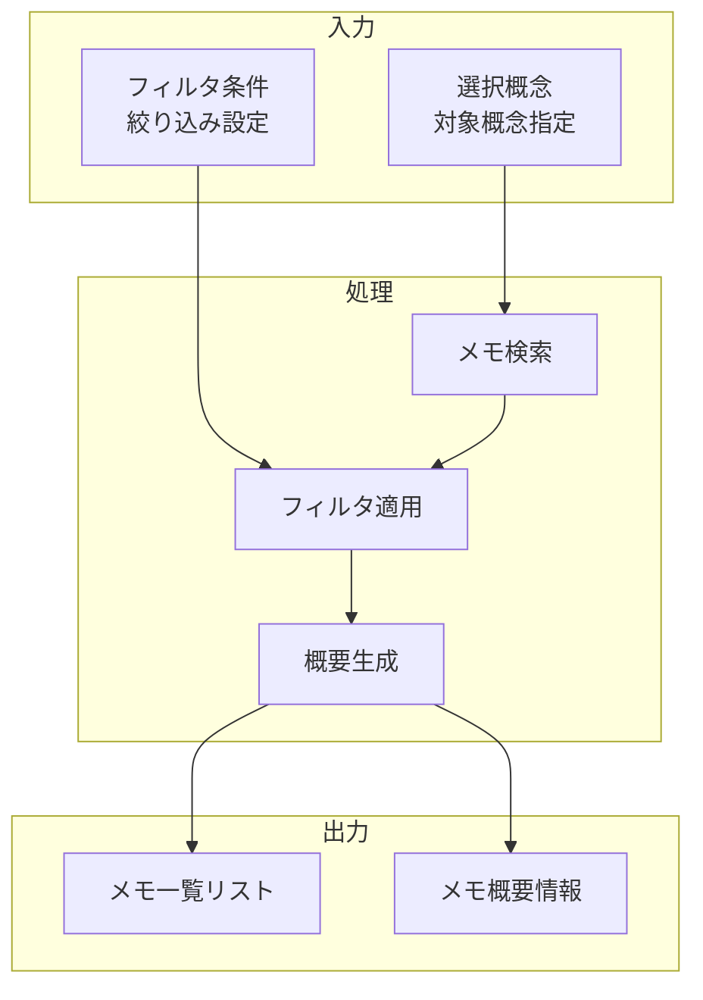

# 文献メモ一覧表示機能

## 責務

<!-- PREMISE_BEGIN: memo-list-display -->
文献メモ一覧表示機能 - 選択した概念に紐付いたメモ一覧表示
<!-- PREMISE_END: memo-list-display -->

## 責務から仕様への詳細化

抽象的な責務定義を具体的な実装仕様に変換します。

**変換**: 抽象的な責務 → 具体的な実装仕様
**入力**: 「何をするか」の責務定義
**出力**: 「どうやるか」のデータフローと処理詳細

<!-- CONCLUSION_BEGIN: memo-list-implementation -->

## データフロー

## 入力

### 選択概念

- 文献メモを表示する対象となる概念を受け取る
  - 特定概念に関連する知識を一覧できるようにするため

### フィルタ条件

- メモの絞り込み条件や表示オプションを受け取る
  - 大量のメモから目的に合った情報を効率的に取得できるようにするため

## 処理

### メモ検索

- 指定された概念に紐付いた文献メモを検索する
  - 概念と関連する学習内容を網羅的に収集するため
- 関連度や作成日順でソートを実行する
  - 最も関連性が高いメモを優先表示するため

### フィルタ適用

- 指定された条件に基づいてメモを絞り込む
  - 作成日、更新日、メモタイプなどの条件で絞り込むため
- 表示件数の制限とページングを実行する
  - パフォーマンスと可読性のバランスを保つため

### 概要生成

- 各メモの概要情報を生成する
  - 一覧でメモの内容を把握できるようにするため
- メモの重要度や特徴を抽出する
  - 優先的に読むべきメモを判別できるようにするため

## 出力

### メモ一覧リスト

- フィルタ適用後のメモ一覧を出力する
  - ユーザーが関連メモを一覧できるようにするため

### メモ概要情報

- 各メモの要点とメタデータを出力する
  - 詳細表示に進む前にメモの价値を判断できるようにするため

## 備考

TBD

<!-- CONCLUSION_END: memo-list-implementation -->
