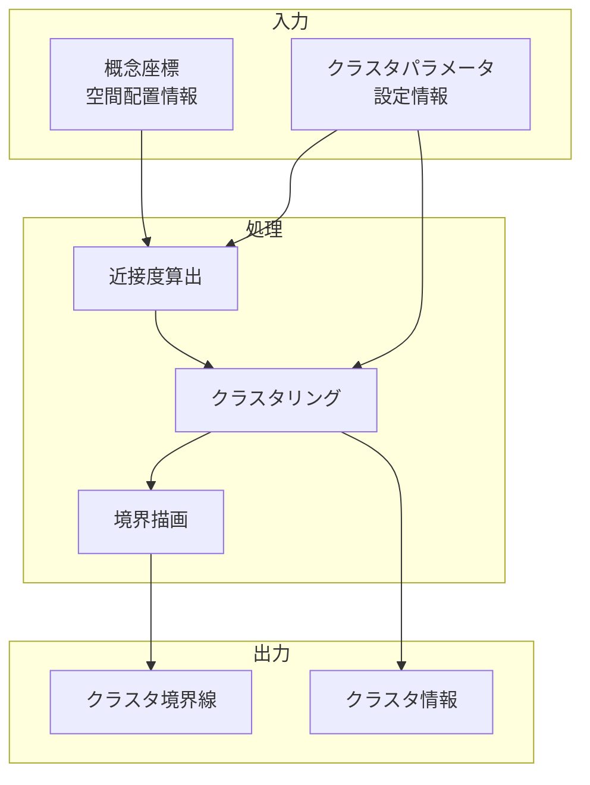

# 近接度ベースクラスタ認識・境界表示機能

## 責務

<!-- PREMISE_BEGIN: cluster-recognition-display -->
近接度ベースクラスタ認識・境界表示機能 - 近くに置かれた概念のクラスタ認識と視覚的境界表示
<!-- PREMISE_END: cluster-recognition-display -->

## 責務から仕様への詳細化

抽象的な責務定義を具体的な実装仕様に変換します。

**変換**: 抽象的な責務 → 具体的な実装仕様
**入力**: 「何をするか」の責務定義
**出力**: 「どうやるか」のデータフローと処理詳細

<!-- CONCLUSION_BEGIN: cluster-recognition-implementation -->

## データフロー

## 入力

### 概念座標

- 空間上に配置された各概念の 2D 座標情報を受け取る
  - 概念間の空間的近さを計算して関連性を推定するため

### クラスタパラメータ

- クラスタ認識の閾値や感度設定を受け取る
  - ユーザーの意図に合った適切なグループ化を実現するため

## 処理

### 近接度算出

- 各概念間の空間的距離を算出し近接度を評価する
  - 関連性の高い概念グループを特定するため
- 距離闾値や重み付けを適用する
  - ユーザーが意図したグループ化を適切に反映するため

### クラスタリング

- 近接度ベースで概念をグループ化しクラスタを形成する
  - 空間上で近い位置にある概念を関連グループとして認識するため
- 動的なクラスタ更新を管理する
  - 概念の配置変更に応じてリアルタイムでグループを再編成するため

### 境界描画

- 認識されたクラスタの周囲に視覚的境界線を描画する
  - ユーザーが概念グループを直感的に理解できるようにするため
- 境界線のスタイルや色を調整する
  - クラスタの特性や重要度を視覚的に表現するため

## 出力

### クラスタ境界線

- 各クラスタを囲む視覚的境界線を出力する
  - 概念グループの範囲を明確に表示して理解を助けるため

### クラスタ情報

- 各クラスタの概念数、中心座標、特徴情報を出力する
  - クラスタの性質を把握し、名前付けや編集に活用できるようにするため

## 備考

動的クラスタ更新とユーザー調整機能が必要

<!-- CONCLUSION_END: cluster-recognition-implementation -->
