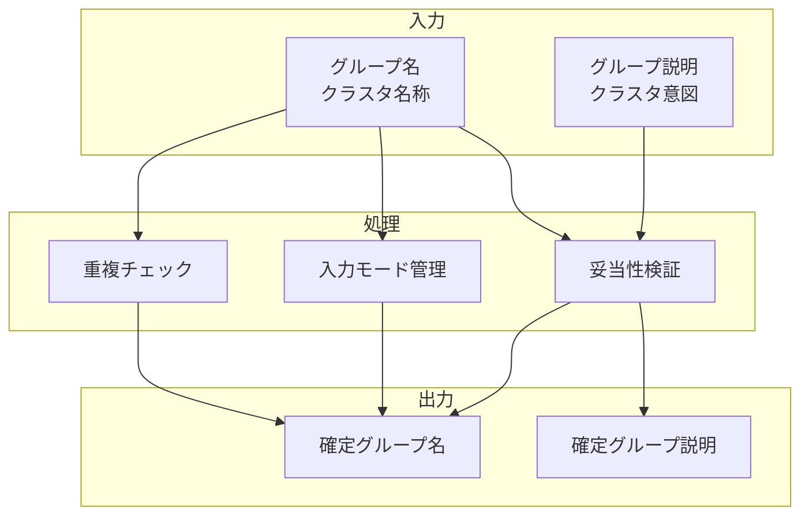

# グループ名・説明入力機能

## 責務

<!-- PREMISE_BEGIN: group-naming-function -->
グループ名・説明入力機能 - 形成されたグループへの名前や説明の後付け入力
<!-- PREMISE_END: group-naming-function -->

## 責務から仕様への詳細化

抽象的な責務定義を具体的な実装仕様に変換します。

**変換**: 抽象的な責務 → 具体的な実装仕様
**入力**: 「何をするか」の責務定義
**出力**: 「どうやるか」のデータフローと処理詳細

<!-- CONCLUSION_BEGIN: group-naming-implementation -->

## データフロー

## 入力

### グループ名

- 形成された概念クラスタの名称を受け取る
  - クラスタを一意に識別し、後から参照できるようにするため

### グループ説明

- クラスタの意図や目的の詳細説明を受け取る
  - クラスタの意味と範囲を明確にして理解を促進するため

## 処理

### 重複チェック

- 既存グループ名との重複を検査する
  - 同一意味のグループの重複作成を防ぐため
- 類似グループとの差異を確認する
  - 細かな違いを持つグループの混同を避けるため

### 入力モード管理

- グループ選択状態での入力モードへの切り替えを管理する
  - ユーザー操作の文脈に応じた適切なタイミングで入力を可能にするため

### 妥当性検証

- グループ名と説明の妥当性を確認する
  - 空文字列や無意味な入力を防ぐため
- 文字数制限とフォーマットをチェックする
  - システムの表示と処理限界内での動作を保証するため

## 出力

### 確定グループ名

- 検証を通過したグループ名を出力する
  - クラスタの正式名称として登録し、後続処理で利用できるようにするため

### 確定グループ説明

- 検証を通過したグループ説明を出力する
  - クラスタの意味と目的を明確にし、将来の参照と編集を可能にするため

## 備考

グループ選択状態での入力モード切り替えが必要

<!-- CONCLUSION_END: group-naming-implementation -->
