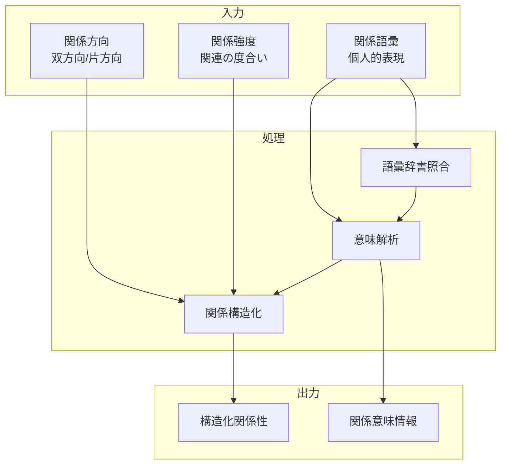

# 関係定義・意味付け機能

## 責務

<!-- PREMISE_BEGIN: relationship-definition-function -->
関係定義・意味付け機能 - 個人的な関係語彙による直感的な関係表現と意味付け
<!-- PREMISE_END: relationship-definition-function -->

## 責務から仕様への詳細化

抽象的な責務定義を具体的な実装仕様に変換します。

**変換**: 抽象的な責務 → 具体的な実装仕様
**入力**: 「何をするか」の責務定義
**出力**: 「どうやるか」のデータフローと処理詳細

<!-- CONCLUSION_BEGIN: relationship-definition-implementation -->

## データフロー

## 入力

### 関係語彙

- 個人的な表現で描述された関係性を受け取る
  - 直感的で自然な語彙で関係性を表現できるようにするため

### 関係方向

- 関係の方向性(双方向/片方向)を受け取る
  - 概念間の影響関係を正確にモデル化するため

### 関係強度

- 関連の度合いや重要度を受け取る
  - 関係性の優先度や検索時の重み付けに活用するため

## 処理

### 語彙辞書照合

- 個人の語彙辞書と照合して既知の表現を確認する
  - 一貫した関係表現と新しい表現の学習を実現するため

### 意味解析

- 関係語彙の意味とニュアンスを解析する
  - 曖昧な表現を明確な関係定義に変換するため
- コンテキストに応じた解釈を実行する
  - 同じ語彙でも状況によって異なる意味を持つことを考慮するため

### 関係構造化

- 解析された関係情報をシステムが処理できる形式に構造化する
  - 概念ネットワークでの検索や推論に活用できるようにするため
- 方向性と強度を統合した関係モデルを作成する
  - 複雑な関係性を体系的に管理できるようにするため

## 出力

### 構造化関係性

- システムが処理できる形式の関係定義を出力する
  - 概念ネットワークへの登録や検索機能で利用できるようにするため

### 関係意味情報

- 関係の意味やコンテキスト情報を出力する
  - 将来の関係性編集や解釈時の参考情報として活用できるようにするため

## 備考

個人の語彙辞書との連携が必要

<!-- CONCLUSION_END: relationship-definition-implementation -->
