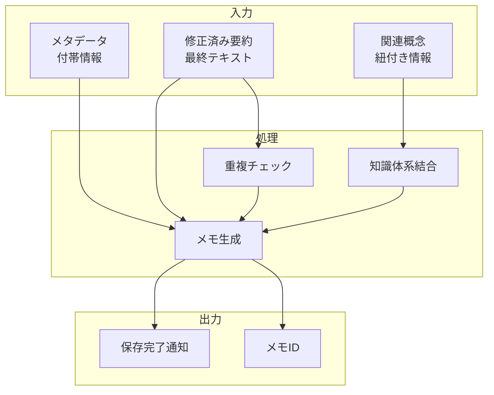

# 文献メモ保存機能

## 責務

<!-- PREMISE_BEGIN: literature-memo-save -->
文献メモ保存機能 - 修正した内容を個人の知識体系に保存
<!-- PREMISE_END: literature-memo-save -->

## 責務から仕様への詳細化

抽象的な責務定義を具体的な実装仕様に変換します。

**変換**: 抽象的な責務 → 具体的な実装仕様
**入力**: 「何をするか」の責務定義
**出力**: 「どうやるか」のデータフローと処理詳細

<!-- CONCLUSION_BEGIN: literature-memo-implementation -->

## データフロー

## 入力

### 修正済み要約

- ユーザーが編集完了した最終的な要約テキストを受け取る
  - 個人の観点や理解が組み込まれた価値あるコンテンツとして保存するため

### 関連概念

- メモと紐付ける概念の情報と関連度を受け取る
  - 概念中心の知識体系に適切に組み込むため

### メタデータ

- 作成日、更新日、ソース URL などの付帯情報を受け取る
  - メモの文脈や信頼性を管理し、将来の参照を支援するため

## 処理

### 重複チェック

- 既存メモとの内容重複や類似性を検出する
  - 同一内容の重複保存を防ぎ、知識体系の整合性を保つため
- 重複発見時の統合方法を提案する
  - 既存情報との結合や更新でより豊かな内容を作成するため

### 知識体系結合

- 指定された関連概念との結合関係を構築する
  - 概念ネットワーク内での検索や関連情報探索を可能にするため
- 概念間の関連度や影響度を更新する
  - 新しいメモの追加による概念間関係の変化を反映するため

### メモ生成

- 入力情報を統合してシステム内で管理可能なメモオブジェクトを生成する
  - 永続的な保存と効率的な検索を実現するため
- 一意なメモ ID とインデックス情報を付与する
  - 高速なアクセスと他メモとの関連付けを可能にするため

## 出力

### 保存完了通知

- メモの保存完了状態と結果情報を出力する
  - ユーザーに保存成功を明確にフィードバックし、安心感を提供するため

### メモ ID

- 保存されたメモの一意識別子を出力する
  - 後続のメモ参照や編集操作で利用できるようにするため

## 備考

重複保存の検出と統合機能が必要

<!-- CONCLUSION_END: literature-memo-implementation -->
