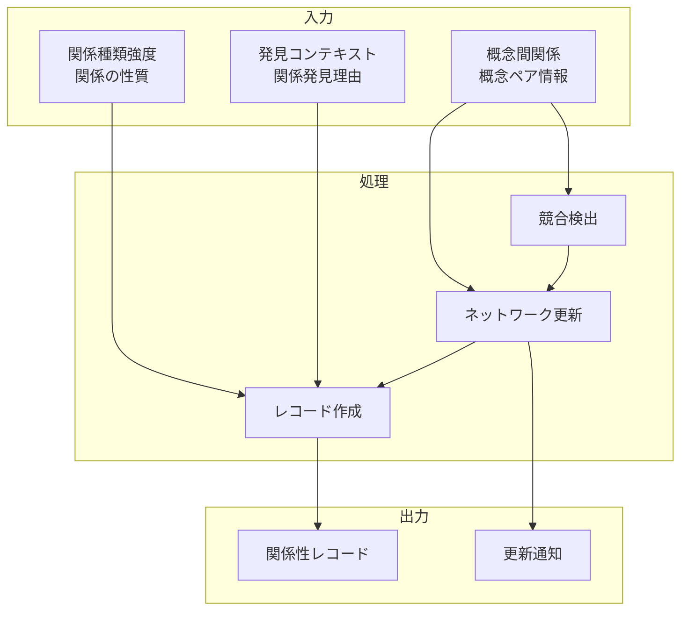

# 関係性ネットワーク記録機能

## 責務

<!-- PREMISE_BEGIN: relationship-network-record -->
関係性ネットワーク記録機能 - 発見した関係性の記録・保存
<!-- PREMISE_END: relationship-network-record -->

## 責務から仕様への詳細化

抽象的な責務定義を具体的な実装仕様に変換します。

**変換**: 抽象的な責務 → 具体的な実装仕様
**入力**: 「何をするか」の責務定義
**出力**: 「どうやるか」のデータフローと処理詳細

<!-- CONCLUSION_BEGIN: relationship-network-implementation -->

## データフロー

## 入力

### 概念間関係

- 新たに発見された概念ペアとその関係性情報を受け取る
  - 概念ネットワークを拡張して知識の関連性を豊かにするため

### 関係種類強度

- 関係の種類(原因結果、類似性など)と強度情報を受け取る
  - 関係性の質を明確にして、適切な文脈で活用できるようにするため

### 発見コンテキスト

- 関係性を発見した状況や理由の情報を受け取る
  - 関係性の信頼性や適用範囲を判断できるようにするため

## 処理

### 競合検出

- 既存の関係性との競合や矛盾を検出する
  - 一貫した概念ネットワークを維持し、矛盾する情報の混在を防ぐため
- 競合解決の方法を提案する
  - 異なる観点や文脈での関係性を適切に統合するため

### ネットワーク更新

- 概念ネットワーク全体への新しい関係性の統合を実行する
  - ネットワークの構造やクラスタを動的に更新するため
- 関連する他の関係性への影響を評価する
  - 新しい関係性が既存の概念間関係に与える影響を把握するため

### レコード作成

- 関係性情報をシステム内で管理可能な形式のレコードとして作成する
  - 永続的な保存と効率的な検索を実現するため
- 関係性のメタデータとインデックスを付与する
  - 関係性ベースの検索や推論を高速化するため

## 出力

### 関係性レコード

- 新たに登録された関係性の完全な情報を出力する
  - 後続の関係性検索や編集で利用できるようにするため

### 更新通知

- ネットワーク更新の完了状態と影響範囲を出力する
  - ユーザーに概念ネットワークの変化を明確にフィードバックするため

## 備考

既存関係との競合解決機能が必要

<!-- CONCLUSION_END: relationship-network-implementation -->
