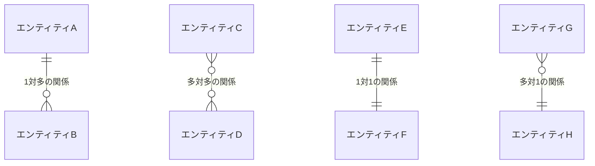
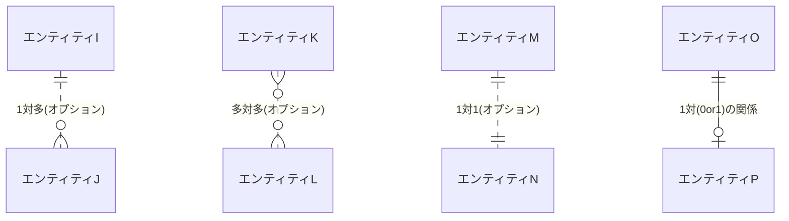
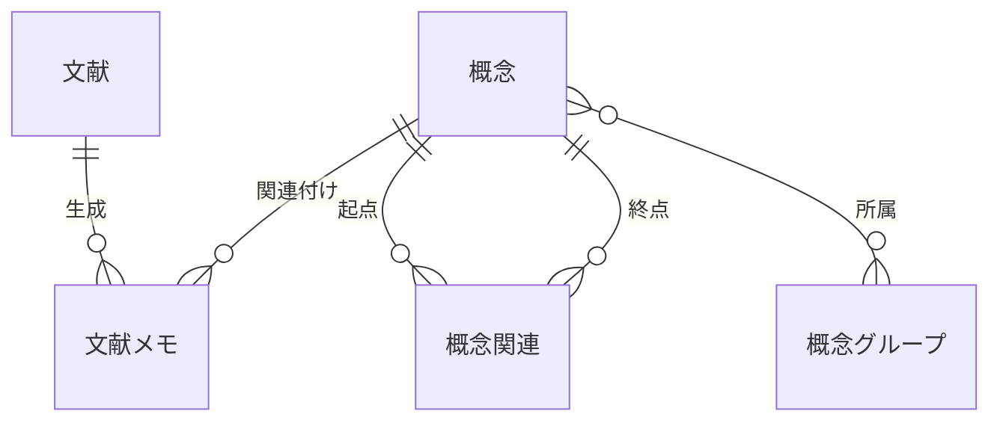

# データモデル (抽象)

## 前提

[UI 要素設計](../../../01-user-desires/README.md)で抽出された 15 個の UI 要素から、システムが扱うべきデータエンティティと関係性を論理的に導出する。

## 論理

### 抽出されたデータエンティティ

UI 要素の分析から以下の核となるデータエンティティを特定した。

**コンテンツ系エンティティ**:

- **概念**: システムの中核となる知識単位
- **文献メモ**: 外部文献から作成されるメモ
- **文献**: 外部から取得する情報源の書誌情報

**関係性系エンティティ**:

- **概念関連**: 概念間の関連
- **概念グループ**: ユーザーが手動で作成・命名するグループ

### ER 図記号の凡例

**基本関係パターン**:

**記号の意味(基本関係)**:

- `||--o{` : 1 対多 (1 つの A に対して複数の B が存在する)
- `}o--o{` : 多対多 (複数の C が複数の D に関連する)
- `||--||` : 1 対 1 (1 つの E に対して 1 つの F が対応する)
- `}o--||` : 多対 1 (複数の G が 1 つの H に関連する)

**オプション・特殊関係パターン**:

**記号の意味(オプション関係(点線))**:

- `||..o{` : 1 対多(オプション) - 関係が存在しない場合もある
- `}o..o{` : 多対多(オプション) - 関係が存在しない場合もある
- `||..||` : 1 対 1(オプション) - 関係が存在しない場合もある

**オプションとは**: 実線は「必ず関係が存在する」、点線は「関係があってもなくてもよい」

**具体例**:

- 実線: `ユーザー ||--o{ 投稿` = ユーザーは必ず 1 つ以上の投稿を持つ
- 点線: `ユーザー ||..o{ プロフィール画像` = ユーザーはプロフィール画像を持たなくてもよい

**その他の関係**:

- `||--o|` : 1 対 0or1 (1 つの O に対して 0 個または 1 個の P が存在する)

### エンティティ間関係

**各関係の説明**:

- `概念 ||--o{ 文献メモ` : 1 つの概念に複数の文献メモが関連付けられる
- `概念 ||--o{ 概念関連 : "起点"` : 1 つの概念が複数の関連の出発点になる
- `概念 ||--o{ 概念関連 : "終点"` : 1 つの概念が複数の関連の到達点になる
- `概念 }o--o{ 概念グループ` : 概念は複数のグループに所属し、グループも複数の概念を含む
- `文献 ||--o{ 文献メモ` : 1 つの文献から複数の観点で文献メモが生成される

### 関係性の意味

**知識蓄積の流れ**:

- 概念 → 文献メモ蓄積 → 概念理解の深化

**関係性発見の流れ**:

- 概念 → 空間配置操作(一時的) → 概念グループ

**概念関連作成の流れ**:

- 概念選択 → 関連概念選択 → 関係性定義 → 概念関連

## 結論

CogitoWeave システムは**概念中心のデータ構造**を採用し、以下の 5 個の核エンティティで知識管理を実現する。

1. **概念**: 中核的な知識単位として全データの関連付け基点となる
2. **文献メモ**: 概念に紐付く具体的知識内容である
3. **概念関連**: 概念間の論理的な関連
4. **概念グループ**: ユーザーが手動で作成・命名する概念のグループである
5. **文献**: 外部文献の書誌情報である

この構造により、「文献から概念への変換」「概念間関連の発見」という 2 つの核ワークフローを統合的にサポートする。空間配置は一時的な UI 操作として扱い、永続化されない。
