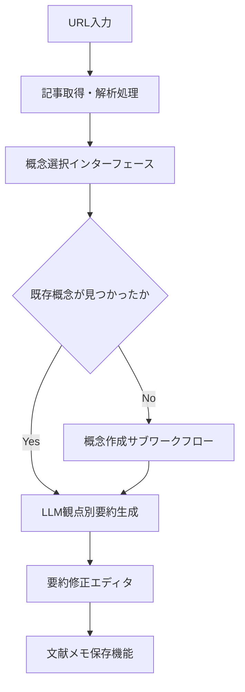
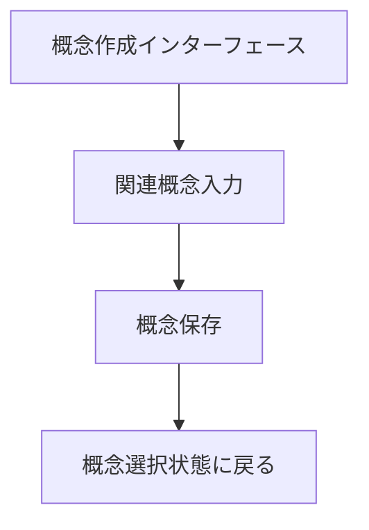
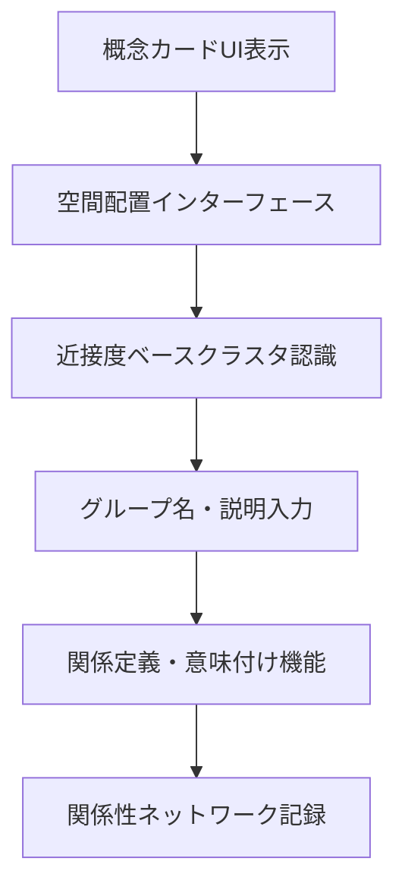
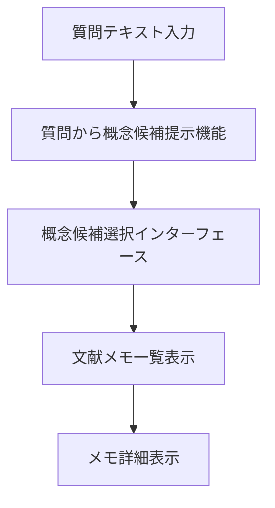

# 機能仕様

## 前提

ユーザーシナリオから抽出された UI 要素を機能的に整理し、システムが提供すべき機能を詳細化する。

### シナリオ 1 UI 要素

<!-- REFERENCE_BEGIN: scenario-01-ui-elements-list -->

1. **URL 入力フィールド** - 外部記事の URL 入力
2. **記事取得・解析処理** - URL 指定による外部記事の取得と内容解析
3. **概念検索・選択インターフェース** - 読む観点となる概念の検索・選択
4. **概念新規作成インターフェース** - 新しい概念の作成
5. **LLM による観点別要約生成機能** - 選択した概念の観点で記事内容を要約
6. **要約修正エディタ** - LLM が作成した要約を個人の理解に合わせて修正
7. **文献メモ保存機能** - 修正した内容を個人の知識体系に保存
8. **複数概念適用機能** - 同一記事を別の概念の観点でも読み直し

<!-- REFERENCE_END: scenario-01-ui-elements-list -->

### シナリオ 1 システム処理フロー

#### 文献読み込み・要約作成ワークフロー

<!-- REFERENCE_BEGIN: literature-reading-workflow -->

- **目的**: 外部文献を概念に紐付けて知識を蓄積する
- **トリガ**: ユーザーが URL 入力フィールドに URL を入力
- **終了条件**: 文献メモが概念に関連付けられて保存される
- **境界越え**: 外部記事取得 API、LLM 要約生成 API

<!-- REFERENCE_END: literature-reading-workflow -->

#### 概念作成サブワークフロー

<!-- REFERENCE_BEGIN: concept-creation-subworkflow -->

- **目的**: 新しい概念をシステムに追加する
- **トリガ**: 概念選択時に既存概念が見つからない場合
- **終了条件**: 新規概念が作成され選択可能になる
- **境界越え**: なし (内部処理)

<!-- REFERENCE_END: concept-creation-subworkflow -->

### シナリオ 2 の UI 要素とシステム処理フロー

<!-- REFERENCE_BEGIN: scenario-02-ui-elements -->

### シナリオ 2 UI 要素

1. **概念カード UI** - 概念を視覚的に操作可能なカード形式で表示
2. **ドラッグ&ドロップ空間配置機能** - 直感的な位置決めインターフェース
3. **近接度ベースクラスタ認識・境界表示機能** - 近くに置かれた概念のクラスタ認識と視覚的境界表示
4. **グループ名・説明入力機能** - 形成されたグループへの名前や説明の後付け入力

### シナリオ 2 システム処理フロー

#### 概念関係性構築ワークフロー

- **目的**: 概念間の関係を発見・定義して知識ネットワークを構築する
- **トリガ**: ユーザーが空間配置インターフェースで概念を操作
- **終了条件**: 概念関連が定義されてネットワークに記録される
- **境界越え**: クラスタ認識アルゴリズム

<!-- REFERENCE_END: scenario-02-ui-elements -->

### シナリオ 3 の UI 要素

<!-- REFERENCE_BEGIN: scenario-03-ui-elements -->

1. **起点概念選択機能** - 探索の出発点となる概念の選択機能
2. **関連概念入力支援機能** - オートコンプリート等による効率的な関連概念入力
3. **関係定義・意味付け機能** - 個人的な関係語彙による直感的な関係表現と意味付け
4. **関係性ネットワーク記録機能** - 発見した関係性の記録・保存による蓄積的知識構築

<!-- REFERENCE_END: scenario-03-ui-elements -->

### シナリオ 4 の UI 要素とシステム処理フロー

<!-- REFERENCE_BEGIN: scenario-04-ui-elements -->

### シナリオ 4 UI 要素

1. **質問テキスト入力フィールド** - 質問内容を受け取るインターフェース
2. **質問から概念候補提示機能** - 質問内容から関連しそうな概念候補を提示
3. **概念候補選択インターフェース** - 提示された概念候補から関連する概念を選択
4. **文献メモ一覧表示機能** - 選択した概念に紐付いた文献メモを表示
5. **メモ詳細表示機能** - 各メモの詳細内容を参照して過去の体験や知識を思い出す機能

### シナリオ 4 システム処理フロー

#### 質問探索・概念発見ワークフロー

- **目的**: 質問から関連概念を発見してメモを参照する
- **トリガ**: ユーザーが質問テキスト入力フィールドに質問を入力
- **終了条件**: 関連文献メモが表示される
- **境界越え**: LLM 概念候補生成 API

<!-- REFERENCE_END: scenario-04-ui-elements -->

### シナリオ 5 の UI 要素

<!-- REFERENCE_BEGIN: scenario-05-ui-elements -->

1. **中心概念設定機能** - 思考の起点となるメインテーマの設定機能
2. **概念空間配置インターフェース** - 断片的概念を KJ 法的に空間配置する機能
3. **概念間関係性定義機能** - 配置した概念間の関係を直感的に定義する機能
4. **思考マップ構築・表示機能** - 定義した関係性を視覚的な思考マップとして構築・表示
5. **論理フロー構築支援機能** - 思考マップから論理的な文章フローを構築する支援機能

<!-- REFERENCE_END: scenario-05-ui-elements -->

これらの散らばった個別 UI 要素を、Interaction Techniques に基づく分類と重複排除により、実装可能な統合 UI 要素群として再構成する。

## 論理

### UI 要素分類と統合の必要性

5 つのユーザーシナリオから独立抽出された 26 個の UI 要素は、そのままでは：

1. **分類の欠如**: 操作種別による体系的整理が不足
2. **機能重複**: 同様の機能を持つ UI 要素が複数存在
3. **実装困難**: 抽象的な記述で具体的な操作方法が不明瞭

これらを解決するため、以下の 3 ステップで統合処理を行う。

### ステップ 1: Interaction Techniques による分類

各 UI 要素をユーザーの操作特性に基づいて分類する。ユーザーストーリーマッピングの原則に従い、ユーザーアクションとシステムレスポンスを明確に分離する。

#### 分類体系

- **テキスト入力**: ユーザーが直接入力するフィールドやエディタ
- **選択操作**: ユーザーが概念や候補を選択するインターフェース
- **直接操作**: ユーザーがドラッグ&ドロップ等で直接操作するインターフェース
- **表示・視覚化**: ユーザーに情報を視覚的に提示するインターフェース
- **自動処理**: ユーザーの入力に基づいてシステムが自動的に処理を行うインターフェース
- **LLM 生成・推論**: ユーザーの入力に基づいてコンテンツを生成したり、推論を行ったりするインターフェース
- **編集操作**: ユーザーがコンテンツを修正・編集するインターフェース
- **データ保存**: ユーザーの入力や生成物を保存する
- **機能実行**: ユーザーが特定の機能やワークフローを実行するトリガー操作

#### 分類不可要素の処理

以下のケースは分類対象外とする：

1. **関心の分離不足**: ユーザーアクションとシステムレスポンスが混在
2. **操作の混在**: 異なる種類の操作が 1 つの機能に混在
3. **不明瞭な操作**: 具体的な UI 操作方法が不明確で実装困難

これらの要素は、プロトタイプ作成やユーザビリティテストを通じて具体的な操作方法を検証・確定する必要がある。

### ステップ 2: 分類ごとのグループ化

同じ分類に属する UI 要素をグループ化し、シナリオ横断的な機能一覧を作成する。各要素の説明文はシナリオから直接継承し、独自の解釈や要約は行わない。

### ステップ 3: 重複排除と統合

同じ機能を持つ UI 要素を特定し、より汎用的な統合 UI 要素として再定義する。統合時は以下の原則に従う：

- **機能の包含**: より包括的な機能説明を採用
- **汎用性の確保**: 特定シナリオに依存しない汎用的な責務定義
- **実装可能性**: 具体的な操作方法が明確な要素を優先

## 結論

3 ステップの統合処理により、5 つのユーザーシナリオから抽出された 26 個の UI 要素を、8 つの操作分類に整理して重複排除・フィルタリングを行い、19 個の統合 UI 要素に削減した。

<!-- GLOBAL_CONCLUSION_BEGIN: functional-specifications -->

### テキスト入力 (5 要素)

- URL 入力フィールド - 外部記事の URL 入力 <!-- GLOBAL_CONCLUSION_INLINE: url-input-field -->
- 概念作成インターフェース - 新規概念作成と関連概念入力の統合機能 <!-- GLOBAL_CONCLUSION_INLINE: concept-creation-interface -->
- 質問テキスト入力フィールド - 質問内容を受け取るインターフェース <!-- GLOBAL_CONCLUSION_INLINE: question-text-field -->
- グループ名・説明入力機能 - 形成されたグループへの名前や説明の後付け入力 <!-- GLOBAL_CONCLUSION_INLINE: group-naming-function -->
- 関係定義・意味付け機能 - 個人的な関係語彙による直感的な関係表現と意味付け <!-- GLOBAL_CONCLUSION_INLINE: relationship-definition-function -->

### 選択操作 (2 要素)

- 概念選択インターフェース - 用途に応じた概念の検索・選択機能 <!-- GLOBAL_CONCLUSION_INLINE: concept-selection-interface -->
- 概念候補選択インターフェース - 提示された概念候補から関連する概念を選択 <!-- GLOBAL_CONCLUSION_INLINE: concept-candidates-selection -->

### 直接操作 (1 要素)

- 空間配置インターフェース - 概念の直感的な配置機能 <!-- GLOBAL_CONCLUSION_INLINE: spatial-arrangement-interface -->

### 表示・視覚化 (4 要素)

- 概念カード UI - 概念を視覚的に操作可能なカード形式で表示 <!-- GLOBAL_CONCLUSION_INLINE: concept-cards-ui -->
- 文献メモ一覧表示機能 - 選択した概念に紐付いたメモ一覧表示 <!-- GLOBAL_CONCLUSION_INLINE: memo-list-display -->
- メモ詳細表示機能 - 各メモの詳細内容を参照 <!-- GLOBAL_CONCLUSION_INLINE: memo-detail-display -->
- 近接度ベースクラスタ認識・境界表示機能 - 近くに置かれた概念のクラスタ認識と視覚的境界表示 <!-- GLOBAL_CONCLUSION_INLINE: cluster-recognition-display -->

### 自動処理 (1 要素)

- 記事取得・解析処理 - URL 指定による外部記事の取得と内容解析

### LLM 生成・推論 (2 要素)

- LLM による観点別要約生成機能 - 選択した概念の観点で記事内容を要約
- 質問から概念候補提示機能 - 質問内容から関連しそうな概念候補を提示

### 編集操作 (1 要素)

- 要約修正エディタ - LLM が作成した要約を個人の理解に合わせて修正 <!-- GLOBAL_CONCLUSION_INLINE: summary-editor -->

### データ保存 (2 要素)

- 文献メモ保存機能 - 修正した内容を個人の知識体系に保存 <!-- GLOBAL_CONCLUSION_INLINE: literature-memo-save -->
- 関係性ネットワーク記録機能 - 発見した関係性の記録・保存 <!-- GLOBAL_CONCLUSION_INLINE: relationship-network-record -->

### 機能実行 (1 要素)

- 複数概念適用機能 - 同一記事を別の概念の観点でも読み直し

<!-- GLOBAL_CONCLUSION_END: functional-specifications -->

これらの統合 UI 要素により、散らばったシナリオベースの要求から、論理的に整理された画面構成設計が実現される。各 UI 要素は後続の UI 要素仕様で具体的な実装仕様が定義される。
