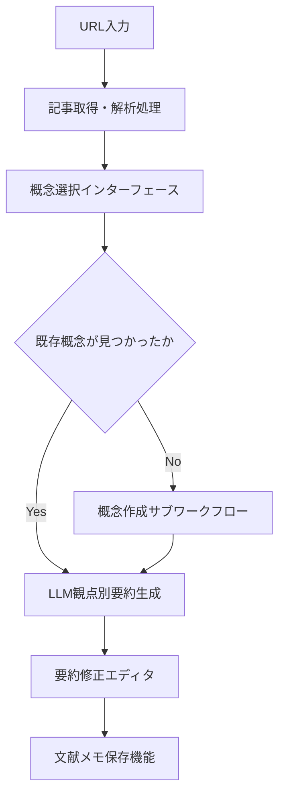
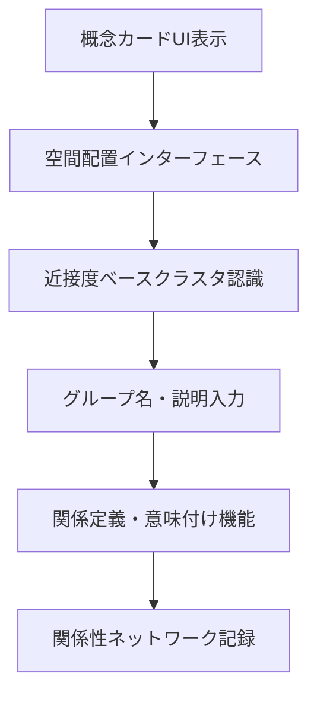
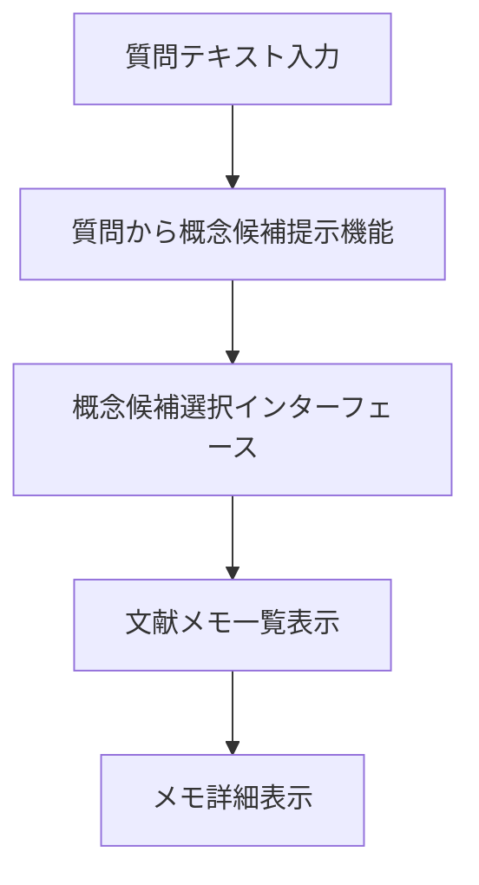
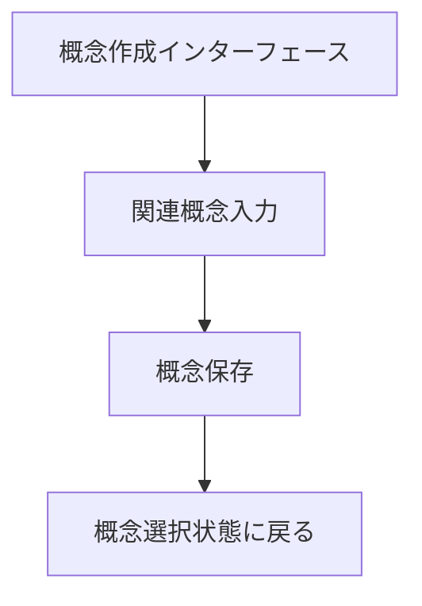
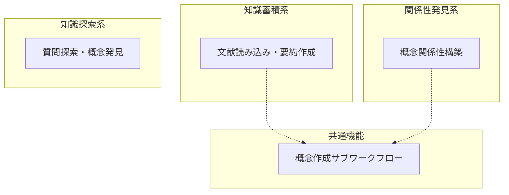

# ワークフロー (抽象)

## 前提

[データモデル](../03-data-model/README.md)で定義された5個の核エンティティと[UI要素](../02-ui-elements/README.md)で抽出された15個のUI要素を踏まえ、システムの処理フローを定義する。

データモデルの結論で示された「文献から概念への変換」「概念間関連の発見」という2つの核ワークフローを中心に、直列のみのMermaidフローチャートで表現する。

## 論理

### 核となる3つのワークフロー

データモデルの分析とUI要素から、以下の3つの主要ワークフローを特定した。

#### 1. 文献読み込み・要約作成ワークフロー

- **目的**: 外部文献を概念に紐付けて知識を蓄積する  
- **トリガ**: ユーザーがURL入力フィールドにURLを入力  
- **終了条件**: 文献メモが概念に関連付けられて保存される  
- **境界越え**: 外部記事取得API、LLM要約生成API

#### 2. 概念関係性構築ワークフロー

- **目的**: 概念間の関係を発見・定義して知識ネットワークを構築する  
- **トリガ**: ユーザーが空間配置インターフェースで概念を操作  
- **終了条件**: 概念関連が定義されてネットワークに記録される  
- **境界越え**: クラスタ認識アルゴリズム

#### 3. 質問探索・概念発見ワークフロー

- **目的**: 質問から関連概念を発見してメモを参照する  
- **トリガ**: ユーザーが質問テキスト入力フィールドに質問を入力  
- **終了条件**: 関連文献メモが表示される  
- **境界越え**: LLM概念候補生成API

### 概念作成サブワークフロー

新規概念の作成は各ワークフローで共通して使用される。

- **目的**: 新しい概念をシステムに追加する  
- **トリガ**: 概念選択時に既存概念が見つからない場合  
- **終了条件**: 新規概念が作成され選択可能になる  
- **境界越え**: なし (内部処理)

### 全体ワークフロー関係図

## 結論

CogitoWeaveシステムは以下の3つの核ワークフローで知識管理を実現する。

1. **文献読み込み・要約作成ワークフロー**: 外部文献を概念に紐付けて知識蓄積
2. **概念関係性構築ワークフロー**: 空間配置による直感的な関係性発見と定義
3. **質問探索・概念発見ワークフロー**: 質問から関連概念・メモの発見

文献読み込みと概念関係性構築の2つのワークフローは概念作成サブワークフローを共通機能として利用し、データモデルの5個の核エンティティ（概念、文献メモ、文献、概念関連、概念グループ）間でのデータフローを実現する。

全ワークフローは直列処理として設計され、境界越えポイントで外部API（記事取得、LLM生成）やアルゴリズム（クラスタ認識）との連携を行う。
