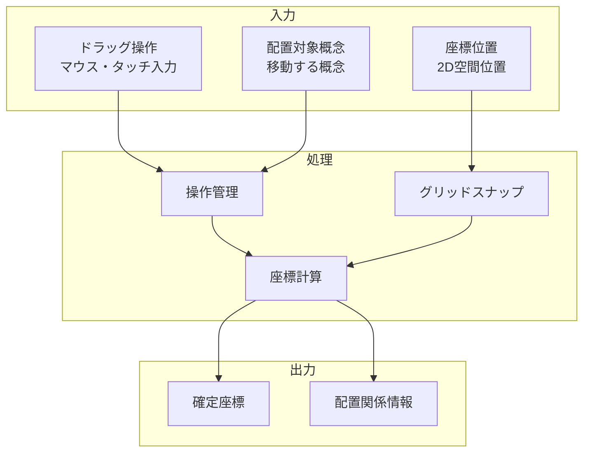

# 空間配置インターフェース

## 責務

<!-- PREMISE_BEGIN: spatial-arrangement-interface -->
空間配置インターフェース - 概念の直感的な配置機能
<!-- PREMISE_END: spatial-arrangement-interface -->

## 責務から仕様への詳細化

抽象的な責務定義を具体的な実装仕様に変換します。

**変換**: 抽象的な責務 → 具体的な実装仕様
**入力**: 「何をするか」の責務定義
**出力**: 「どうやるか」のデータフローと処理詳細

<!-- LOCAL_CONCLUSION_BEGIN: spatial-arrangement-implementation -->

## データフロー

## 入力

### ドラッグ操作

- マウスドラッグやタッチ操作による概念移動指示を受け取る
  - 直感的な操作で概念の空間配置を変更できるようにするため

### 座標位置

- 2D 平面上での目標配置位置を受け取る
  - 概念間の関係性を空間的に表現できるようにするため

### 配置対象概念

- 移動・配置する概念オブジェクトを受け取る
  - 特定の概念を意図した位置に配置できるようにするため

## 処理

### 操作管理

- ドラッグ&ドロップ操作の開始・継続・終了を管理する
  - スムーズな操作体験と正確な配置を実現するため
- 複数概念の同時操作を制御する
  - 操作の混乱を防ぎ、意図した配置を可能にするため

### グリッドスナップ

- 座標をグリッドに吸着させる処理を実行する
  - 整然とした配置と概念間の適切な距離を保証するため
- スナップ感度と範囲を調整する
  - ユーザーの意図を尊重しつつ整列効果を提供するため

### 座標計算

- 最終的な配置座標を計算し更新する
  - 概念の新しい位置を正確に記録するため
- 他概念との衝突回避を実行する
  - 概念の重複配置を防ぎ、視認性を保つため

## 出力

### 確定座標

- 処理完了後の概念の最終座標を出力する
  - 空間配置情報として保存し、表示に反映できるようにするため

### 配置関係情報

- 概念間の空間的関係性情報を出力する
  - 近接概念の自動グループ化や関係性推定に活用するため

## 備考

2D 平面での自由配置とグリッドスナップ機能

<!-- LOCAL_CONCLUSION_END: spatial-arrangement-implementation -->
