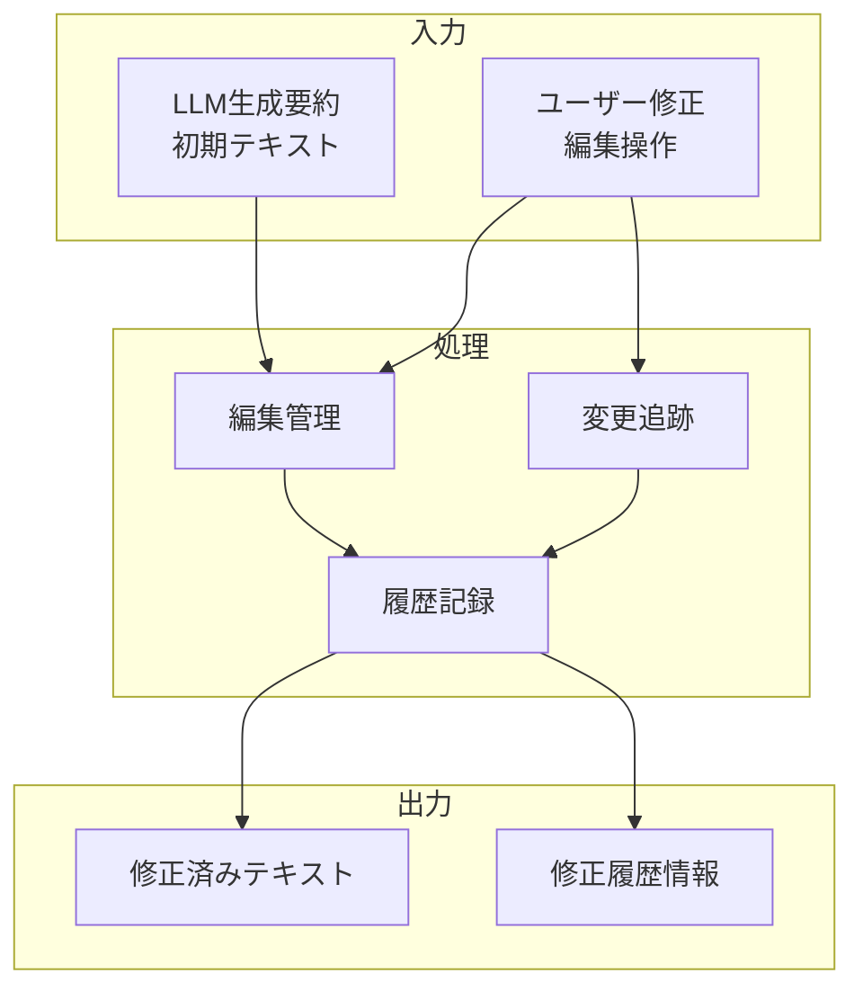

# 要約修正エディタ

## 責務

<!-- PREMISE_BEGIN: summary-editor -->
要約修正エディタ - LLM が作成した要約を個人の理解に合わせて修正
<!-- PREMISE_END: summary-editor -->

## 責務から仕様への詳細化

抽象的な責務定義を具体的な実装仕様に変換します。

**変換**: 抽象的な責務 → 具体的な実装仕様
**入力**: 「何をするか」の責務定義
**出力**: 「どうやるか」のデータフローと処理詳細

<!-- LOCAL_CONCLUSION_BEGIN: summary-editor-implementation -->

## データフロー

## 入力

### LLM 生成要約

- LLM が自動生成した初期要約テキストを受け取る
  - 個人の理解や観点を反映させるためのベースとして必要なため

### ユーザー修正

- ユーザーによるテキスト編集、追加、削除の操作を受け取る
  - 機械的な要約を個人的な視点や体験を組み込んだ内容に変換するため

## 処理

### 編集管理

- リアルタイムでのテキスト編集機能を管理する
  - スムーズな編集体験で思考の流れを中断させないようにするため
- カーソル位置や選択範囲の管理を実行する
  - 正確な編集位置で意図した修正を可能にするため

### 変更追跡

- ユーザーの編集操作をリアルタイムで追跡し変更箱所をハイライトする
  - 変更内容を視覚的に把握し、修正の精度を向上させるため
- 変更の種類(追加/修正/削除)を分類して管理する
  - 修正の意図や影響範囲を明確にするため

### 履歴記録

- 編集操作の履歴を時系列で記録し管理する
  - 将来の参照や学習効果の検証に活用できるようにするため
- 主要な変更ポイントとその理由を記録する
  - 修正の意図や思考プロセスを後から振り返えるようにするため

## 出力

### 修正済みテキスト

- ユーザーの修正を反映した最終的な要約テキストを出力する
  - 個人的な理解や観点が組み込まれた価値あるコンテンツとして活用できるようにするため

### 修正履歴情報

- 編集過程の詳細情報と主要変更ポイントを出力する
  - 学習効果の検証や今後の改善に活用できるようにするため

## 備考

リアルタイム編集と変更ハイライト機能が必要

<!-- LOCAL_CONCLUSION_END: summary-editor-implementation -->
