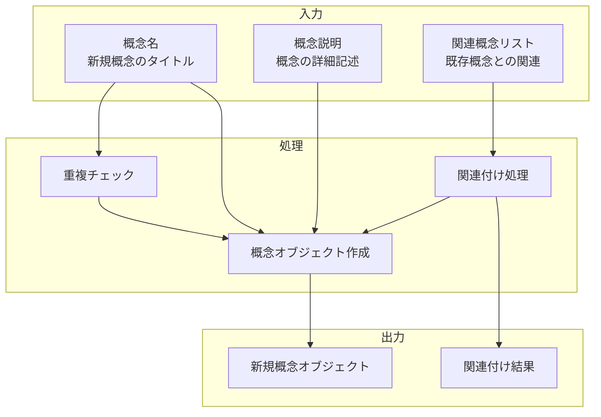

# 概念作成インターフェース

## 責務

<!-- PREMISE_BEGIN: concept-creation-interface -->
概念作成インターフェース - 新規概念作成と関連概念入力の統合機能
<!-- PREMISE_END: concept-creation-interface -->

## 責務から仕様への詳細化

抽象的な責務定義を具体的な実装仕様に変換します。

**変換**: 抽象的な責務 → 具体的な実装仕様
**入力**: 「何をするか」の責務定義
**出力**: 「どうやるか」のデータフローと処理詳細

<!-- LOCAL_CONCLUSION_BEGIN: concept-creation-implementation -->

## データフロー

## 入力

### 概念名

- 新規に作成する概念のタイトルを受け取る
  - 概念を一意に識別するための基本情報として必要なため

### 概念説明

- 概念の詳細な記述内容を受け取る
  - 概念の意味と範囲を明確にして理解を促進するため

### 関連概念リスト

- 既存概念との関連情報を受け取る
  - 新規概念を個人の概念体系に適切に組み込むため

## 処理

### 重複チェック

- 既存概念名との重複を検査する
  - 同一概念の重複作成を防ぎ、概念体系の整合性を保つため
- 類似概念との差異を確認する
  - 微妙に異なる概念の混同を避けるため

### 関連付け処理

- 指定された関連概念との関連性を設定する
  - 概念間のネットワーク構造を構築するため
- 関連の種類と強度を定義する
  - 関連性の質を明確にして検索精度を向上させるため

### 概念オブジェクト作成

- 入力情報を統合して新規概念オブジェクトを生成する
  - システム内で管理可能な形式に変換するため
- 作成日時やメタデータを付与する
  - 概念の履歴管理と検索機能を支援するため

## 出力

### 新規概念オブジェクト

- 作成された概念の完全な情報を出力する
  - 後続処理や表示機能で利用できるようにするため

### 関連付け結果

- 確立された関連概念との結びつき情報を出力する
  - 概念ネットワークの更新状況を確認できるようにするため

## 備考

既存概念との重複チェック機能が必要

<!-- LOCAL_CONCLUSION_END: concept-creation-implementation -->
