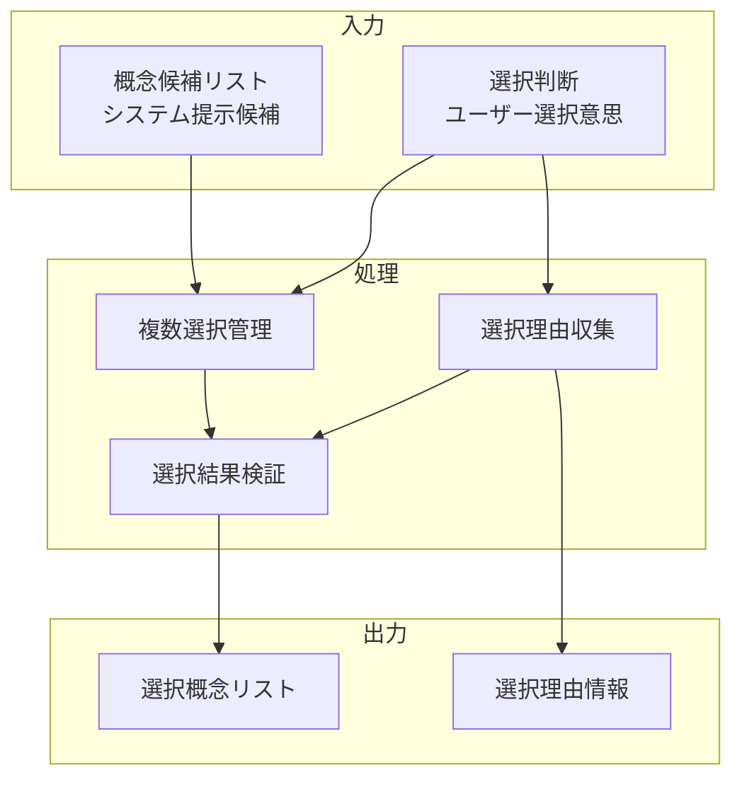

# 概念候補選択インターフェース

## 責務

<!-- PREMISE_BEGIN: concept-candidates-selection -->
概念候補選択インターフェース - 提示された概念候補から関連する概念を選択
<!-- PREMISE_END: concept-candidates-selection -->

## 責務から仕様への詳細化

抽象的な責務定義を具体的な実装仕様に変換します。

**変換**: 抽象的な責務 → 具体的な実装仕様
**入力**: 「何をするか」の責務定義
**出力**: 「どうやるか」のデータフローと処理詳細

<!-- LOCAL_CONCLUSION_BEGIN: concept-candidates-implementation -->

## データフロー

## 入力

### 概念候補リスト

- システムが提示した概念候補の一覧を受け取る
  - 質問内容に関連する概念を効率的に選択できるようにするため

### 選択判断

- ユーザーの選択・非選択の意思決定を受け取る
  - 関連概念を柔軟に組み合わせて回答精度を向上させるため

## 処理

### 複数選択管理

- チェックボックス形式での複数概念同時選択を管理する
  - 1 つの質問に対して複数の観点から回答を構築できるようにするため
- 選択状態の追跡と更新を実行する
  - ユーザーが選択内容を自由に変更できるようにするため

### 選択理由収集

- 各概念を選択した理由をオプションで収集する
  - 選択根拠を記録して将来の参考にできるようにするため
- 理由の妥当性を確認する
  - 無意味な選択を防ぎ、質の高い概念組み合わせを実現するため

### 選択結果検証

- 選択された概念の組み合わせ妥当性を検証する
  - 矛盾する概念の同時選択を防ぐため
- 最低選択数と最大選択数の制限を適用する
  - 効果的な回答生成に適した概念数を保証するため

## 出力

### 選択概念リスト

- 最終的に選択確定された概念の一覧を出力する
  - 後続の回答生成処理で利用できるようにするため

### 選択理由情報

- 各概念の選択理由と関連情報を出力する
  - 回答の根拠を明確にし、学習効果を高めるため

## 備考

複数選択可能なチェックボックス形式

<!-- LOCAL_CONCLUSION_END: concept-candidates-implementation -->
