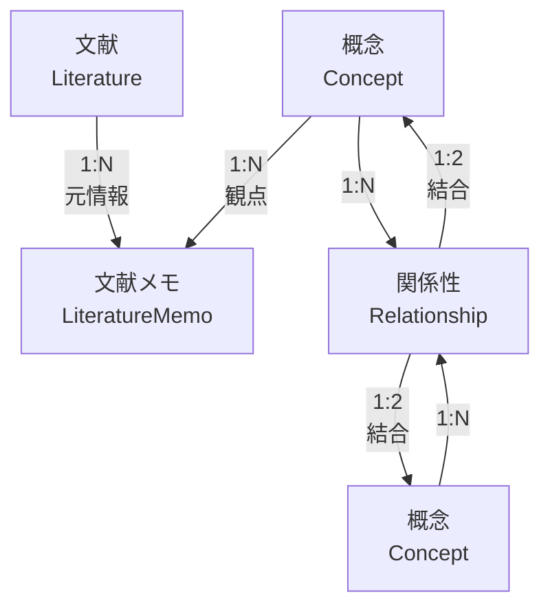

# データモデル

## 前提

<!-- PREMISE_BEGIN: key-abstractions -->

CogitoWeave システムは**概念ベース知識体系構築システム**として抽象化される。

中核的価値は、個人の思考を「概念」という抽象化を通じて構造化し、外部情報を自分の理解に統合する仕組みの提供にある。

### 主要抽象化

#### 1. 概念 (Concept)

思考の最小単位として知識体系の中心に位置する抽象化

- 外部情報を個人の理解に変換するフィルター
- 知識統合の基点として機能する
- 他の概念との関係によって意味を形成する

#### 2. 文献メモ (Literature Memo)

概念に紐づく具体的知識内容を表現する抽象化

- 外部文献を個人の観点で解釈した結果
- LLM 協働により効率的に作成され個人の理解で修正される
- 概念の理解を深化させる具体例や体験を蓄積する

#### 3. 関係性 (Relationship)

概念間の関連性を表現し知識ネットワークを形成する抽象化

- 個人的な関係語彙による柔軟な関係定義
- 空間配置による直感的な関係性発見を支援
- 断片的知識を構造化された思考地図に変換する

### 抽象化の相互作用

- **外部文献** → **概念フィルター** → **文献メモ** (情報の個人化プロセス)
- **概念** ↔ **関係性** ↔ **概念** (知識ネットワーク形成プロセス)
- **空間配置** → **関係性発見** → **思考地図構築** (直感的構造化プロセス)

これらの抽象化により、外部情報の受動的消費から、個人の理解体系への能動的統合への転換が実現される。

<!-- PREMISE_END: key-abstractions -->

DOA(Data Oriented Approach)に基づき、データ構造をシステム設計の基盤として確立する。概念中心設計により、データモデルが思考支援システムの論理構造を直接反映する。

## 論理

個人の思考体系化を実現するデータ構造には、思考の最小単位から段階的に構築される論理的な階層が必要である。

### 概念エンティティの設計根拠

概念は知識体系の中心的存在であり、以下の特性を持つ:

- 思考の最小単位として機能する
- 他の概念との関係によって意味を形成する
- 外部情報を個人の理解に変換する観点として作用する

### 文献メモエンティティの設計根拠

文献メモは概念と外部情報の橋渡しとして機能し、ツェッテルカステン方式を踏襲する:

- 概念の観点で外部文献を要約・解釈する
- LLM 協働により効率的に作成される
- 個人の理解とコメントを含む

### 関係性エンティティの設計根拠

関係性は概念間の構造を形成し、知識ネットワークを構築する:

- 無向グラフ構造で概念間の関連を表現する
- 個人的な関係語彙で関係の意味を定義する
- 空間配置による直感的な関係性発見を支援する

### 概念的データ構造

CogitoWeave システムの論理的データ構造は、4 つのコア概念とその関係性で表現される：

**概念エンティティ (Concept)**:

- 思考の最小単位として機能
- 知識体系の中心的存在
- 他の概念との関係によって意味を形成
- 外部情報を個人の理解に変換する観点

**文献エンティティ (Literature)**:

- 外部文献の書誌情報
- 複数の概念観点からアクセス可能
- システム外部の知識源との接点

**文献メモエンティティ (LiteratureMemo)**:

- 特定概念の観点による文献の解釈結果
- ツェッテルカステン方式による知識蓄積
- LLM 協働と個人理解の融合

**関係性エンティティ (Relationship)**:

- 概念間の意味的連関を表現
- 無向グラフによる知識ネットワーク形成
- 個人的語彙による関係定義

**関係性の多重度**:

- **概念 ← 文献メモ (1:N)**: 1 つの概念に複数の文献メモが関連付けられる
- **文献 ← 文献メモ (1:N)**: 1 つの文献から複数の観点で文献メモが作成される
- **概念 ← 関係性 → 概念 (1:N:1)**: 1 つの関係性は必ず 2 つの概念を結合し、1 つの概念は複数の関係性に参加する

この構造は実装技術に依存せず、あらゆるデータストレージ方式で具現化可能である。

### データフローパターン

**外部情報の個人化プロセス**:

- 外部文献 → 概念フィルター適用 → 文献メモ生成 → 個人理解の蓄積

**知識ネットワーク形成プロセス**:

- 概念間関係の発見 → 関係性定義 → 知識構造の構築

**直感的構造化プロセス**:

- 空間配置操作(一時的) → 関係性の発見 → 思考地図の構築

## 結論

CogitoWeave のデータモデルは概念中心設計により以下の 4 つのコアエンティティで構成される:

### コアエンティティ定義

#### 1. 概念エンティティ (Concept)

<!-- GLOBAL_CONCLUSION_BEGIN: concept-entity -->

- 思考の最小単位として知識体系の中心に位置する
- 基本属性: ID、名前、説明、作成日時、更新日時
- 他の概念との関係性によって意味を形成する
- 外部情報を個人の理解に変換する観点として機能する

<!-- GLOBAL_CONCLUSION_END: concept-entity -->

#### 2. 文献メモエンティティ (LiteratureMemo)

<!-- GLOBAL_CONCLUSION_BEGIN: literature-memo-entity -->

- ツェッテルカステン方式による概念ベースの知識蓄積
- 基本属性: ID、タイトル、内容、元 URL、作成日時、更新日時
- 特定の概念の観点で外部文献を要約・解釈したもの
- LLM 協働により効率的に作成され、個人の理解で修正される

<!-- GLOBAL_CONCLUSION_END: literature-memo-entity -->

#### 3. 関係性エンティティ (Relationship)

<!-- GLOBAL_CONCLUSION_BEGIN: relationship-entity -->

- 概念間の無向グラフ構造による知識ネットワーク形成
- 基本属性: ID、関係名、説明、作成日時
- 個人的な関係語彙による柔軟な関係定義
- 空間配置による直感的な関係性発見を支援

<!-- GLOBAL_CONCLUSION_END: relationship-entity -->

#### 4. 文献エンティティ (Literature)

<!-- GLOBAL_CONCLUSION_BEGIN: literature-entity -->

- 外部文献の書誌情報管理
- 基本属性: ID、URL、タイトル、取得日時
- 複数の概念観点から文献メモが生成される元情報

<!-- GLOBAL_CONCLUSION_END: literature-entity -->

### データ関係構造

- 概念 ← 1:N → 文献メモ (概念の観点で文献を解釈)
- 概念 ← N:M → 関係性 (概念間の無向関係)
- 文献 ← 1:N → 文献メモ (1 つの文献から複数の文献メモ)

このデータモデルにより、外部情報の受動的消費から個人の理解体系への能動的統合が実現される。
