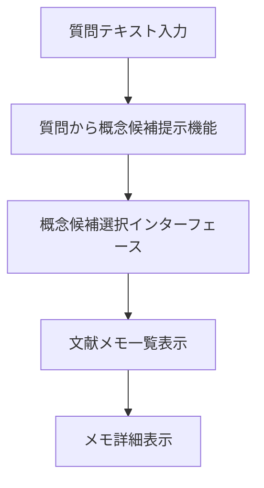

# API 契約

## 前提

<!-- PREMISE_BEGIN: api-tech-approach -->

API 技術方針として REST API を採用する。

<!-- PREMISE_END: api-tech-approach -->

<!-- PREMISE_BEGIN: scenario-04-ui-elements -->

### シナリオ 4 UI 要素

1. **質問テキスト入力フィールド** - 質問内容を受け取るインターフェース
2. **質問から概念候補提示機能** - 質問内容から関連しそうな概念候補を提示
3. **概念候補選択インターフェース** - 提示された概念候補から関連する概念を選択
4. **文献メモ一覧表示機能** - 選択した概念に紐付いた文献メモを表示
5. **メモ詳細表示機能** - 各メモの詳細内容を参照して過去の体験や知識を思い出す機能

### シナリオ 4 システム処理フロー

#### 質問探索・概念発見ワークフロー

- **目的**: 質問から関連概念を発見してメモを参照する
- **トリガ**: ユーザーが質問テキスト入力フィールドに質問を入力
- **終了条件**: 関連文献メモが表示される
- **境界越え**: LLM 概念候補生成 API

<!-- PREMISE_END: scenario-04-ui-elements -->

### 1. 概念エンティティ (Concept)

<!-- PREMISE_BEGIN: concept-entity -->

- 思考の最小単位として知識体系の中心に位置する
- 基本属性: ID、名前、説明、作成日時、更新日時
- 他の概念との関係性によって意味を形成する
- 外部情報を個人の理解に変換する観点として機能する

<!-- PREMISE_END: concept-entity -->

### 2. 文献メモエンティティ (LiteratureMemo)

<!-- PREMISE_BEGIN: literature-memo-entity -->

- ツェッテルカステン方式による概念ベースの知識蓄積
- 基本属性: ID、タイトル、内容、元 URL、作成日時、更新日時
- 特定の概念の観点で外部文献を要約・解釈したもの
- LLM 協働により効率的に作成され、個人の理解で修正される

<!-- PREMISE_END: literature-memo-entity -->

### 3. 関係性エンティティ (Relationship)

<!-- PREMISE_BEGIN: relationship-entity -->

- 概念間の無向グラフ構造による知識ネットワーク形成
- 基本属性: ID、関係名、説明、作成日時
- 個人的な関係語彙による柔軟な関係定義
- 空間配置による直感的な関係性発見を支援

<!-- PREMISE_END: relationship-entity -->

### 4. 文献エンティティ (Literature)

<!-- PREMISE_BEGIN: literature-entity -->

- 外部文献の書誌情報管理
- 基本属性: ID、URL、タイトル、取得日時
- 複数の概念観点から文献メモが生成される元情報

<!-- PREMISE_END: literature-entity -->

CogitoWeave のデータアクセスは CRUD 中心で、概念間の関係性は重複可能である。質問から概念発見は既存個人概念体系からの検索・発見支援として実現される。

## 論理

第一に、4 つのコアエンティティに対応する基本的な CRUD API が必要である。概念・文献メモ・関係性・文献のそれぞれについて、作成・読み取り・更新の操作を提供し、システムの基本機能を支える。

第二に、シナリオ 4 の質問探索機能により、既存概念体系からの検索・発見支援 API が必要である。質問テキストから関連する既存概念の候補を提示し、個人の知識資産を効率的に活用する機能を実現する。

第三に、LLM 協働による文献メモ作成を支援する API 群が必要である。外部記事の取得、概念の観点に基づく要約生成により、効率的な知識蓄積プロセスを実現する。

第四に、概念と文献メモの関係性に基づく一覧取得 API が必要である。選択した概念に紐づく文献メモを効率的に取得し、関連知識の統合的活用を支援する。

## 結論

<!-- GLOBAL_CONCLUSION_BEGIN: api-contract -->

CogitoWeave の API 契約は以下の 9 つの論理的 API 群で構成される:

### エンティティ操作 API

1. **概念 API**: 作成・読み取り・更新 (削除は優先度低)
2. **文献メモ API**: 作成・読み取り・更新・概念別一覧取得
3. **関係性 API**: 作成・読み取り・更新 (概念間の重複関係許可)
4. **文献 API**: 作成・読み取り (URL・タイトル・引用が必須)

### 検索・発見 API

1. **概念検索 API**: 名前・説明での部分一致検索
2. **質問から概念候補提示 API**: 既存個人概念体系からの検索・発見支援

### 協働・処理 API

1. **LLM 要約生成 API**: 記事内容と概念 ID から観点別要約を生成
2. **記事取得 API**: URL からタイトル・内容を取得
3. **バックアップ API**: Webhook 化による自動実行支援

これらの API により、概念中心の知識体系構築と効率的な知識活用が実現される。

<!-- GLOBAL_CONCLUSION_END: api-contract -->
