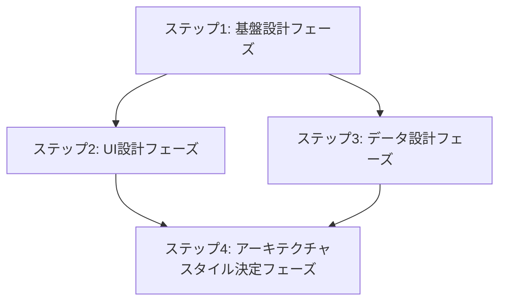

# Logical View

## 目次

1. [概要](#概要)
2. [処理フロー](#処理フロー)
3. [ステップ 1: 基盤設計フェーズ](#ステップ-1-基盤設計フェーズ)
4. [ステップ 2: UI 設計フェーズ](#ステップ-2-ui-設計フェーズ)
5. [ステップ 3: データ設計フェーズ](#ステップ-3-データ設計フェーズ)
6. [ステップ 4: アーキテクチャスタイル決定フェーズ](#ステップ-4-アーキテクチャスタイル決定フェーズ)

## 概要

Kruchten 4+1 アーキテクチャビューモデルの Logical View は機能要件の実現に焦点を当てる。

> The logical architecture primarily supports the functional requirements—what the system should provide in terms of services to its users. The system is decomposed into a set of key abstractions, taken (mostly) from the problem domain, in the form of objects or object classes.

- **関心事**: 機能要件の実現 - システムがユーザーに提供するサービス
- **時間軸**: 設計時
- **視点**: エンドユーザー、設計者
- **成果物**: クラス図、ドメインモデル、API 契約(抽象レベル)

Logical View は機能要件から論理設計への変換プロセスである。合意済みシナリオを起点として、段階的詳細化により論理構造を構築する。各段階は前段階の成果を基盤とし、独立した設計価値を持つ。

DOA(Data Oriented Approach)を採用し、データ構造を論理設計の基盤とする。これにより整合性の高い論理設計が実現できる。

## 処理フロー

## ステップ 1: 基盤設計フェーズ

システムの根本概念と機能要件を明確化する段階。合意済みシナリオを起点として、システムが提供すべき基本的な価値とサービス境界を定義する。この段階で確立された抽象化とコンテキスト境界は、後続の UI 設計とデータ設計の両方向に展開される基盤となる。

1. **[主要抽象化設計](01-key-abstractions.md)** - システムの根本概念を定義し、ドメインの本質的な概念を明確化する
2. **[機能境界と責務](02-functional-boundaries.md)** - Bounded Context を定義し、論理レベルでの境界設定を行う
3. **[機能仕様](03-functional-specifications.md)** - 機能要件を詳細化し、具体的な機能定義を行う

## ステップ 2: UI 設計フェーズ

ユーザーインターフェースの設計と技術方針を決定する段階。機能仕様で定義された要件を具体的なユーザー体験として実現するため、画面構成から視覚デザイン、コンポーネント設計までを順序立てて設計する。最終的に UI 技術方針を通じて実装レベルの技術判断を確立し、アーキテクチャスタイル決定の重要な入力となる。

- **[画面構成設計](04-screen-structure.md)** - ユーザーインターフェースの構成を設計する
- **[視覚デザイン](05-visual-design.md)** - ユーザーインターフェースの視覚的設計を行う
- **[UI 技術方針](06-ui-tech-approach.md)** - UI 実装の技術的方針を決定する(SPA vs MPA 等)
- **[UI コンポーネント責務](07-ui-component-responsibilities.md)** - UI コンポーネントの責務と構造を定義する

## ステップ 3: データ設計フェーズ

データ構造とドメインロジックを設計する段階。DOA(Data Oriented Approach)に従い、データ構造を論理設計の基盤として確立する。主要抽象化で定義された概念をデータモデルとして具体化し、データベース技術方針を経てドメインモデルでビジネス制約を設計する。最終的にバッチ仕様で運用処理の必要性を判断し、アーキテクチャスタイル決定における重要な制約条件を提供する。

- **[データモデル](08-data-model.md)** - DOA に基づきデータ構造を確立する
- **[データベース方針](09-database-approach.md)** - データベース技術の方針を決定する(RDBMS vs NoSQL 等)
- **[ドメインモデル](10-domain-model.md)** - ビジネスロジックとドメイン設計を行う
- **[バッチ仕様](11-batch-specification.md)** - バッチ処理要件を分析し仕様化する

## ステップ 4: アーキテクチャスタイル決定フェーズ

前段階の成果を統合してアーキテクチャの技術方針を決定する段階。機能境界、UI コンポーネント責務、ドメインモデル、バッチ仕様から得られた制約条件と、非機能要件・チーム構造を総合的に判断し、システム全体のアーキテクチャスタイルを確定する。具体的な製品選択ではなく技術方針レベルの判断を行い、後続の Development View での実装設計に明確な指針を提供する。

- **[バックエンドアーキテクチャスタイル](12-backend-architecture-style.md)** - 機能境界・非機能要件・ドメイン複雑度・バッチ特性・チーム構造から総合判断する(レイヤード・マイクロサービス・モジュラーモノリス等)
- **[フロントエンドレンダリングスタイル](13-frontend-rendering-style.md)** - UI 複雑度・画面構成・デプロイ独立性・チーム境界から総合判断する(CSR・SSR・ハイブリッド等)
- **[フロントエンド／バックエンド接続方針](14-frontend-backend-connection-approach.md)** - 両アーキテクチャスタイルから API 実装の技術的方針を決定する(REST vs GraphQL vs gRPC、BFF 必要性等)
- **[API 契約](15-api-contract.md)** - システムに必要な API 群の論理的な契約を定義する
