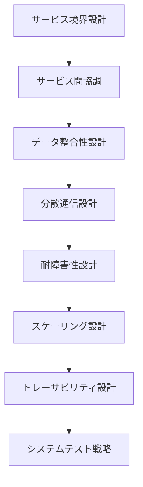

# ステップ 1: サービス間プロセス設計フェーズ

## 目次

1. [概要](#概要)
2. [処理フロー](#処理フロー)
3. [ステップ 1: サービス間プロセス設計](#ステップ-1-サービス間プロセス設計)

## 概要

Logical View で定義された機能境界を実行時のサービス境界に変換する段階。Bounded Context をマイクロサービス・モジュラモノリス等の具体的な協調パターンで実現し、分散システム全体の非機能要件を満たす設計を確立する。

- **関心事**: 分散システム全体の実行時品質
- **時間軸**: 実行時
- **視点**: システム運用者、アーキテクト
- **成果物**: サービス境界設計、通信設計、耐障害性設計

サービス境界設計から耐障害性・スケーリングまで、システム全体レベルでの実行時品質を保証する基盤を構築し、後続のサービス内設計の制約条件を明確化する。

## 処理フロー

## ステップ 1: サービス間プロセス設計

- **[サービス境界設計](01-service-boundaries.md)** - 機能境界をサービス実行境界に変換する
- **[サービス間協調](02-service-coordination.md)** - サービス間の協調パターンを設計する
- **[データ整合性設計](03-data-consistency.md)** - 分散環境での整合性戦略を設計する
- **[分散通信設計](04-distributed-communication.md)** - サービス間通信の具体的設計を行う
- **[耐障害性設計](05-fault-tolerance.md)** - 障害対応と復旧戦略を設計する
- **[スケーリング設計](06-scaling.md)** - 負荷分散と拡張性を設計する
- **[トレーサビリティ設計](07-traceability.md)** - 分散トレーシングと監視を設計する
- **[システムテスト戦略](08-system-test-strategy.md)** - 分散システム全体のテスト戦略を策定する
