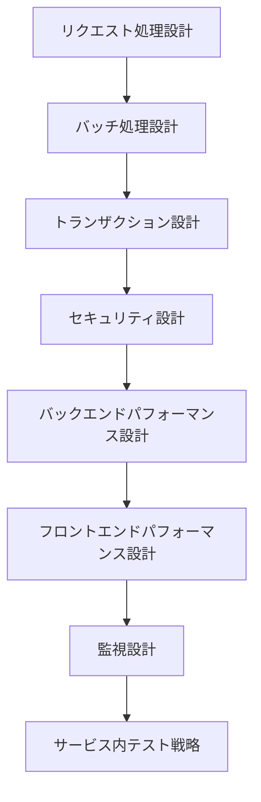

# ステップ 2: サービス内プロセス設計フェーズ

## 目次

1. [概要](#概要)
2. [処理フロー](#処理フロー)
3. [ステップ 1: サービス内プロセス設計](#ステップ-1-サービス内プロセス設計)

## 概要

前段階で確立されたサービス境界と制約条件を基盤として、各サービス内部の詳細なプロセス設計を行う段階。Logical View のドメインモデルとバッチ仕様から得られた処理要件を、具体的な実行時動作として設計する。

- **関心事**: サービス内部の実行時品質
- **時間軸**: 実行時
- **視点**: サービス開発者、運用者
- **成果物**: 処理設計、セキュリティ設計、パフォーマンス設計

リクエスト処理からセキュリティ・パフォーマンス・監視まで、サービス内の実行時品質を詳細化し、Development View での実装設計に必要な制約条件を提供する。

## 処理フロー

## ステップ 1: サービス内プロセス設計

- **[リクエスト処理設計](01-request-processing.md)** - サービス内のリクエスト処理フローを設計する
- **[バッチ処理設計](02-batch-processing.md)** - バッチ処理の実行設計を行う
- **[トランザクション設計](03-transaction.md)** - データ整合性とトランザクション境界を設計する
- **[セキュリティ設計](04-security.md)** - サービス内のセキュリティ機構を設計する
- **[バックエンドパフォーマンス設計](05-backend-performance.md)** - バックエンドの性能要件を満たす処理設計を行う
- **[フロントエンドパフォーマンス設計](06-frontend-performance.md)** - フロントエンドの性能要件を満たす処理設計を行う
- **[監視設計](07-monitoring.md)** - サービス内の監視とメトリクス設計を行う
- **[サービス内テスト戦略](08-intra-service-test-strategy.md)** - 統合テストとユニットテストの戦略を策定する
