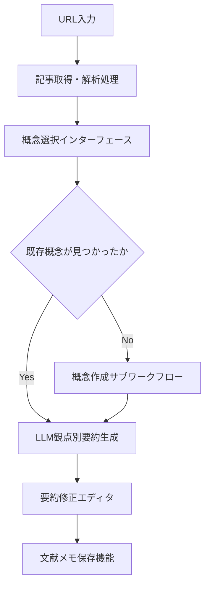

# サービス間協調

CogitoWeave システムの 3 サービス完全分離構成における協調パターンを設計する。シンプルな一方向依存による安定した協調体制を確立する。

## 前提

<!-- PREMISE_BEGIN: service-boundaries-decision -->

技術的観点からの最適解は**3 サービス完全分離**となる：

- **コア知識管理サービス**: 安定した CRUD 処理を独立プロセスで実行し、長期安定リリースサイクルで運用
- **LLM 統合サービス**: 外部 API 依存を独立プロセスで分離し、技術進歩に応じた中期リリースサイクルで運用
- **コンテンツ取得サービス**: Web スクレイピングを独立プロセスで分離し、サイト変更に応じた短期リリースサイクルで運用

この構成により実行時の責務分離とリリースサイクルの最適化を両立し、各サービスの独立性を確保できる。

<!-- PREMISE_END: service-boundaries-decision -->

<!-- PREMISE_BEGIN: development-constraints -->

- シンプルで理解しやすい構造、一人で管理可能な複雑度に制限する。

<!-- PREMISE_END: development-constraints -->

### 外部依存耐性

<!-- PREMISE_BEGIN: external-dependency-resilience -->

- **機能分離設計**: LLM 機能障害時もコア機能(保存・閲覧・編集)は継続動作
- **API 障害部分許容**: 外部 API 障害時は該当機能のみ利用不可で運用継続
- **ブラウザ互換性**: 標準 Web 技術使用による互換性問題の最小化

<!-- PREMISE_END: external-dependency-resilience -->

### 文献読み込み・要約作成ワークフロー

<!-- PREMISE_BEGIN: literature-reading-workflow -->

- **目的**: 外部文献を概念に紐付けて知識を蓄積する
- **トリガ**: ユーザーが URL 入力フィールドに URL を入力
- **終了条件**: 文献メモが概念に関連付けられて保存される
- **境界越え**: 外部記事取得 API、LLM 要約生成 API

<!-- PREMISE_END: literature-reading-workflow -->

## 論理

### 問題設定

3 つの独立サービス間で、シンプルで安定した協調パターンを設計する必要がある。各サービスの特性と制約条件から最適な協調方式を論理的に導出する。

### 分析

#### 依存関係の整理

##### 循環依存の禁止

サービス間で循環依存させてはいけない。循環依存は以下の問題を引き起こすためである。

- 保守性の問題: 一方を変更する際に他方も影響を受け変更コストが増大する
- テストの困難さ: 循環依存している要素を単体でテストすることが困難になる
- デプロイの複雑化: 独立したデプロイができず常に両方を同時にデプロイする必要がある
- 理解の困難さ: どちらがどちらに依存しているか把握しにくくシステム全体の理解が困難になる
- 障害の連鎖: 一方の障害が他方に伝播しシステム全体が不安定になる

##### 実際の依存関係

シナリオ 1 のワークフローを分析すると、記事取得・解析処理は URL 入力の直後に実行され、LLM による観点別要約生成は概念選択後に実行される。各操作は独立したタイミングで発生し、相互に依存しない。このためフロントエンドから各サービスを直接呼び出す構成が適している。

- フロントエンド → 記事取得(コンテンツ取得サービス)
- フロントエンド → LLM による要約生成(LLM 統合サービス)

#### 通信パターンの選択

開発制約の「シンプルで理解しやすい構造」を満たすため、同期通信と非同期通信を比較検討する。同期通信はシンプルな制御フローと予測可能な応答時間をタイムアウト制御で実現でき、デバッグやトレーシングも容易になる。

対して非同期通信は複雑なエラーハンドリングと状態管理の困難さを伴い、システム構成を複雑化させる。一人で管理可能な複雑度に制限する制約に照らすと、タイムアウトつき同期通信がシンプルで制御可能な協調パターンとして最適である。

## 結論

<!-- GLOBAL_CONCLUSION_BEGIN: service-coordination-pattern -->

CogitoWeave システムのサービス間協調では以下を採用する。

フロントエンドから各サービスを直接呼び出す。フロントエンドからコンテンツ取得サービスと LLM 統合サービスへの依存のみ存在し、サービス間の相互依存は発生しない。

サービス間通信はタイムアウトつき同期通信で行う。開発制約のシンプルで理解しやすい構造を満たし、一人で管理可能な複雑度に制限できる。

<!-- GLOBAL_CONCLUSION_END: service-coordination-pattern -->
